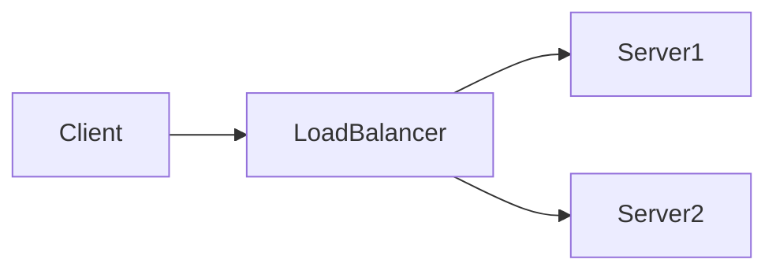

# System Design Dive Deep

A comprehensive system design learning repository with structured sessions, case studies, and hands-on materials. This repository is designed as an **Obsidian vault** for optimal knowledge management and learning.

## 🎯 Using Obsidian with This Repository

This repository **is** an Obsidian vault - the root directory contains all your notes and configuration.

### Quick Setup

1. **Install Obsidian**: Download from [obsidian.md](https://obsidian.md/)

2. **Open as Vault**: 
   - Launch Obsidian
   - Click "Open folder as vault"
   - Navigate to and select: `system-design-dive-deep/`
   - That's it! The `.obsidian` folder contains all settings

3. **Recommended Plugins** (Optional):
   - **Mermaid** (built-in): Already supported for diagrams
   - **Dataview**: For dynamic content queries
   - **Excalidraw**: For hand-drawn diagrams
   - **Git**: For version control within Obsidian

### Repository Structure

```
system-design-dive-deep/
├── .obsidian/              # Obsidian configuration (auto-managed)
├── Sessions/               # Topic-based learning sessions
│   ├── Cache/
│   │   ├── Cache.md              # Main concepts and diagrams
│   │   ├── Materials.md          # Curated learning resources
│   │   ├── Discussion Topics.md  # Discussion questions
│   │   └── demos/                # Code examples and POCs
│   └── [Other Topics]/
├── Design/                 # System design stages and processes
├── output/                 # Auto-generated PDFs (via GitHub Actions)
├── diagrams/               # PlantUML diagrams
├── templates/              # Document templates
├── rednote-case-study/     # Real-world case study
└── presentation/           # PowerPoint presentations
```

## 📚 Session Topics

| Topic | Duration | Level | Key Concepts | Discussion | Materials |
|-------|----------|-------|--------------|------------|-----------|
| [Cache](Sessions/Cache/Cache.md) | 60 min | Intermediate | Cache layers, eviction policies (LRU/LFU), write strategies, cache invalidation | [Discussion Topics](Sessions/Cache/Discussion%20Topics.md) | [Materials](Sessions/Cache/Materials.md) |
| [Load Balancer](Sessions/Load%20Balancer/Load%20Balancer.md) | 60 min | Intermediate | L4 vs L7 load balancing, algorithms (round-robin, least connections, IP hash), health checks | [Discussion Topics](Sessions/Load%20Balancer/Discussion%20Topics.md) | [Materials](Sessions/Load%20Balancer/Materials.md) |
| [Circuit Breaker](Sessions/Circuit%20Breaker/Circuit%20Breaker.md) | 60 min | Intermediate-Advanced | State machine (closed/open/half-open), bulkhead pattern, retry with backoff, timeouts | [Discussion Topics](Sessions/Circuit%20Breaker/Discussion%20Topics.md) | [Materials](Sessions/Circuit%20Breaker/Materials.md) |
| [Consistent Hashing](Sessions/Consistent%20Hashing/Consistent%20Hashing.md) | 60 min | Intermediate | Hash ring, virtual nodes, key redistribution, replication | [Discussion Topics](Sessions/Consistent%20Hashing/Discussion%20Topics.md) | [Materials](Sessions/Consistent%20Hashing/Materials.md) |
| [Distributed Transactions](Sessions/Distributed%20Transactions/Distributed%20Transactions.md) | 60 min | Intermediate-Advanced | 2PC/3PC, Saga pattern, compensation, outbox pattern, eventual consistency | [Discussion Topics](Sessions/Distributed%20Transactions/Discussion%20Topics.md) | [Materials](Sessions/Distributed%20Transactions/Materials.md) |
| [Message Queue](Sessions/Message%20Queue/Message%20Queue.md) | 60 min | Intermediate | Kafka vs RabbitMQ vs SQS, pub/sub patterns, event-driven architecture | [Discussion Topics](Sessions/Message%20Queue/Discussion%20Topics.md) | [Materials](Sessions/Message%20Queue/Materials.md) |
| [Rate Limiter](Sessions/Rate%20Limiter/Rate%20Limiter.md) | 60 min | Intermediate | Token bucket, leaky bucket, sliding window, distributed rate limiting | [Discussion Topics](Sessions/Rate%20Limiter/Discussion%20Topics.md) | [Materials](Sessions/Rate%20Limiter/Materials.md) |
| [Service Discovery](Sessions/Service%20Discovery/Service%20Discovery.md) | 60 min | Intermediate | Client-side vs server-side discovery, service registry, health checking, DNS-based discovery | [Discussion Topics](Sessions/Service%20Discovery/Discussion%20Topics.md) | [Materials](Sessions/Service%20Discovery/Materials.md) |

## 🧭 Navigation Tips

- **Wiki Links**: Use `[[Topic Name]]` to link between notes
- **Backlinks**: See which notes reference the current note in the right sidebar
- **Graph View**: Visualize connections between topics (Ctrl/Cmd + G)
- **Quick Switcher**: Jump to any note quickly (Ctrl/Cmd + O)
- **Search**: Full-text search across all notes (Ctrl/Cmd + Shift + F)

## 📖 Working with Sessions

Each session topic follows a consistent structure:

1. **Main Document**: Core concepts with Mermaid diagrams
2. **Materials**: Curated articles, videos, and documentation (best of the best only)
3. **Discussion Topics**: Thought-provoking questions for deeper understanding
4. **Demos Folder**: Practical code examples and configurations

## 🎨 Mermaid Diagrams

All diagrams use Mermaid syntax and render automatically in Obsidian:



## 📄 PDF Generation

GitHub Actions automatically converts all markdown files to PDFs:

- **Trigger**: Automatic on push to `main` branch
- **Output**: `output/` folder (preserves directory structure)
- **Features**: Mermaid diagrams, Obsidian syntax support, custom styling

Test locally:
```bash
./test-pdf-generation.sh
```

## 🎯 Best Practices

- **Link Liberally**: Create connections between related topics using `[[links]]`
- **Use Tags**: Add `#systemdesign`, `#architecture`, etc. for organization
- **Daily Notes**: Keep learning logs and insights in daily notes
- **Templates**: Create templates for new session topics (see existing structure)
- **Callouts**: Use Obsidian callouts for notes, tips, warnings:
  ```markdown
  > [!note]
  > This is a note
  
  > [!tip]
  > This is a tip
  ```

## 🤝 Contributing

When adding new topics:

1. Follow the existing folder structure under `Sessions/`
2. Use Obsidian markdown with Mermaid for diagrams
3. Curate only the best learning materials
4. Include practical discussion topics
5. Add code examples in the `demos/` folder
6. Use wiki links `[[Topic]]` to connect related concepts

## 📚 Resources

- [Obsidian Documentation](https://help.obsidian.md/)
- [Mermaid Syntax](https://mermaid.js.org/intro/)
- [Markdown Guide](https://www.markdownguide.org/)
- [System Design Primer](https://github.com/donnemartin/system-design-primer)

---

**Note**: This is a public-facing repository. For internal training materials, see the `system-design-internal` repository.
