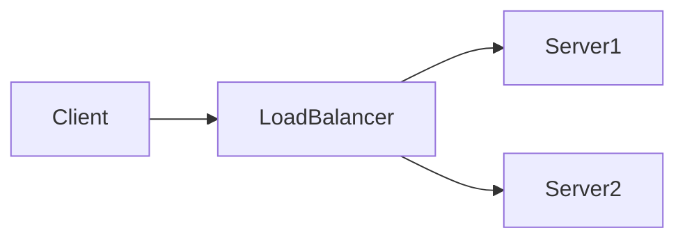

# System Design Dive Deep

A comprehensive system design learning repository with structured sessions, case studies, and hands-on materials.

## Using Obsidian with This Repository

This repository is designed to work seamlessly with [Obsidian](https://obsidian.md/), a powerful knowledge management tool.

### Setup

1. **Install Obsidian**: Download from [obsidian.md](https://obsidian.md/)

2. **Open as Vault**: 
   - Launch Obsidian
   - Click "Open folder as vault"
   - Navigate to: `system-design-dive-deep/SystemDesign/SystemDesign/`
   - This is your Obsidian vault root

3. **Recommended Plugins** (Optional):
   - **Mermaid** (built-in): Already supported for diagrams
   - **Dataview**: For dynamic content queries
   - **Excalidraw**: For hand-drawn diagrams
   - **Git**: For version control within Obsidian

### Repository Structure

```
SystemDesign/SystemDesign/
├── Sessions/              # Topic-based learning sessions
│   ├── Cache/
│   │   ├── Cache.md              # Main concepts and diagrams
│   │   ├── Materials.md          # Curated learning resources
│   │   ├── Discussion Topics.md  # Discussion questions
│   │   └── demos/                # Code examples and POCs
│   └── Load Balancer/
│       ├── Load Balancer.md
│       ├── Materials.md
│       ├── Discussion Topics.md
│       └── demos/
```

### Navigation Tips

- **Wiki Links**: Use `[[Topic Name]]` to link between notes
- **Backlinks**: See which notes reference the current note in the right sidebar
- **Graph View**: Visualize connections between topics (Ctrl/Cmd + G)
- **Quick Switcher**: Jump to any note quickly (Ctrl/Cmd + O)

### Working with Sessions

Each session topic follows a consistent structure:

1. **Main Document**: Core concepts with Mermaid diagrams
2. **Materials**: Curated articles, videos, and documentation (best of the best only)
3. **Discussion Topics**: Thought-provoking questions for deeper understanding
4. **Demos Folder**: Practical code examples and configurations

### Mermaid Diagrams

All diagrams use Mermaid syntax and render automatically in Obsidian:



### Best Practices

- **Link Liberally**: Create connections between related topics using `[[links]]`
- **Use Tags**: Add `#systemdesign`, `#architecture`, etc. for organization
- **Daily Notes**: Keep learning logs and insights in daily notes
- **Templates**: Create templates for new session topics (see existing structure)

### Contributing

When adding new topics:

1. Follow the existing folder structure
2. Use Obsidian markdown with Mermaid for diagrams
3. Curate only the best learning materials
4. Include practical discussion topics
5. Add code examples in the `demos/` folder

### Resources

- [Obsidian Documentation](https://help.obsidian.md/)
- [Mermaid Syntax](https://mermaid.js.org/intro/)
- [Markdown Guide](https://www.markdownguide.org/)

---

**Note**: This is a public-facing repository. For internal training materials, see the `system-design-internal` repository.
