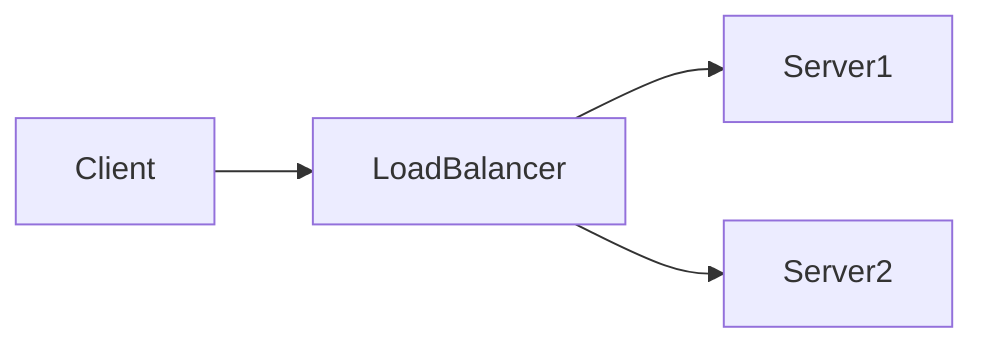

# System Design Dive Deep

A comprehensive system design learning repository with structured sessions, case studies, and hands-on materials.

## Using Obsidian with This Repository

This repository is designed to work seamlessly with [Obsidian](https://obsidian.md/), a powerful knowledge management tool.

### Setup

1. **Install Obsidian**: Download from [obsidian.md](https://obsidian.md/)

2. **Open as Vault**: 
   - Launch Obsidian
   - Click "Open folder as vault"
   - Navigate to: `system-design-dive-deep/SystemDesign/SystemDesign/`
   - This is your Obsidian vault root

3. **Recommended Plugins** (Optional):
   - **Mermaid** (built-in): Already supported for diagrams
   - **Dataview**: For dynamic content queries
   - **Excalidraw**: For hand-drawn diagrams
   - **Git**: For version control within Obsidian

### Repository Structure

```
SystemDesign/SystemDesign/
├── Sessions/              # Topic-based learning sessions
│   ├── Cache/
│   │   ├── Cache.md              # Main concepts and diagrams
│   │   ├── Materials.md          # Curated learning resources
│   │   ├── Discussion Topics.md  # Discussion questions
│   │   └── demos/                # Code examples and POCs
│   └── [Other Topics]/
│       └── ...
```

## 📚 Session Topics

| Topic | Duration | Level | Key Concepts | Discussion Focus | Future Learning |
|-------|----------|-------|--------------|------------------|-----------------|
| **[Cache](SystemDesign/SystemDesign/Sessions/Cache/Cache.md)** | 60 min | Intermediate | Cache layers, eviction policies (LRU/LFU), write strategies (write-through/write-back), cache invalidation | Cache hit ratio optimization, thundering herd problem, cache warming strategies | Redis Cluster, distributed caching, cache-aside vs read-through patterns |
| **[Load Balancer](SystemDesign/SystemDesign/Sessions/Load%20Balancer/Load%20Balancer.md)** | 60 min | Intermediate | L4 vs L7 load balancing, algorithms (round-robin, least connections, IP hash), health checks | Sticky sessions trade-offs, SSL termination, zero-downtime deployments | Service mesh (Istio/Envoy), global load balancing, auto-scaling integration |
| **[Circuit Breaker](SystemDesign/SystemDesign/Sessions/Circuit%20Breaker/Circuit%20Breaker.md)** | 60 min | Intermediate-Advanced | State machine (closed/open/half-open), bulkhead pattern, retry with backoff, timeouts | Cascading failure prevention, fallback strategies, graceful degradation | Resilience4j, Hystrix patterns, chaos engineering |
| **[Consistent Hashing](SystemDesign/SystemDesign/Sessions/Consistent%20Hashing/Consistent%20Hashing.md)** | 60 min | Intermediate | Hash ring, virtual nodes, key redistribution, replication | Hotspot mitigation, node failure handling, rebalancing strategies | DynamoDB partitioning, Cassandra ring, jump consistent hashing |
| **[Distributed Transactions](SystemDesign/SystemDesign/Sessions/Distributed%20Transactions/Distributed%20Transactions.md)** | 60 min | Intermediate-Advanced | 2PC/3PC, Saga pattern, compensation, outbox pattern, eventual consistency | CAP theorem trade-offs, idempotency, transaction boundaries | Event sourcing, CQRS, distributed consensus (Raft/Paxos) |
| **[Message Queue](SystemDesign/SystemDesign/Sessions/Message%20Queue/Message%20Queue.md)** | 60 min | Intermediate | Kafka vs RabbitMQ vs SQS, pub/sub patterns, event-driven architecture, choreography vs orchestration | Message ordering, exactly-once delivery, dead letter queues | Event sourcing, CQRS, stream processing (Kafka Streams/Flink) |
| **[Rate Limiter](SystemDesign/SystemDesign/Sessions/Rate%20Limiter/Rate%20Limiter.md)** | 60 min | Intermediate | Token bucket, leaky bucket, sliding window, distributed rate limiting | Algorithm selection, burst handling, multi-tier limits | API gateway rate limiting, adaptive throttling, quota management |
| **[Service Discovery](SystemDesign/SystemDesign/Sessions/Service%20Discovery/Service%20Discovery.md)** | 60 min | Intermediate | Client-side vs server-side discovery, service registry (Consul/etcd/ZooKeeper), health checking, DNS-based discovery | Registration patterns, failure detection, service mesh integration | Kubernetes service discovery, Envoy xDS, multi-cluster discovery |

### Navigation Tips

- **Wiki Links**: Use `[[Topic Name]]` to link between notes
- **Backlinks**: See which notes reference the current note in the right sidebar
- **Graph View**: Visualize connections between topics (Ctrl/Cmd + G)
- **Quick Switcher**: Jump to any note quickly (Ctrl/Cmd + O)

### Working with Sessions

Each session topic follows a consistent structure:

1. **Main Document**: Core concepts with Mermaid diagrams
2. **Materials**: Curated articles, videos, and documentation (best of the best only)
3. **Discussion Topics**: Thought-provoking questions for deeper understanding
4. **Demos Folder**: Practical code examples and configurations

### Mermaid Diagrams

All diagrams use Mermaid syntax and render automatically in Obsidian:



### Best Practices

- **Link Liberally**: Create connections between related topics using `[[links]]`
- **Use Tags**: Add `#systemdesign`, `#architecture`, etc. for organization
- **Daily Notes**: Keep learning logs and insights in daily notes
- **Templates**: Create templates for new session topics (see existing structure)

### Contributing

When adding new topics:

1. Follow the existing folder structure
2. Use Obsidian markdown with Mermaid for diagrams
3. Curate only the best learning materials
4. Include practical discussion topics
5. Add code examples in the `demos/` folder

### Resources

- [Obsidian Documentation](https://help.obsidian.md/)
- [Mermaid Syntax](https://mermaid.js.org/intro/)
- [Markdown Guide](https://www.markdownguide.org/)

---

**Note**: This is a public-facing repository. For internal training materials, see the `system-design-internal` repository.
