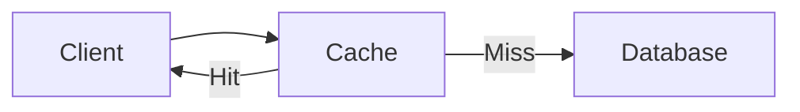

# System Design Knowledge Base

Welcome to your System Design learning vault! This Obsidian workspace is organized to help you master system design concepts through structured learning, hands-on practice, and deep discussions.

## 🗂️ Vault Structure

```
SystemDesign/
├── Sessions/          # Topic-based deep dives
│   ├── Cache/
│   ├── Load Balancer/
│   └── [More topics...]
└── Design/            # Design process stages
    ├── Stage1.md      # Requirements & Scope
    ├── Stage2.md      # High-Level Design
    └── Stage3.md      # Deep Dive & Details
```

## 📚 Sessions - Topic Deep Dives

Each session focuses on a specific system design topic with comprehensive materials:

### Current Topics

- **[[Cache/Cache|Cache]]** - Caching strategies, eviction policies, distributed caching
- **[[Load Balancer/Load Balancer|Load Balancer]]** - Layer 4/7 LB, algorithms, high availability

### Session Structure

Every topic follows this consistent format:

```
{Topic}/
├── {Topic}.md              # 📖 Core concepts with Mermaid diagrams
├── Materials.md            # 🔗 Curated resources (articles, videos, docs)
├── Discussion Topics.md    # 💬 Thought-provoking questions
└── demos/                  # 💻 Code examples and POCs
```

**What to expect:**
- **Main Document**: Comprehensive overview with visual diagrams
- **Materials**: Only the best articles, videos, and technical docs (no courses/books)
- **Discussion Topics**: Real-world scenarios and architecture decisions
- **Demos**: Practical implementations you can run and modify

## 🎨 Design Process

The Design folder contains templates for the system design interview process:

- **[[Design/Stage1|Stage 1]]** - Requirements gathering and scope definition
- **[[Design/Stage2|Stage 2]]** - High-level architecture and component design
- **[[Design/Stage3|Stage 3]]** - Deep dive into specific components and trade-offs

Use these as frameworks when practicing system design problems.

## 🚀 Getting Started

### For New Learners

1. Start with **[[Cache/Cache|Cache]]** or **[[Load Balancer/Load Balancer|Load Balancer]]**
2. Read the main document to understand core concepts
3. Review the Materials for deeper learning
4. Try the demos to get hands-on experience
5. Discuss the Discussion Topics with peers or mentors

### For Interview Prep

1. Review the **Design/** stages to understand the interview framework
2. Pick a topic from Sessions and study it thoroughly
3. Practice explaining concepts using the Mermaid diagrams
4. Work through Discussion Topics to prepare for follow-up questions

### For Hands-On Practice

1. Explore the `demos/` folders in each topic
2. Run the code examples locally
3. Modify configurations to see different behaviors
4. Build your own variations and document learnings

## 💡 Using This Vault

### Navigation

- **Graph View** (Ctrl/Cmd + G): Visualize topic connections
- **Quick Switcher** (Ctrl/Cmd + O): Jump to any note instantly
- **Backlinks Panel**: See what references the current note
- **Search** (Ctrl/Cmd + Shift + F): Full-text search across all notes

### Linking

Use wiki-style links to connect ideas:
- `[[Cache/Cache]]` - Link to Cache topic
- `[[Load Balancer/Load Balancer|Load Balancing]]` - Link with custom text
- `[[Design/Stage1#Requirements]]` - Link to specific section

### Diagrams

All diagrams use Mermaid syntax:



### Tags

Organize with tags:
- `#systemdesign` - General system design concepts
- `#architecture` - Architecture patterns
- `#performance` - Performance optimization
- `#scalability` - Scalability patterns
- `#interview` - Interview preparation

## 📝 Contributing

When adding new topics:

1. Create folder: `Sessions/{Topic}/`
2. Follow the 4-file structure (main doc, materials, discussion, demos)
3. Use Mermaid for all diagrams
4. Curate only the best resources in Materials
5. Link to related topics using `[[wiki links]]`

See `.kiro/steering/sessions-structure.md` for detailed guidelines.

## 🔗 Quick Links

### Sessions
- [[Cache/Cache|Cache]]
- [[Load Balancer/Load Balancer|Load Balancer]]

### Design Process
- [[Design/Stage1|Stage 1 - Requirements]]
- [[Design/Stage2|Stage 2 - High-Level Design]]
- [[Design/Stage3|Stage 3 - Deep Dive]]

---

**Last Updated**: December 2024  
**Obsidian Version**: 1.x+  
**Vault Type**: Learning & Interview Prep