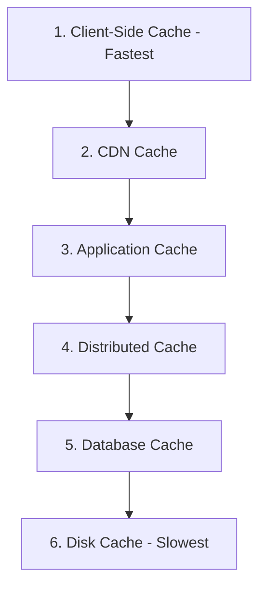
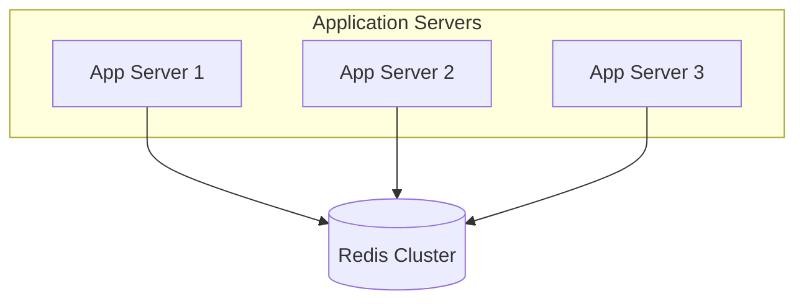
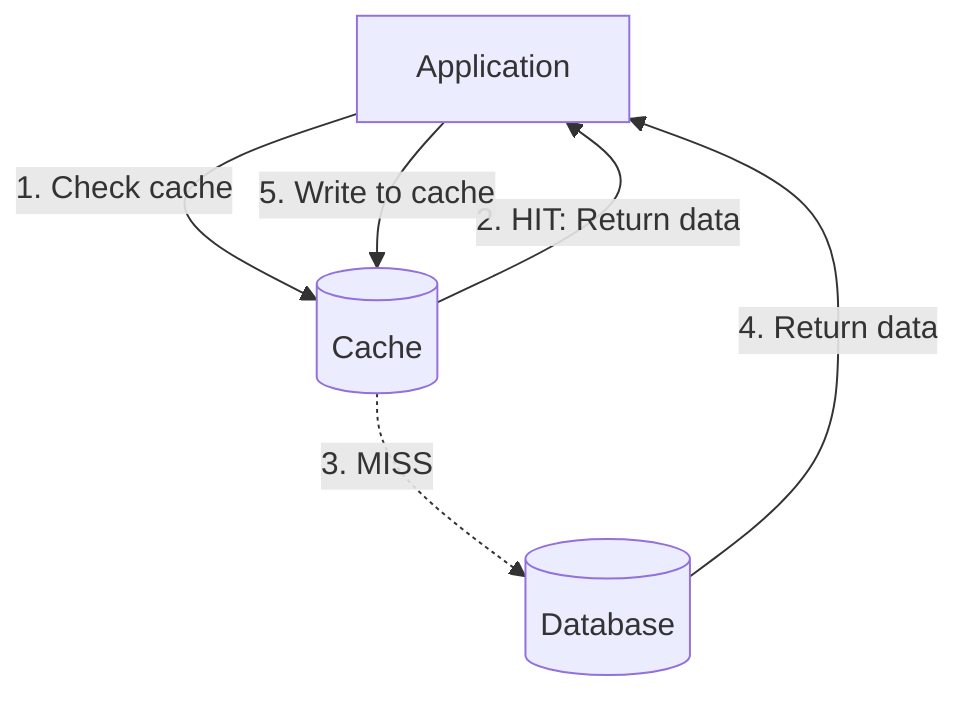
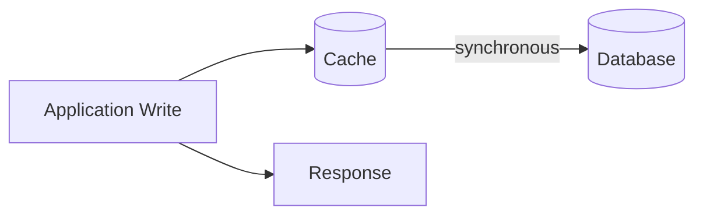
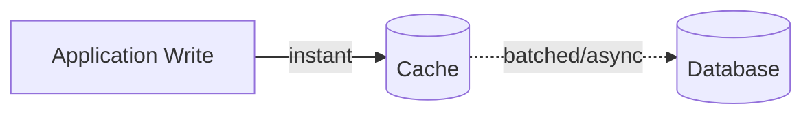
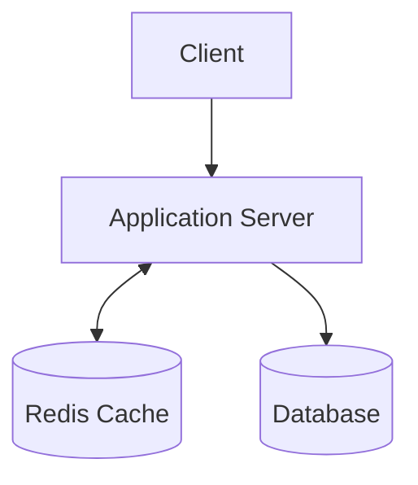
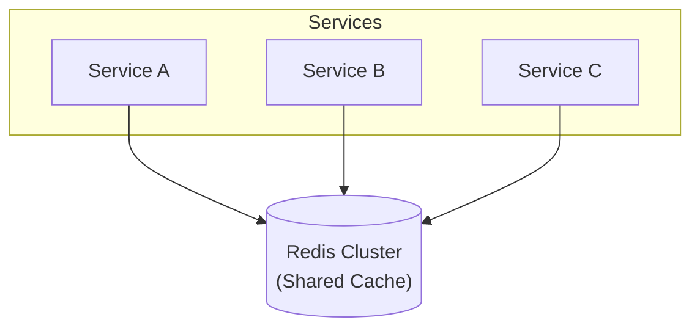
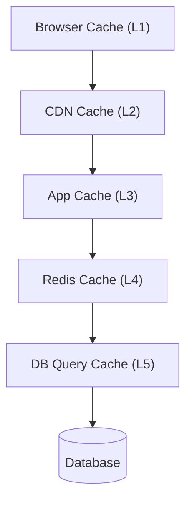

# Caching - 1 Hour Session

**Duration:** 60 minutes
**Level:** Intermediate

---

## 📋 Session Agenda

- [ ] Introduction to Caching (10 min)
- [ ] Cache Types & Layers (10 min)
- [ ] Caching Strategies & Patterns (15 min)
- [ ] Cache Eviction Policies (10 min)
- [ ] Implementation & Best Practices (15 min)

---

## 🎯 Learning Objectives

By the end of this session, you will understand:
- What caching is and when to use it
- Different types and layers of caching
- Common caching patterns and strategies
- Cache eviction policies and their trade-offs
- How to implement and manage caching effectively
- Common pitfalls and how to avoid them

---

## 1. Introduction to Caching (10 min)

### What is Caching?

**Caching** is the process of storing copies of data in a temporary storage location (cache) for faster access.

> [!quote] Fundamental Principle
> "There are only two hard things in Computer Science: cache invalidation and naming things." - Phil Karlton

### Why Cache?

**Performance Improvements:**
- 🚀 **Speed:** RAM access ~100ns vs Database ~10ms (100,000x faster)
- 💰 **Cost:** Reduce database load and infrastructure costs
- 📊 **Scalability:** Handle more requests with same resources
- 🌐 **User Experience:** Faster response times = happier users

### The Cache Hit/Miss Concept

~~~
Request Flow:

1. Check Cache
   ├─ HIT: Return cached data (fast!) ✓
   └─ MISS: 
       ├─ Query database/API (slow)
       ├─ Store in cache
       └─ Return data

Cache Hit Ratio = (Cache Hits / Total Requests) × 100%
Target: 80-95% for most applications
~~~

### Key Metrics

| Metric | Description | Good Target |
|--------|-------------|-------------|
| **Hit Ratio** | Percentage of requests served from cache | > 80% |
| **Latency** | Time to retrieve from cache | < 10ms |
| **TTL** | Time data stays in cache | Depends on use case |
| **Memory Usage** | Cache size vs available memory | < 80% of allocated |

---

## 2. Cache Types & Layers (10 min)

### Caching Layers (Closest to Farthest from User)


```
```

### 1. Client-Side Cache

**Browser Cache:**
- Stores static assets (images, CSS, JS)
- Controlled via HTTP headers

~~~http
HTTP Headers:

Cache-Control: max-age=3600, public
ETag: "33a64df551425fcc55e4d42a148795d9f25f89d4"
Last-Modified: Wed, 21 Oct 2023 07:28:00 GMT
Expires: Thu, 01 Dec 2024 16:00:00 GMT
~~~

**LocalStorage/SessionStorage:**
- JavaScript-accessible storage
- 5-10MB limit per domain

~~~javascript
// LocalStorage example
localStorage.setItem('user_preferences', JSON.stringify(data));
const prefs = JSON.parse(localStorage.getItem('user_preferences'));
~~~

### 2. CDN Cache

**Content Delivery Network** caches at edge locations worldwide.

~~~
User in Tokyo → Tokyo Edge Server (cached) ✓ (50ms)
              vs
User in Tokyo → US Origin Server (not cached) ✗ (250ms)
~~~

**Use Cases:**
- Static assets (images, videos, CSS, JS)
- API responses (with proper headers)
- Entire pages (for static sites)

### 3. Application-Level Cache

**In-Process Cache:**
- Stored in application memory
- Fastest but not shared across instances

~~~python
# Python simple in-memory cache
from functools import lru_cache

@lru_cache(maxsize=1000)
def get_user(user_id):
    # This result will be cached
    return database.query(f"SELECT * FROM users WHERE id={user_id}")
~~~

### 4. Distributed Cache

**Shared cache across multiple application instances.**

**Popular Solutions:**
- **Redis** - Feature-rich, supports data structures
- **Memcached** - Simple, fast, key-value only
- **Hazelcast** - Distributed in-memory data grid



### 5. Database Cache

**Query Result Cache:**
- MySQL Query Cache (deprecated in 8.0)
- PostgreSQL shared buffers
- MongoDB WiredTiger cache

**ORM-Level Cache:**
- Hibernate second-level cache
- Django cache framework
- Entity Framework caching

### Cache Type Comparison

| Type | Speed | Shared | Complexity | Persistence |
|------|-------|--------|------------|-------------|
| Browser | Fastest | No | Low | Session-based |
| CDN | Very Fast | Yes | Medium | Configurable |
| In-Memory | Fast | No | Low | No |
| Redis | Fast | Yes | Medium | Optional |
| Database | Medium | Yes | Low | Yes |

---

## 3. Caching Strategies & Patterns (15 min)

### 1. Cache-Aside (Lazy Loading)

**Most common pattern.** Application manages cache explicitly.



**Implementation:**

~~~python
def get_user(user_id):
    # 1. Try cache first
    cache_key = f"user:{user_id}"
    user = cache.get(cache_key)
    
    if user is not None:
        return user  # Cache HIT
    
    # 2. Cache MISS - query database
    user = database.query(f"SELECT * FROM users WHERE id={user_id}")
    
    # 3. Store in cache
    cache.set(cache_key, user, ttl=3600)  # 1 hour
    
    return user
~~~

**Pros:**
- Only requested data is cached
- Cache failure doesn't break the app

**Cons:**
- Cache miss penalty (extra latency)
- Data can become stale

### 2. Read-Through Cache

**Cache sits between app and database.** Cache manages data loading.

~~~
Application → Cache → Database
              (auto-loads on miss)
~~~

~~~python
# Pseudo-code (handled by cache library)
user = cache.get(user_id)  # Cache automatically queries DB on miss
~~~

**Pros:**
- Simplified application code
- Consistent pattern

**Cons:**
- Tight coupling to cache
- First request still slow

### 3. Write-Through Cache

**Write to cache and database simultaneously.**

~~~python
def update_user(user_id, data):
    # 1. Update database
    database.update(user_id, data)
    
    # 2. Update cache
    cache_key = f"user:{user_id}"
    cache.set(cache_key, data, ttl=3600)
    
    return data
~~~



**Pros:**
- Cache always consistent with DB
- No stale data

**Cons:**
- Write latency (two operations)
- Wasted writes for unread data

### 4. Write-Behind (Write-Back) Cache

**Write to cache immediately, database asynchronously.**



~~~python
def update_user(user_id, data):
    # 1. Update cache immediately
    cache_key = f"user:{user_id}"
    cache.set(cache_key, data, ttl=3600)
    
    # 2. Queue database update (async)
    queue.enqueue('db_update', user_id, data)
    
    return data  # Fast response!
~~~

**Pros:**
- Very fast writes
- Can batch database operations

**Cons:**
- Risk of data loss if cache fails
- Complex to implement correctly

### 5. Refresh-Ahead

**Proactively refresh cache before expiration.**

~~~python
import time
from threading import Thread

def get_user_with_refresh(user_id):
    cache_key = f"user:{user_id}"
    user, expiry = cache.get_with_expiry(cache_key)
    
    if user is None:
        # Cache miss - load from DB
        user = database.query(user_id)
        cache.set(cache_key, user, ttl=3600)
    elif time.time() > (expiry - 300):  # 5 min before expiry
        # Refresh in background
        Thread(target=refresh_cache, args=(user_id,)).start()
    
    return user

def refresh_cache(user_id):
    user = database.query(user_id)
    cache.set(f"user:{user_id}", user, ttl=3600)
~~~

**Pros:**
- Reduced latency (no cache miss delays)
- Predictable performance

**Cons:**
- Additional complexity
- May refresh unused data

### Strategy Comparison

| Pattern | Read Perf | Write Perf | Complexity | Data Freshness |
|---------|-----------|------------|------------|----------------|
| Cache-Aside | Good | Good | Low | Can be stale |
| Read-Through | Good | Good | Medium | Can be stale |
| Write-Through | Good | Slower | Medium | Always fresh |
| Write-Behind | Good | Fastest | High | Eventually consistent |
| Refresh-Ahead | Best | Good | High | Very fresh |

---

## 4. Cache Eviction Policies (10 min)

### Why Eviction?

> [!warning] Memory is Limited
> Caches have finite memory. When full, old data must be removed to make room for new data.

### Common Eviction Algorithms

#### 1. LRU (Least Recently Used)

**Removes the least recently accessed item.**

~~~
Cache: [A, B, C, D] (max size: 4)

Access B → [A, C, D, B]
Access C → [A, D, B, C]
Add E   → [D, B, C, E]  (A evicted - oldest access)
~~~

**Best for:** General purpose, temporal locality

~~~python
from collections import OrderedDict

class LRUCache:
    def __init__(self, capacity):
        self.cache = OrderedDict()
        self.capacity = capacity
    
    def get(self, key):
        if key not in self.cache:
            return None
        # Move to end (most recently used)
        self.cache.move_to_end(key)
        return self.cache[key]
    
    def put(self, key, value):
        if key in self.cache:
            self.cache.move_to_end(key)
        self.cache[key] = value
        if len(self.cache) > self.capacity:
            # Remove first item (least recently used)
            self.cache.popitem(last=False)
~~~

#### 2. LFU (Least Frequently Used)

**Removes the least frequently accessed item.**

~~~
Item A: accessed 10 times
Item B: accessed 5 times
Item C: accessed 2 times  ← Evicted first
Item D: accessed 8 times
~~~

**Best for:** Items with consistent popularity

#### 3. FIFO (First In, First Out)

**Removes oldest item regardless of access.**

~~~
Cache: [A(1st), B(2nd), C(3rd), D(4th)]

Add E → [B(2nd), C(3rd), D(4th), E(5th)]  (A evicted)
~~~

**Best for:** Simple use cases, streaming data

#### 4. TTL (Time To Live)

**Items expire after a set time.**

~~~python
import time

cache = {}

def set_with_ttl(key, value, ttl_seconds):
    expiry = time.time() + ttl_seconds
    cache[key] = {'value': value, 'expiry': expiry}

def get_with_ttl(key):
    if key not in cache:
        return None
    
    item = cache[key]
    if time.time() > item['expiry']:
        del cache[key]  # Expired
        return None
    
    return item['value']
~~~

**Best for:** Time-sensitive data (sessions, tokens)

#### 5. Random Replacement

**Randomly selects item to evict.**

**Best for:** When access patterns are unpredictable

### Eviction Policy Comparison

| Policy | Complexity | Hit Ratio | Use Case |
|--------|------------|-----------|----------|
| LRU | Medium | High | General purpose, recency matters |
| LFU | High | High | Popularity-based content |
| FIFO | Low | Low | Simple queues |
| TTL | Low | Medium | Time-sensitive data |
| Random | Low | Low | Unpredictable patterns |

### Redis Eviction Policies

Redis supports multiple policies:

~~~redis
# redis.conf
maxmemory 2gb
maxmemory-policy allkeys-lru

# Options:
# noeviction       - Return errors when memory limit reached
# allkeys-lru      - Remove any key, LRU algorithm
# volatile-lru     - Remove keys with TTL, LRU
# allkeys-lfu      - Remove any key, LFU algorithm
# volatile-lfu     - Remove keys with TTL, LFU
# allkeys-random   - Remove random key
# volatile-random  - Remove random key with TTL
# volatile-ttl     - Remove key with nearest expiration
~~~

---

## 5. Implementation & Best Practices (15 min)

### Redis Implementation Examples

#### Basic Operations

~~~python
import redis
import json

# Connect to Redis
r = redis.Redis(host='localhost', port=6379, db=0, decode_responses=True)

# SET with TTL
def cache_user(user_id, user_data):
    key = f"user:{user_id}"
    r.setex(key, 3600, json.dumps(user_data))  # 1 hour TTL

# GET
def get_cached_user(user_id):
    key = f"user:{user_id}"
    data = r.get(key)
    return json.loads(data) if data else None

# DELETE
def invalidate_user_cache(user_id):
    key = f"user:{user_id}"
    r.delete(key)

# CHECK EXISTS
def is_cached(user_id):
    key = f"user:{user_id}"
    return r.exists(key) > 0
~~~

#### Advanced Patterns

**1. Cache Warming:**

~~~python
def warm_cache():
    """Pre-load frequently accessed data"""
    popular_users = database.query("SELECT * FROM users ORDER BY views DESC LIMIT 100")
    
    pipeline = r.pipeline()
    for user in popular_users:
        key = f"user:{user['id']}"
        pipeline.setex(key, 3600, json.dumps(user))
    
    pipeline.execute()  # Batch operation
~~~

**2. Cache Stampede Prevention:**

~~~python
import time
import random

def get_with_stampede_protection(key, fetch_func, ttl=3600):
    """Prevent multiple threads from fetching same data simultaneously"""
    
    data = r.get(key)
    if data:
        return json.loads(data)
    
    # Try to acquire lock
    lock_key = f"lock:{key}"
    lock_acquired = r.set(lock_key, "1", nx=True, ex=10)  # 10 sec lock
    
    if lock_acquired:
        try:
            # Fetch data
            data = fetch_func()
            r.setex(key, ttl, json.dumps(data))
            return data
        finally:
            r.delete(lock_key)
    else:
        # Wait and retry
        time.sleep(random.uniform(0.1, 0.5))
        return get_with_stampede_protection(key, fetch_func, ttl)
~~~

**3. Multi-Level Cache:**

~~~python
class MultiLevelCache:
    def __init__(self):
        self.l1_cache = {}  # In-memory (fast)
        self.l2_cache = redis.Redis()  # Redis (shared)
    
    def get(self, key):
        # Try L1 first
        if key in self.l1_cache:
            return self.l1_cache[key]
        
        # Try L2
        data = self.l2_cache.get(key)
        if data:
            # Promote to L1
            self.l1_cache[key] = data
            return data
        
        return None
    
    def set(self, key, value, ttl=3600):
        # Write to both levels
        self.l1_cache[key] = value
        self.l2_cache.setex(key, ttl, value)
~~~

### Memcached Implementation

~~~python
import memcache

mc = memcache.Client(['127.0.0.1:11211'], debug=0)

# SET
mc.set("user:123", user_data, time=3600)

# GET
user = mc.get("user:123")

# DELETE
mc.delete("user:123")

# GET MULTIPLE
users = mc.get_multi(["user:123", "user:456", "user:789"])
~~~

### Application-Level Caching (Node.js)

~~~javascript
const NodeCache = require('node-cache');
const cache = new NodeCache({ stdTTL: 3600 });

// Middleware for Express
function cacheMiddleware(duration) {
  return (req, res, next) => {
    const key = req.originalUrl;
    const cachedResponse = cache.get(key);
    
    if (cachedResponse) {
      return res.send(cachedResponse);
    }
    
    // Override res.send to cache response
    const originalSend = res.send;
    res.send = function(data) {
      cache.set(key, data, duration);
      originalSend.call(this, data);
    };
    
    next();
  };
}

// Usage
app.get('/api/users', cacheMiddleware(300), (req, res) => {
  // This response will be cached for 5 minutes
  const users = database.getUsers();
  res.json(users);
});
~~~

### Best Practices

#### 1. Cache Key Naming Convention

~~~
Pattern: {resource}:{identifier}:{attribute}

Examples:
user:123                    - User object
user:123:profile            - User profile
user:123:posts              - User's posts
session:abc123              - Session data
product:456:inventory       - Product inventory
api:v1:users:list:page:1    - API response
~~~

#### 2. TTL Strategy

~~~python
# Different TTL for different data types
CACHE_TTL = {
    'static_content': 86400,    # 24 hours
    'user_profile': 3600,       # 1 hour
    'user_session': 1800,       # 30 minutes
    'api_response': 300,        # 5 minutes
    'real_time_data': 60,       # 1 minute
}
~~~

#### 3. Cache Invalidation Strategies

**Time-based (TTL):**
~~~python
cache.setex('user:123', 3600, user_data)  # Auto-expires
~~~

**Event-based:**
~~~python
def update_user(user_id, new_data):
    database.update(user_id, new_data)
    cache.delete(f'user:{user_id}')  # Invalidate on update
~~~

**Tag-based:**
~~~python
# Invalidate all user-related caches
tags = cache.smembers(f'tags:user:{user_id}')
for tag in tags:
    cache.delete(tag)
~~~

#### 4. Monitoring & Alerting

~~~python
# Track cache metrics
def cache_get_with_metrics(key):
    start_time = time.time()
    data = cache.get(key)
    latency = time.time() - start_time
    
    # Log metrics
    if data:
        metrics.increment('cache.hit')
    else:
        metrics.increment('cache.miss')
    
    metrics.histogram('cache.latency', latency)
    
    return data
~~~

**Key Metrics to Monitor:**
- Hit/Miss ratio
- Cache memory usage
- Eviction rate
- Average latency
- Connection pool usage

#### 5. Cache Size Calculation

~~~python
import sys

def calculate_cache_size(data_size_bytes, num_items, overhead=1.2):
    """
    data_size_bytes: Average size of each cached item
    num_items: Number of items to cache
    overhead: Redis overhead factor (keys, metadata)
    """
    total_size = data_size_bytes * num_items * overhead
    
    # Convert to GB
    size_gb = total_size / (1024 ** 3)
    
    return size_gb

# Example: Cache 1M user profiles, avg 2KB each
cache_size = calculate_cache_size(2048, 1_000_000)
print(f"Required cache size: {cache_size:.2f} GB")
~~~

---

## 🚨 Common Pitfalls & Solutions

### 1. Cache Stampede

**Problem:** Multiple requests for expired key hit database simultaneously.

~~~
Cache expires → 1000 concurrent requests → 1000 DB queries! 💥
~~~

**Solution:** Use locks or probabilistic early expiration

~~~python
def get_with_early_expiration(key, ttl=3600, beta=1.0):
    data, expiry, delta = cache.get_with_metadata(key)
    
    if data is None:
        # Cache miss - fetch and store
        data = fetch_from_db(key)
        cache.set(key, data, ttl)
        return data
    
    # Probabilistic early refresh
    time_to_expiry = expiry - time.time()
    if time_to_expiry < 0:
        return data
    
    # XFetch algorithm
    if time.time() - delta * beta * math.log(random.random()) >= expiry:
        # Refresh in background
        refresh_async(key)
    
    return data
~~~

### 2. Stale Data

**Problem:** Cache returns outdated information.

**Solutions:**
- Shorter TTL for frequently changing data
- Event-driven invalidation
- Write-through caching
- Cache versioning

~~~python
# Cache versioning
CACHE_VERSION = "v2"

def versioned_key(key):
    return f"{CACHE_VERSION}:{key}"

# When data structure changes, increment version
# Old cached data automatically becomes inaccessible
~~~

### 3. Cache Penetration

**Problem:** Requests for non-existent keys always hit database.

~~~
Request for user:99999 (doesn't exist)
→ Cache miss
→ Database query (returns null)
→ No caching (null not cached)
→ Repeat 1000 times 💥
~~~

**Solution:** Cache null results with short TTL

~~~python
def get_user(user_id):
    key = f"user:{user_id}"
    user = cache.get(key)
    
    if user == "NULL":  # Cached null result
        return None
    
    if user:
        return user
    
    user = database.query(user_id)
    
    if user is None:
        cache.setex(key, 60, "NULL")  # Cache null for 1 min
    else:
        cache.setex(key, 3600, user)
    
    return user
~~~

### 4. Memory Overflow

**Problem:** Cache grows too large, OOM errors.

**Solutions:**
- Set maxmemory limit
- Configure eviction policy
- Monitor memory usage
- Use TTL aggressively

~~~redis
# redis.conf
maxmemory 2gb
maxmemory-policy allkeys-lru
~~~

### 5. Cache Inconsistency

**Problem:** Cache and database out of sync.

**Solutions:**

~~~python
# Use database transactions with cache updates
def update_user_transactional(user_id, data):
    try:
        # Start transaction
        db.begin()
        db.update('users', user_id, data)
        db.commit()
        
        # Only update cache after successful DB update
        cache.set(f'user:{user_id}', data, ttl=3600)
        
    except Exception as e:
        db.rollback()
        # Don't update cache if DB update failed
        raise e
~~~

---

## 📊 Cache Architecture Patterns

### Pattern 1: Simple Web Application



### Pattern 2: Microservices with Shared Cache



### Pattern 3: Multi-Tier Caching



---

## 🔍 Decision Framework

### When to Cache?

~~~mermaid
graph TD
    A[Is data read frequently?] -->|Yes| B[Is data computation expensive?]
    A -->|No| Z[Don't Cache]
    B -->|Yes| C[Can data be stale?]
    B -->|No| Z
    C -->|Yes| D[CACHE IT!]
    C -->|No| E[Use short TTL or write-through]
~~~

**Cache if:**
- ✅ Read frequency >> Write frequency
- ✅ Expensive to compute/fetch
- ✅ Can tolerate some staleness
- ✅ Limited data size

**Don't cache if:**
- ❌ Write-heavy workload
- ❌ Must be real-time accurate
- ❌ Data is already fast to fetch
- ❌ Unlimited data size

### Choosing Cache Type

| Requirement | Recommended Solution |
|-------------|---------------------|
| Static assets | CDN (CloudFront, Cloudflare) |
| Session data | Redis with TTL |
| Database query results | Application cache + Redis |
| API responses | CDN + Redis |
| Computed values | Redis with refresh-ahead |
| User preferences | Browser localStorage + Redis |
| Real-time data | Redis with short TTL (30-60s) |

---

## ✅ Key Takeaways

1. **Caching dramatically improves performance** but adds complexity
2. **Choose the right cache layer** based on data access patterns
3. **Cache invalidation is hard** - use TTL, event-based, or hybrid approaches
4. **Monitor your cache** - hit ratio, memory, latency
5. **Handle edge cases** - stampede, penetration, inconsistency
6. **Different data needs different strategies** - one size doesn't fit all
7. **Start simple** - add complexity only when needed

---

## 💡 Practical Exercise

**Scenario:** You're building a social media feed application.

**Requirements:**
- User posts (10k posts/day)
- User profiles (1M users)
- Feed generation (complex algorithm, 2s to compute)
- Real-time likes/comments

**Questions:**
1. What should you cache?
2. What TTL for each cache?
3. Which caching strategy for each?
4. How to handle real-time updates?

**Suggested Solution:**

~~~yaml
Cache Strategy:

User Profiles:
  - Strategy: Cache-Aside
  - TTL: 1 hour
  - Invalidation: On profile update
  
Feed (Personalized):
  - Strategy: Cache-Aside with refresh-ahead
  - TTL: 5 minutes
  - Invalidation: Time-based + new post event
  
Feed (Public):
  - Strategy: Write-through
  - TTL: 1 minute
  - Invalidation: On new post

Posts:
  - Strategy: Write-through
  - TTL: 1 hour
  - Invalidation: On edit/delete

Likes/Comments Count:
  - Strategy: Write-behind (async update)
  - TTL: 30 seconds
  - Invalidation: Eventual consistency OK
~~~

---

## 📝 Quick Reference

### Redis Commands Cheatsheet

~~~bash
# String operations
SET key value EX 3600          # Set with TTL
GET key                         # Get value
DEL key                         # Delete
EXISTS key                      # Check exists
TTL key                         # Check remaining TTL
EXPIRE key 3600                 # Set TTL on existing key

# Hash operations (for objects)
HSET user:123 name "John"
HGET user:123 name
HGETALL user:123
HDEL user:123 name

# List operations
LPUSH list value                # Add to front
RPUSH list value                # Add to end
LRANGE list 0 10                # Get range

# Set operations
SADD tags "redis" "cache"
SMEMBERS tags
SISMEMBER tags "redis"

# Sorted Set (for leaderboards)
ZADD leaderboard 100 "user1"
ZRANGE leaderboard 0 10 WITHSCORES

# Cache patterns
SETEX key 3600 value           # Set with expiry
SETNX key value                # Set if not exists (lock)
GETEX key EX 3600              # Get and refresh TTL
~~~

---

## Q&A Session

**Time remaining for questions and discussion**

Common Questions:

1. **Redis vs Memcached?**
   - Redis: Feature-rich, persistent, data structures
   - Memcached: Simpler, pure cache, slightly faster

2. **How to size cache?**
   - Calculate: items × size × overhead
   - Start with 20% of hot data
   - Monitor and adjust

3. **Cache in serverless (AWS Lambda)?**
   - Use external cache (ElastiCache)
   - Or global variables (limited)
   - Or DAX for DynamoDB

4. **Handling cache cluster failures?**
   - Graceful degradation (fall back to DB)
   - Cache replication
   - Circuit breaker pattern

---

**Session End - Thank You! 🎉**

#caching #performance #redis #architecture #session-notes