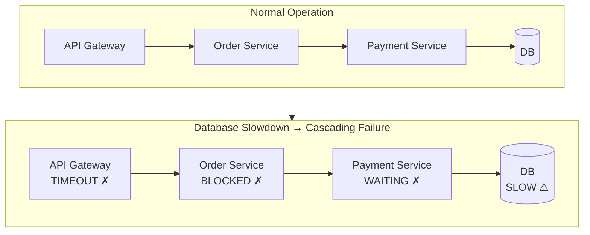
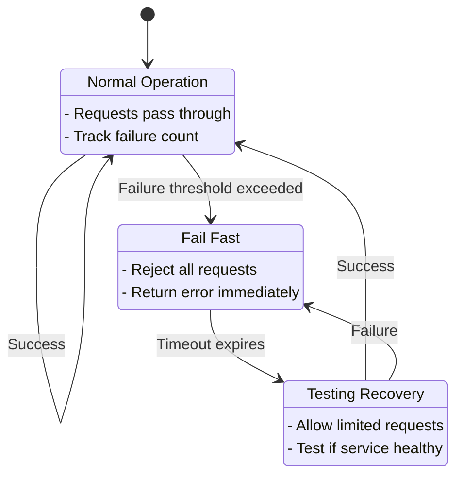
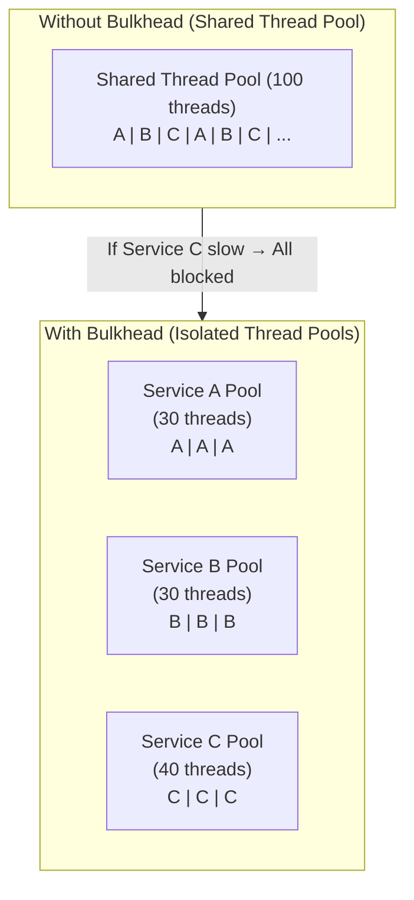
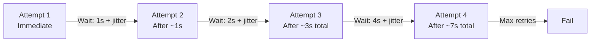
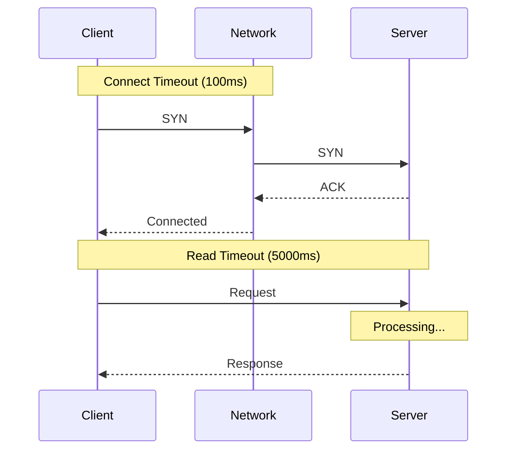
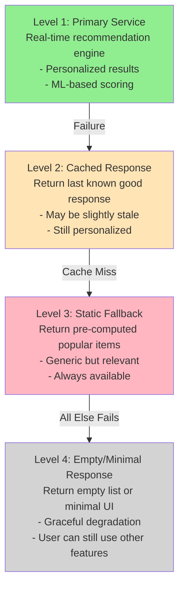

# Circuit Breaker & Resilience Patterns

## Session Overview

| Attribute | Details |
|-----------|---------|
| Duration | 60 minutes |
| Level | Intermediate to Advanced |
| Prerequisites | Microservices basics, distributed systems concepts |

## Agenda

| Time | Topic |
|------|-------|
| 0-5 min | Introduction & Why Resilience Matters |
| 5-20 min | Circuit Breaker Pattern Deep Dive |
| 20-35 min | Bulkhead, Retry & Timeout Patterns |
| 35-50 min | Fallback Strategies & Graceful Degradation |
| 50-60 min | Practical Exercise & Discussion |

## Learning Objectives

By the end of this session, you will be able to:
- Understand the circuit breaker state machine and transitions
- Implement bulkhead pattern for fault isolation
- Design effective retry strategies with exponential backoff
- Configure appropriate timeouts for different scenarios
- Build fallback mechanisms for graceful degradation

---

## 1. Why Resilience Matters

### The Cascading Failure Problem



Thread pools exhausted → All services fail!

### Resilience Patterns Overview

| Pattern | Purpose | When to Use |
|---------|---------|-------------|
| Circuit Breaker | Fail fast, prevent cascade | Downstream service failures |
| Bulkhead | Isolate failures | Resource contention |
| Retry | Handle transient failures | Network glitches, timeouts |
| Timeout | Bound wait time | Slow dependencies |
| Fallback | Graceful degradation | Any failure scenario |

---

## 2. Circuit Breaker Pattern

### State Machine



### Circuit Breaker Implementation

```java
public class CircuitBreaker {
    private final String name;
    private final int failureThreshold;
    private final long openTimeoutMs;
    private final int halfOpenMaxCalls;
    
    private CircuitState state = CircuitState.CLOSED;
    private int failureCount = 0;
    private int successCount = 0;
    private long lastFailureTime = 0;
    private int halfOpenCallCount = 0;
    
    public CircuitBreaker(String name, int failureThreshold, 
                          long openTimeoutMs, int halfOpenMaxCalls) {
        this.name = name;
        this.failureThreshold = failureThreshold;
        this.openTimeoutMs = openTimeoutMs;
        this.halfOpenMaxCalls = halfOpenMaxCalls;
    }
    
    public <T> T execute(Supplier<T> action, Supplier<T> fallback) {
        if (!allowRequest()) {
            return fallback.get();
        }
        
        try {
            T result = action.get();
            recordSuccess();
            return result;
        } catch (Exception e) {
            recordFailure();
            return fallback.get();
        }
    }
    
    private synchronized boolean allowRequest() {
        switch (state) {
            case CLOSED:
                return true;
                
            case OPEN:
                if (System.currentTimeMillis() - lastFailureTime > openTimeoutMs) {
                    transitionTo(CircuitState.HALF_OPEN);
                    return true;
                }
                return false;
                
            case HALF_OPEN:
                if (halfOpenCallCount < halfOpenMaxCalls) {
                    halfOpenCallCount++;
                    return true;
                }
                return false;
                
            default:
                return false;
        }
    }
    
    private synchronized void recordSuccess() {
        switch (state) {
            case CLOSED:
                failureCount = 0;
                break;
                
            case HALF_OPEN:
                successCount++;
                if (successCount >= halfOpenMaxCalls) {
                    transitionTo(CircuitState.CLOSED);
                }
                break;
        }
    }
    
    private synchronized void recordFailure() {
        lastFailureTime = System.currentTimeMillis();
        
        switch (state) {
            case CLOSED:
                failureCount++;
                if (failureCount >= failureThreshold) {
                    transitionTo(CircuitState.OPEN);
                }
                break;
                
            case HALF_OPEN:
                transitionTo(CircuitState.OPEN);
                break;
        }
    }
    
    private void transitionTo(CircuitState newState) {
        CircuitState oldState = this.state;
        this.state = newState;
        this.failureCount = 0;
        this.successCount = 0;
        this.halfOpenCallCount = 0;
        
        log.info("Circuit breaker '{}' transitioned: {} -> {}", 
                 name, oldState, newState);
    }
}

enum CircuitState {
    CLOSED, OPEN, HALF_OPEN
}
```

### Using Resilience4j

```java
// Configuration
CircuitBreakerConfig config = CircuitBreakerConfig.custom()
    .failureRateThreshold(50)                    // 50% failure rate
    .waitDurationInOpenState(Duration.ofSeconds(30))
    .slidingWindowType(SlidingWindowType.COUNT_BASED)
    .slidingWindowSize(10)                       // Last 10 calls
    .minimumNumberOfCalls(5)                     // Min calls before calculating
    .permittedNumberOfCallsInHalfOpenState(3)
    .automaticTransitionFromOpenToHalfOpenEnabled(true)
    .build();

CircuitBreaker circuitBreaker = CircuitBreaker.of("paymentService", config);

// Usage with decorator
Supplier<Payment> decoratedSupplier = CircuitBreaker
    .decorateSupplier(circuitBreaker, () -> paymentService.process(order));

Try<Payment> result = Try.ofSupplier(decoratedSupplier)
    .recover(CallNotPermittedException.class, e -> fallbackPayment());
```

---

## 3. Bulkhead Pattern

### Thread Pool Isolation



**Without Bulkhead:** If Service C is slow → All threads blocked → A & B fail!

**With Bulkhead:** If Service C is slow → Only C's pool affected → A & B OK!

### Bulkhead Implementation

```java
// Resilience4j Bulkhead Configuration
BulkheadConfig bulkheadConfig = BulkheadConfig.custom()
    .maxConcurrentCalls(25)           // Max concurrent calls
    .maxWaitDuration(Duration.ofMillis(500))  // Wait time for permit
    .build();

Bulkhead bulkhead = Bulkhead.of("paymentService", bulkheadConfig);

// Thread Pool Bulkhead (for async operations)
ThreadPoolBulkheadConfig threadPoolConfig = ThreadPoolBulkheadConfig.custom()
    .maxThreadPoolSize(10)
    .coreThreadPoolSize(5)
    .queueCapacity(100)
    .keepAliveDuration(Duration.ofMillis(100))
    .build();

ThreadPoolBulkhead threadPoolBulkhead = 
    ThreadPoolBulkhead.of("paymentService", threadPoolConfig);

// Usage
Supplier<Payment> decoratedSupplier = Bulkhead
    .decorateSupplier(bulkhead, () -> paymentService.process(order));
```

### Semaphore-Based Bulkhead

```java
public class SemaphoreBulkhead {
    private final Semaphore semaphore;
    private final String name;
    private final long maxWaitMs;
    
    public SemaphoreBulkhead(String name, int maxConcurrent, long maxWaitMs) {
        this.name = name;
        this.semaphore = new Semaphore(maxConcurrent);
        this.maxWaitMs = maxWaitMs;
    }
    
    public <T> T execute(Supplier<T> action) throws BulkheadFullException {
        boolean acquired = false;
        try {
            acquired = semaphore.tryAcquire(maxWaitMs, TimeUnit.MILLISECONDS);
            if (!acquired) {
                throw new BulkheadFullException(
                    "Bulkhead '" + name + "' is full"
                );
            }
            return action.get();
        } catch (InterruptedException e) {
            Thread.currentThread().interrupt();
            throw new BulkheadFullException("Interrupted waiting for bulkhead");
        } finally {
            if (acquired) {
                semaphore.release();
            }
        }
    }
}
```


---

## 4. Retry Pattern

### Exponential Backoff with Jitter



**Formula:** `delay = min(base * 2^attempt + random_jitter, max)`

### Why Jitter Matters

```mermaid
gantt
    title Without Jitter (Thundering Herd)
    dateFormat X
    axisFormat %s
    
    section Client 1
    Retry 1    :0, 1
    Retry 2    :5, 1
    Retry 3    :10, 1
    
    section Client 2
    Retry 1    :0, 1
    Retry 2    :5, 1
    Retry 3    :10, 1
    
    section Client 3
    Retry 1    :0, 1
    Retry 2    :5, 1
    Retry 3    :10, 1
```



**Without Jitter:** All clients retry together → Server overwhelmed!

```mermaid
gantt
    title With Jitter (Spread Load)
    dateFormat X
    axisFormat %s
    
    section Client 1
    Retry 1    :0, 1
    Retry 2    :4, 1
    Retry 3    :9, 1
    
    section Client 2
    Retry 1    :1, 1
    Retry 2    :6, 1
    Retry 3    :11, 1
    
    section Client 3
    Retry 1    :2, 1
    Retry 2    :7, 1
    Retry 3    :13, 1
```



**With Jitter:** Retries spread out → Server can recover

### Retry Implementation

```java
public class RetryWithBackoff {
    private final int maxRetries;
    private final long baseDelayMs;
    private final long maxDelayMs;
    private final Set<Class<? extends Exception>> retryableExceptions;
    
    public RetryWithBackoff(int maxRetries, long baseDelayMs, long maxDelayMs) {
        this.maxRetries = maxRetries;
        this.baseDelayMs = baseDelayMs;
        this.maxDelayMs = maxDelayMs;
        this.retryableExceptions = Set.of(
            IOException.class,
            TimeoutException.class,
            ServiceUnavailableException.class
        );
    }
    
    public <T> T execute(Supplier<T> action) throws Exception {
        Exception lastException = null;
        
        for (int attempt = 0; attempt <= maxRetries; attempt++) {
            try {
                return action.get();
            } catch (Exception e) {
                lastException = e;
                
                if (!isRetryable(e) || attempt == maxRetries) {
                    throw e;
                }
                
                long delay = calculateDelay(attempt);
                log.warn("Attempt {} failed, retrying in {}ms: {}", 
                         attempt + 1, delay, e.getMessage());
                Thread.sleep(delay);
            }
        }
        
        throw lastException;
    }
    
    private long calculateDelay(int attempt) {
        // Exponential backoff: base * 2^attempt
        long exponentialDelay = baseDelayMs * (1L << attempt);
        
        // Add jitter: random value between 0 and delay
        long jitter = ThreadLocalRandom.current().nextLong(exponentialDelay / 2);
        
        // Cap at max delay
        return Math.min(exponentialDelay + jitter, maxDelayMs);
    }
    
    private boolean isRetryable(Exception e) {
        return retryableExceptions.stream()
            .anyMatch(clazz -> clazz.isInstance(e));
    }
}

// Using Resilience4j Retry
RetryConfig retryConfig = RetryConfig.custom()
    .maxAttempts(3)
    .waitDuration(Duration.ofMillis(500))
    .intervalFunction(IntervalFunction.ofExponentialBackoff(
        Duration.ofMillis(500),  // Initial interval
        2.0,                      // Multiplier
        Duration.ofSeconds(10)   // Max interval
    ))
    .retryOnException(e -> e instanceof IOException)
    .ignoreExceptions(BusinessException.class)
    .build();

Retry retry = Retry.of("paymentService", retryConfig);
```

### Retry Strategy Comparison

| Strategy | Formula | Use Case |
|----------|---------|----------|
| Fixed Delay | `delay = constant` | Simple scenarios, low traffic |
| Linear Backoff | `delay = base * attempt` | Gradual increase |
| Exponential Backoff | `delay = base * 2^attempt` | Standard for distributed systems |
| Exponential + Jitter | `delay = base * 2^attempt + random` | High concurrency scenarios |
| Decorrelated Jitter | `delay = random(base, prev_delay * 3)` | AWS recommended approach |

---

## 5. Timeout Pattern

### Types of Timeouts



**Connection Timeout:** Time to establish TCP connection
**Read/Socket Timeout:** Time to receive response after sending
**Request Timeout:** Total time for entire operation

### Timeout Configuration

```java
// HTTP Client Timeouts
HttpClient httpClient = HttpClient.newBuilder()
    .connectTimeout(Duration.ofSeconds(2))
    .build();

HttpRequest request = HttpRequest.newBuilder()
    .uri(URI.create("https://api.example.com/payment"))
    .timeout(Duration.ofSeconds(5))  // Request timeout
    .build();

// RestTemplate Configuration
@Bean
public RestTemplate restTemplate() {
    HttpComponentsClientHttpRequestFactory factory = 
        new HttpComponentsClientHttpRequestFactory();
    factory.setConnectTimeout(2000);      // Connection timeout
    factory.setReadTimeout(5000);         // Read timeout
    
    return new RestTemplate(factory);
}

// WebClient Configuration
@Bean
public WebClient webClient() {
    HttpClient httpClient = HttpClient.create()
        .option(ChannelOption.CONNECT_TIMEOUT_MILLIS, 2000)
        .responseTimeout(Duration.ofSeconds(5))
        .doOnConnected(conn -> conn
            .addHandlerLast(new ReadTimeoutHandler(5))
            .addHandlerLast(new WriteTimeoutHandler(5)));
    
    return WebClient.builder()
        .clientConnector(new ReactorClientHttpConnector(httpClient))
        .build();
}

// Resilience4j TimeLimiter
TimeLimiterConfig timeLimiterConfig = TimeLimiterConfig.custom()
    .timeoutDuration(Duration.ofSeconds(3))
    .cancelRunningFuture(true)
    .build();

TimeLimiter timeLimiter = TimeLimiter.of("paymentService", timeLimiterConfig);
```

### Timeout Guidelines

| Service Type | Connect Timeout | Read Timeout | Notes |
|--------------|-----------------|--------------|-------|
| Internal APIs | 100-500ms | 1-5s | Low latency expected |
| External APIs | 1-2s | 5-30s | Higher variability |
| Database | 1-2s | 5-30s | Depends on query complexity |
| Cache (Redis) | 100ms | 500ms-1s | Should be fast |
| Message Queue | 1s | 5-10s | Depends on message size |

---

## 6. Fallback Strategies

### Graceful Degradation Patterns



### Fallback Implementation

```java
@Service
public class ProductRecommendationService {
    
    private final RecommendationEngine recommendationEngine;
    private final CacheService cacheService;
    private final CircuitBreaker circuitBreaker;
    
    public List<Product> getRecommendations(String userId) {
        return circuitBreaker.execute(
            () -> getPrimaryRecommendations(userId),
            () -> getFallbackRecommendations(userId)
        );
    }
    
    private List<Product> getPrimaryRecommendations(String userId) {
        // Primary: Real-time ML-based recommendations
        List<Product> recommendations = recommendationEngine.recommend(userId);
        
        // Cache for fallback
        cacheService.put("recommendations:" + userId, recommendations, 
                        Duration.ofHours(1));
        
        return recommendations;
    }
    
    private List<Product> getFallbackRecommendations(String userId) {
        // Level 1: Try cached personalized recommendations
        Optional<List<Product>> cached = cacheService.get(
            "recommendations:" + userId, 
            new TypeReference<List<Product>>() {}
        );
        
        if (cached.isPresent()) {
            log.info("Returning cached recommendations for user {}", userId);
            return cached.get();
        }
        
        // Level 2: Try category-based popular items
        String userCategory = getUserCategory(userId);
        Optional<List<Product>> categoryPopular = cacheService.get(
            "popular:" + userCategory,
            new TypeReference<List<Product>>() {}
        );
        
        if (categoryPopular.isPresent()) {
            log.info("Returning category popular items for user {}", userId);
            return categoryPopular.get();
        }
        
        // Level 3: Return global popular items
        log.warn("Returning global fallback for user {}", userId);
        return getGlobalPopularItems();
    }
    
    @Cacheable("global-popular")
    public List<Product> getGlobalPopularItems() {
        // Pre-computed list of globally popular items
        return productRepository.findTopByOrderBySalesDesc(20);
    }
}
```

### Combining All Patterns

```java
@Service
public class ResilientPaymentService {
    
    private final CircuitBreaker circuitBreaker;
    private final Bulkhead bulkhead;
    private final Retry retry;
    private final TimeLimiter timeLimiter;
    
    @PostConstruct
    public void init() {
        // Circuit Breaker: 50% failure rate opens circuit
        circuitBreaker = CircuitBreaker.of("payment", CircuitBreakerConfig.custom()
            .failureRateThreshold(50)
            .waitDurationInOpenState(Duration.ofSeconds(30))
            .slidingWindowSize(10)
            .build());
        
        // Bulkhead: Max 20 concurrent calls
        bulkhead = Bulkhead.of("payment", BulkheadConfig.custom()
            .maxConcurrentCalls(20)
            .maxWaitDuration(Duration.ofMillis(500))
            .build());
        
        // Retry: 3 attempts with exponential backoff
        retry = Retry.of("payment", RetryConfig.custom()
            .maxAttempts(3)
            .intervalFunction(IntervalFunction.ofExponentialBackoff(
                Duration.ofMillis(100), 2.0))
            .retryExceptions(IOException.class, TimeoutException.class)
            .build());
        
        // Timeout: 5 second limit
        timeLimiter = TimeLimiter.of("payment", TimeLimiterConfig.custom()
            .timeoutDuration(Duration.ofSeconds(5))
            .build());
    }
    
    public PaymentResult processPayment(PaymentRequest request) {
        // Compose decorators: Bulkhead → CircuitBreaker → Retry → TimeLimiter
        Supplier<PaymentResult> decoratedSupplier = Decorators
            .ofSupplier(() -> paymentGateway.process(request))
            .withBulkhead(bulkhead)
            .withCircuitBreaker(circuitBreaker)
            .withRetry(retry)
            .withTimeLimiter(timeLimiter, executorService)
            .withFallback(Arrays.asList(
                TimeoutException.class,
                BulkheadFullException.class,
                CallNotPermittedException.class
            ), e -> handleFallback(request, e))
            .decorate();
        
        return Try.ofSupplier(decoratedSupplier)
            .getOrElseThrow(e -> new PaymentException("Payment failed", e));
    }
    
    private PaymentResult handleFallback(PaymentRequest request, Throwable e) {
        log.error("Payment failed, executing fallback: {}", e.getMessage());
        
        // Queue for async processing
        paymentQueue.enqueue(request);
        
        return PaymentResult.builder()
            .status(PaymentStatus.PENDING)
            .message("Payment queued for processing")
            .build();
    }
}
```

---

## Key Takeaways

1. **Circuit Breaker** prevents cascading failures by failing fast when a service is unhealthy
2. **Bulkhead** isolates failures by limiting concurrent access to resources
3. **Retry with backoff** handles transient failures while avoiding thundering herd
4. **Timeouts** bound wait times and prevent resource exhaustion
5. **Fallback strategies** provide graceful degradation when primary services fail
6. **Combine patterns** for comprehensive resilience (order matters: Bulkhead → Circuit Breaker → Retry → Timeout)

---

## Practical Exercise

### Scenario: Build a Resilient Product Service

Design and implement a resilient product service that:

1. Fetches product details from an external inventory API
2. Gets pricing from a pricing service
3. Retrieves reviews from a review service

**Requirements:**
- Circuit breaker with 50% failure threshold
- Bulkhead limiting to 10 concurrent calls per downstream service
- Retry with exponential backoff (max 3 attempts)
- 3-second timeout for each service call
- Fallback to cached data when services fail

**Starter Code:**

```java
@Service
public class ProductService {
    
    // TODO: Add resilience patterns
    
    public ProductDetails getProduct(String productId) {
        // Fetch from multiple services
        Inventory inventory = inventoryService.getInventory(productId);
        Price price = pricingService.getPrice(productId);
        List<Review> reviews = reviewService.getReviews(productId);
        
        return ProductDetails.builder()
            .productId(productId)
            .inventory(inventory)
            .price(price)
            .reviews(reviews)
            .build();
    }
}
```

**Discussion Questions:**
1. How would you handle partial failures (e.g., reviews fail but inventory succeeds)?
2. What metrics would you monitor to tune the circuit breaker thresholds?
3. How would you test the resilience patterns in a staging environment?
