# Circuit Breaker & Resilience Patterns: A Comprehensive Guide

## Table of Contents

1. [Introduction: Why Resilience Matters](#1-introduction-why-resilience-matters)
2. [The Problem: Cascading Failures](#2-the-problem-cascading-failures)
3. [Circuit Breaker Pattern](#3-circuit-breaker-pattern)
4. [Bulkhead Pattern](#4-bulkhead-pattern)
5. [Retry Pattern](#5-retry-pattern)
6. [Timeout Pattern](#6-timeout-pattern)
7. [Fallback Strategies](#7-fallback-strategies)
8. [Real-World Case Studies](#8-real-world-case-studies)
9. [Combining Patterns](#9-combining-patterns)
10. [Key Takeaways](#10-key-takeaways)

---

## 1. Introduction: Why Resilience Matters

### The Reality of Distributed Systems

In modern distributed systems, failure is not a question of "if" but "when." Every network call, every database query, every external API interaction is a potential point of failure. As systems grow more complex with microservices architectures, the probability of something going wrong increases exponentially.

**Key Statistics:**
- A system with 30 dependencies, each with 99.99% uptime, has only 99.7% uptime overall
- The average cost of IT downtime is $5,600 per minute (Gartner)
- 98% of organizations say a single hour of downtime costs over $100,000

### What is Resilience?

Resilience is the ability of a system to:
- **Anticipate** potential failures before they occur
- **Withstand** failures when they happen
- **Recover** quickly from failures
- **Adapt** to prevent similar failures in the future

Think of resilience like the immune system of your application. A healthy immune system doesn't prevent all illnesses, but it limits their spread and helps the body recover quickly.

### The Cost of Ignoring Resilience

Without proper resilience patterns:

| Impact Area | Consequence |
|-------------|-------------|
| User Experience | Slow responses, timeouts, error pages |
| Revenue | Lost sales, abandoned transactions |
| Reputation | Customer trust erosion, negative reviews |
| Operations | Alert fatigue, firefighting mode |
| Resources | Wasted compute, memory leaks, thread exhaustion |

---

## 2. The Problem: Cascading Failures

### Understanding Cascading Failures

A cascading failure occurs when the failure of one component triggers failures in other components, creating a domino effect that can bring down an entire system.

~~~mermaid
flowchart TB
    subgraph Stage1["Stage 1: Initial Problem"]
        DB1[("Database<br/>Slow queries")]
    end
    
    subgraph Stage2["Stage 2: Propagation"]
        S1["Service A<br/>Threads waiting"]
        S2["Service B<br/>Connections pooled"]
        S3["Service C<br/>Requests queued"]
    end
    
    subgraph Stage3["Stage 3: System-Wide Impact"]
        GW["API Gateway<br/>TIMEOUT"]
        LB["Load Balancer<br/>Health checks failing"]
        U["Users<br/>Errors everywhere"]
    end
    
    DB1 --> S1
    DB1 --> S2
    DB1 --> S3
    S1 --> GW
    S2 --> GW
    S3 --> GW
    GW --> LB
    LB --> U
~~~

### The Anatomy of a Cascading Failure

**Step 1: The Trigger**
A single component starts experiencing issues—perhaps a database becomes slow due to a complex query, or an external API becomes unresponsive.

**Step 2: Resource Exhaustion**
Services waiting for the slow component begin consuming resources:
- Threads are blocked waiting for responses
- Connection pools fill up
- Memory increases as requests queue

**Step 3: Backpressure**
As one service becomes slow, upstream services also slow down:
- Timeouts are exceeded
- Retry storms begin
- More threads are consumed

**Step 4: Complete Failure**
Eventually, the entire system becomes unresponsive:
- All thread pools exhausted
- Memory limits reached
- Health checks fail
- Load balancers mark instances as unhealthy

### Real-World Analogy: The Traffic Jam

Imagine a highway system:

~~~mermaid
flowchart LR
    subgraph Normal["Normal Traffic Flow"]
        A1["Highway A"] --> I1["Intersection"]
        B1["Highway B"] --> I1
        I1 --> C1["Downtown"]
    end
    
    subgraph Problem["One Lane Blocked"]
        A2["Highway A"] --> I2["Intersection<br/>🚧 Blocked"]
        B2["Highway B"] --> I2
        I2 --> C2["Downtown"]
    end
    
    subgraph Cascade["Cascading Traffic Jam"]
        A3["Highway A<br/>🚗🚗🚗 Backed Up"] --> I3["Intersection<br/>🚧 Gridlock"]
        B3["Highway B<br/>🚗🚗🚗 Backed Up"] --> I3
        I3 --> C3["Downtown<br/>Empty"]
    end
~~~

When one lane is blocked at an intersection:
1. Cars start backing up on that road
2. The backup extends to connecting roads
3. Eventually, entire regions become gridlocked
4. Even roads far from the original problem are affected

The same thing happens in distributed systems!

### What Happens Without Protection?

**Scenario: E-commerce Checkout**

Your checkout service depends on:
- Inventory Service
- Payment Gateway
- Shipping Calculator
- Tax Service
- Loyalty Points Service

~~~mermaid
flowchart TB
    User["Customer<br/>Trying to checkout"] --> Checkout["Checkout Service"]
    Checkout --> Inv["Inventory ✓"]
    Checkout --> Pay["Payment Gateway<br/>⚠️ SLOW"]
    Checkout --> Ship["Shipping ✓"]
    Checkout --> Tax["Tax Service ✓"]
    Checkout --> Loyalty["Loyalty Points ✓"]
    
    Pay --> |"30 second response"| Checkout
    Checkout --> |"Timeout after 60s"| User
~~~

**Without resilience patterns:**

1. Payment gateway becomes slow (30-second responses)
2. Checkout service threads wait for payment responses
3. Thread pool exhausted after 100 concurrent users
4. New checkout requests fail immediately
5. Users can't complete purchases
6. Revenue loss: potentially thousands of dollars per minute

**The cruel irony:** Inventory, shipping, tax, and loyalty services are all working perfectly, but users can't checkout because ONE service is slow!

---

## 3. Circuit Breaker Pattern

### The Concept

The Circuit Breaker pattern is borrowed from electrical engineering. In your home, a circuit breaker protects electrical circuits from damage caused by overcurrent. When it detects a problem, it "trips" and stops the flow of electricity, preventing fires and equipment damage.

In software, a circuit breaker monitors for failures and, when a threshold is exceeded, "trips" to prevent further calls to the failing service.

### Why "Circuit Breaker"?

~~~mermaid
flowchart LR
    subgraph Electrical["Electrical Circuit Breaker"]
        E1["Power Source"] --> EB["🔌 Breaker"]
        EB --> E2["Appliances"]
        EB --> |"Overload detected"| Trip["TRIP!<br/>Power cut"]
    end
    
    subgraph Software["Software Circuit Breaker"]
        S1["Your Service"] --> SB["⚡ Circuit Breaker"]
        SB --> S2["Downstream Service"]
        SB --> |"Failures detected"| Open["OPEN!<br/>Fail fast"]
    end
~~~

### The Three States

~~~mermaid
stateDiagram-v2
    [*] --> CLOSED
    
    CLOSED: 🟢 CLOSED (Normal)
    CLOSED: Requests flow through normally
    CLOSED: Failures are counted
    CLOSED: Success resets failure count
    
    OPEN: 🔴 OPEN (Protecting)
    OPEN: All requests rejected immediately
    OPEN: Returns error or fallback
    OPEN: No calls to failing service
    OPEN: Timer running for recovery
    
    HALF_OPEN: 🟡 HALF-OPEN (Testing)
    HALF_OPEN: Limited requests allowed through
    HALF_OPEN: Testing if service recovered
    HALF_OPEN: Success → Close circuit
    HALF_OPEN: Failure → Open circuit again
    
    CLOSED --> OPEN: Failure threshold exceeded
    OPEN --> HALF_OPEN: Timeout expires
    HALF_OPEN --> CLOSED: Test requests succeed
    HALF_OPEN --> OPEN: Test requests fail
~~~

### State Descriptions

**CLOSED State (Normal Operation)**
- All requests pass through to the downstream service
- The circuit breaker monitors success and failure rates
- If failures exceed the threshold, the circuit "trips" to OPEN
- This is the healthy, normal state

**OPEN State (Failure Protection)**
- All requests are immediately rejected
- No calls are made to the failing service
- Errors or fallback responses are returned instantly
- A timer starts counting down to the recovery attempt
- This protects both your service and the failing service

**HALF-OPEN State (Recovery Testing)**
- After the timeout, a limited number of test requests are allowed
- If these succeed, the service is considered recovered → CLOSED
- If they fail, the service is still unhealthy → OPEN
- This prevents premature closure and repeated failures

### Key Configuration Parameters

| Parameter | Description | Typical Values |
|-----------|-------------|----------------|
| Failure Threshold | Percentage or count of failures to trip | 50%, or 5 consecutive failures |
| Sliding Window | How many recent calls to consider | Last 10-100 calls, or last 60 seconds |
| Open Timeout | How long to stay open before testing | 30-60 seconds |
| Half-Open Permits | How many test requests to allow | 3-10 requests |
| Minimum Calls | Minimum calls before calculating failure rate | 5-20 calls |

### What Happens Without Circuit Breaker?

**Scenario: Payment Service Outage**

~~~mermaid
sequenceDiagram
    participant U as Users (1000s)
    participant O as Order Service
    participant P as Payment Service (DOWN)
    
    Note over P: Service is DOWN
    
    U->>O: Place Order
    O->>P: Process Payment
    Note over O: Waiting... (30s timeout)
    P-->>O: Timeout!
    O-->>U: Error after 30s
    
    U->>O: Place Order (retry)
    O->>P: Process Payment
    Note over O: Waiting... (30s timeout)
    P-->>O: Timeout!
    O-->>U: Error after 30s
    
    Note over O: Thread pool exhausted!
    Note over O: All threads waiting for Payment
    
    U->>O: Place Order
    O-->>U: Service Unavailable (immediate)
~~~

**Problems:**
1. Each request waits 30 seconds before failing
2. Users experience terrible latency
3. Thread pools fill up with waiting requests
4. Eventually, Order Service can't handle ANY requests
5. Even inventory queries (unrelated to payment) fail

**With Circuit Breaker:**

~~~mermaid
sequenceDiagram
    participant U as Users
    participant O as Order Service
    participant CB as Circuit Breaker
    participant P as Payment Service (DOWN)
    
    Note over CB: State: CLOSED
    
    U->>O: Place Order
    O->>CB: Process Payment
    CB->>P: Forward request
    P-->>CB: Timeout!
    CB-->>O: Failure (count: 1)
    
    Note over CB: After 5 failures...
    Note over CB: State: OPEN 🔴
    
    U->>O: Place Order
    O->>CB: Process Payment
    CB-->>O: REJECTED (immediate!)
    O-->>U: "Payment unavailable, try later" (50ms)
    
    Note over O: Threads freed immediately
    Note over O: Can still serve other requests
~~~

**Benefits:**
1. Failures are detected and responded to in milliseconds
2. Users get immediate feedback
3. Thread pools stay healthy
4. Other functionality continues working
5. The failing service gets time to recover

### Real-World Example: Netflix

Netflix pioneered the circuit breaker pattern with their Hystrix library (now in maintenance mode, succeeded by Resilience4j).

**The Problem Netflix Faced:**
- Netflix has hundreds of microservices
- During peak hours, millions of users stream simultaneously
- A single slow service could take down the entire platform

**Their Solution:**
- Every service-to-service call wrapped in a circuit breaker
- Aggressive timeouts (often under 1 second)
- Fallback to cached data or degraded functionality
- Real-time monitoring of circuit states

**Result:**
- Even when services fail, users can still browse and watch
- Recommendations might be stale, but the core experience works
- The platform stays up even during partial outages

### Circuit Breaker vs. Simple Retry

| Aspect | Simple Retry | Circuit Breaker |
|--------|--------------|-----------------|
| Failed Service Load | Increases (retry storms) | Decreases (requests blocked) |
| Response Time | Slow (waits for timeouts) | Fast (fails immediately) |
| Resource Usage | High (threads blocked) | Low (immediate rejection) |
| Recovery Detection | None | Automatic (half-open state) |
| Cascade Prevention | No | Yes |

---

## 4. Bulkhead Pattern

### The Concept

The Bulkhead pattern is named after the compartmentalized sections in a ship's hull. If one compartment is breached and floods, the bulkheads prevent water from flooding the entire ship, keeping it afloat.

In software, bulkheads isolate different parts of your system so that a failure in one area doesn't consume all resources and bring down everything.

~~~mermaid
flowchart TB
    subgraph Ship["Ship Without Bulkheads"]
        W1["Water floods entire hull"]
        W1 --> Sink["Ship Sinks 🚢💀"]
    end
    
    subgraph ShipBulk["Ship With Bulkheads"]
        B1["Compartment 1<br/>💧 Flooded"]
        B2["Compartment 2<br/>✓ Dry"]
        B3["Compartment 3<br/>✓ Dry"]
        B4["Compartment 4<br/>✓ Dry"]
        Float["Ship Stays Afloat 🚢✓"]
    end
~~~

### Types of Bulkheads

**1. Thread Pool Isolation**
Each downstream service gets its own dedicated thread pool.

~~~mermaid
flowchart TB
    subgraph Without["Without Bulkhead"]
        Shared["Shared Thread Pool<br/>(100 threads total)"]
        Shared --> SA1["Service A calls"]
        Shared --> SB1["Service B calls"]
        Shared --> SC1["Service C calls<br/>⚠️ SLOW"]
        
        Note1["If C is slow, all 100 threads<br/>get stuck waiting for C!"]
    end
    
    subgraph With["With Bulkhead"]
        PA["Pool A<br/>(30 threads)"]
        PB["Pool B<br/>(30 threads)"]
        PC["Pool C<br/>(40 threads)"]
        
        PA --> SA2["Service A ✓"]
        PB --> SB2["Service B ✓"]
        PC --> SC2["Service C ⚠️"]
        
        Note2["C is slow, but only its<br/>40 threads are affected!"]
    end
~~~

**2. Semaphore Isolation**
Limits the number of concurrent calls to each service without dedicated threads.

**3. Connection Pool Isolation**
Separate database or HTTP connection pools for different operations.

### What Happens Without Bulkhead?

**Scenario: Multi-Tenant SaaS Platform**

Your platform serves multiple customers:
- Customer A: 10,000 users, normal usage
- Customer B: 5,000 users, normal usage
- Customer C: 100 users, but running expensive analytics queries

~~~mermaid
flowchart TB
    subgraph Problem["Without Bulkhead"]
        CA["Customer A<br/>10,000 users"]
        CB["Customer B<br/>5,000 users"]
        CC["Customer C<br/>100 users"]
        
        CA --> Pool["Shared Connection Pool<br/>(100 connections)"]
        CB --> Pool
        CC --> Pool
        
        Pool --> DB[("Database")]
        
        Note["Customer C's heavy queries<br/>exhaust all 100 connections!<br/>A and B can't access DB!"]
    end
~~~

**Without bulkhead:**
1. Customer C runs heavy analytics
2. Their queries take 30+ seconds each
3. All 100 database connections are occupied
4. Customers A and B can't access the database
5. 15,000 users affected by 100 users' actions!

**With bulkhead:**
- Each customer tier gets dedicated connection quota
- Customer C's heavy usage only affects their quota
- Customers A and B continue operating normally

### Bulkhead Sizing Guidelines

| Resource Type | Sizing Strategy |
|---------------|-----------------|
| Thread Pools | Based on expected concurrency + buffer (e.g., 99th percentile × 1.5) |
| Connection Pools | Based on downstream service capacity |
| Semaphores | Based on acceptable concurrent load |
| Queue Size | Based on acceptable latency (longer queue = higher latency) |

### Real-World Example: Amazon

Amazon uses bulkhead patterns extensively:

**The Cell Architecture:**
- Amazon divides their infrastructure into "cells"
- Each cell serves a subset of customers
- Failures in one cell don't affect other cells
- This is bulkhead at infrastructure level

**Per-Service Isolation:**
- Each microservice has dedicated resources
- Database connections, thread pools, memory are isolated
- A runaway service can't starve others

---

## 5. Retry Pattern

### The Concept

Retrying failed operations is intuitive—if something fails, try again. However, naive retry implementation can cause more harm than good. The retry pattern defines smart strategies for when, how often, and under what conditions to retry.

### Why Retries Are Necessary

Many failures are **transient**—temporary conditions that resolve themselves:
- Network packet loss
- Brief service restarts
- Momentary resource contention
- DNS propagation delays
- Load balancer rebalancing

These failures often succeed on the next attempt without any intervention.

### The Danger of Naive Retries

**The Thundering Herd Problem**

~~~mermaid
flowchart TB
    subgraph Before["Service Becomes Unavailable"]
        C1["Client 1"] --> S["Service"]
        C2["Client 2"] --> S
        C3["Client 3"] --> S
        C4["...100 clients"] --> S
    end
    
    subgraph After["Service Recovers + Immediate Retries"]
        C1a["Client 1<br/>RETRY!"] --> Sa["Service<br/>😱 100 requests<br/>simultaneously!"]
        C2a["Client 2<br/>RETRY!"] --> Sa
        C3a["Client 3<br/>RETRY!"] --> Sa
        C4a["...100 clients<br/>RETRY!"] --> Sa
    end
    
    Sa --> Crash["Service crashes again!"]
~~~

When a service fails and all clients retry immediately:
1. Service starts recovering
2. All waiting clients retry simultaneously
3. Service overwhelmed by sudden load spike
4. Service fails again
5. Cycle repeats

### Retry Strategies

**1. Fixed Interval**
Wait the same amount of time between each retry.
- Simple but can cause synchronized retries
- Suitable for low-traffic scenarios

**2. Linear Backoff**
Increase wait time linearly with each attempt.
- Wait 1s, then 2s, then 3s, then 4s...
- Gradual increase in spacing

**3. Exponential Backoff**
Double the wait time with each attempt.
- Wait 1s, then 2s, then 4s, then 8s...
- Quickly spreads out retries
- Industry standard approach

**4. Exponential Backoff with Jitter**
Add randomness to exponential backoff.
- Wait 1s + random, then 2s + random, then 4s + random...
- Prevents synchronized retries
- **Recommended for production systems**

~~~mermaid
flowchart LR
    subgraph NoJitter["Without Jitter"]
        A1["All clients retry at t=1s"]
        A2["All clients retry at t=3s"]
        A3["All clients retry at t=7s"]
        A1 --> A2 --> A3
    end
    
    subgraph WithJitter["With Jitter"]
        B1["Client 1: t=1.2s"]
        B2["Client 2: t=0.8s"]
        B3["Client 3: t=1.4s"]
        B4["Retries spread out!"]
    end
~~~

### Jitter Formulas

| Type | Formula | Use Case |
|------|---------|----------|
| Full Jitter | `random(0, base × 2^attempt)` | Maximum spread |
| Equal Jitter | `base × 2^attempt / 2 + random(0, base × 2^attempt / 2)` | Balance between spread and minimum wait |
| Decorrelated Jitter | `min(cap, random(base, previous × 3))` | AWS recommended |

### What to Retry (and What Not To)

**Retry These (Transient Errors):**
- Connection timeouts
- HTTP 503 Service Unavailable
- HTTP 429 Too Many Requests (with backoff)
- Network errors
- Database connection failures

**Don't Retry These (Permanent Errors):**
- HTTP 400 Bad Request
- HTTP 401 Unauthorized
- HTTP 404 Not Found
- Validation errors
- Business logic errors

### Idempotency Requirement

**Critical:** Only retry operations that are **idempotent**—operations that produce the same result regardless of how many times they're executed.

| Operation | Idempotent? | Safe to Retry? |
|-----------|-------------|----------------|
| GET /users/123 | Yes | ✓ Yes |
| PUT /users/123 (full update) | Yes | ✓ Yes |
| DELETE /users/123 | Yes | ✓ Yes |
| POST /orders (create new) | No | ⚠️ Dangerous! |
| POST /payments/charge | No | ⚠️ Could double-charge! |

**Solution for non-idempotent operations:**
- Use idempotency keys
- Check if operation already completed before retrying
- Implement exactly-once semantics

### Real-World Example: AWS SDK Retry Behavior

AWS SDKs implement sophisticated retry logic:

**Default Behavior:**
- Maximum 3 retry attempts
- Exponential backoff starting at 100ms
- Maximum backoff capped at 20 seconds
- Jitter applied to all wait times
- Automatic retry on throttling (429) errors

**Why This Matters:**
- AWS services experience occasional throttling
- Without proper retry, applications fail unnecessarily
- With proper retry + backoff, applications ride through transient issues

---

## 6. Timeout Pattern

### The Concept

A timeout defines the maximum time you're willing to wait for an operation to complete. Without timeouts, your application can hang indefinitely waiting for a response that may never come.

### Types of Timeouts

~~~mermaid
sequenceDiagram
    participant Client
    participant Network
    participant Server
    
    Note over Client,Network: Connection Timeout
    Note over Client,Network: Time to establish connection
    Client->>Network: TCP SYN
    Network->>Server: TCP SYN
    Server-->>Network: TCP ACK
    Network-->>Client: Connected!
    
    Note over Client,Server: Read/Socket Timeout
    Note over Client,Server: Time to receive response
    Client->>Server: HTTP Request
    Note over Server: Processing...
    Server-->>Client: HTTP Response
    
    Note over Client,Server: Request/Total Timeout
    Note over Client,Server: Total time for entire operation
~~~

**Connection Timeout**
- How long to wait for TCP handshake
- Typically short: 1-5 seconds
- Longer values waste resources on unreachable hosts

**Read/Socket Timeout**
- How long to wait for data after connection established
- Depends on expected operation duration
- Usually 5-30 seconds for API calls

**Request/Total Timeout**
- Total time for the entire operation
- Includes connection + all retries + processing
- Your SLA commitment to callers

### What Happens Without Timeouts?

**Scenario: Service Hangs Forever**

~~~mermaid
sequenceDiagram
    participant User
    participant Frontend
    participant Backend
    participant Database
    
    User->>Frontend: Click "Submit"
    Frontend->>Backend: POST /order
    Backend->>Database: INSERT query
    Note over Database: Table lock held by another process
    Note over Database: Waiting for lock...
    Note over Database: Still waiting...
    Note over Database: 5 minutes later...
    Note over Database: 10 minutes later...
    
    Note over Backend: Thread blocked
    Note over Backend: More requests come in
    Note over Backend: More threads blocked
    Note over Backend: Thread pool exhausted!
    
    User->>Frontend: "Why is this taking so long?"
    Note over User: Closes browser
    Note over User: But server still processing!
~~~

**Without timeouts:**
1. A database lock causes queries to hang
2. Application threads wait indefinitely
3. Thread pool slowly exhausts
4. New requests can't be processed
5. Entire application becomes unresponsive
6. Users leave, but resources still consumed

### Timeout Guidelines

| Dependency Type | Connection Timeout | Read Timeout | Notes |
|-----------------|-------------------|--------------|-------|
| Internal Microservices | 100-500ms | 1-3 seconds | Low latency expected |
| External APIs | 1-2 seconds | 5-30 seconds | Variable latency |
| Databases | 1-2 seconds | 5-30 seconds | Query complexity varies |
| Cache (Redis/Memcached) | 100-200ms | 500ms-1s | Should be very fast |
| Message Queues | 1 second | 5-10 seconds | Message size dependent |
| File Storage (S3) | 1-2 seconds | 30-60 seconds | File size dependent |

### The Timeout Calculation Problem

**Setting timeouts too short:**
- Operations fail unnecessarily
- High error rates
- User frustration

**Setting timeouts too long:**
- Resources held too long
- Cascading delays
- Poor user experience

**Best Practice: Measure and Set Based on Data**
1. Measure actual latency (p50, p95, p99)
2. Set timeout slightly above p99
3. Monitor and adjust based on real-world performance

Example:
- P50 latency: 100ms
- P95 latency: 500ms
- P99 latency: 2 seconds
- Recommended timeout: 3-5 seconds

### Timeout Propagation

In a chain of services, timeouts must be coordinated:

~~~mermaid
flowchart LR
    A["Service A<br/>Timeout: 10s"] --> B["Service B<br/>Timeout: 8s"]
    B --> C["Service C<br/>Timeout: 5s"]
    C --> D["Service D<br/>Timeout: 3s"]
~~~

**Rule:** Each service's timeout should be less than its caller's timeout minus processing time.

If Service A has 10s timeout:
- B should timeout in <8s (leaving buffer for A's processing)
- C should timeout in <5s
- D should timeout in <3s

---

## 7. Fallback Strategies

### The Concept

Fallbacks provide alternative responses when primary operations fail. Instead of showing users error messages, fallbacks deliver degraded but functional experiences.

### The Graceful Degradation Pyramid

~~~mermaid
flowchart TB
    L1["🥇 Level 1: Full Functionality<br/>Real-time, personalized, complete data"]
    L2["🥈 Level 2: Cached Data<br/>Slightly stale but still personalized"]
    L3["🥉 Level 3: Static/Default Data<br/>Generic but relevant content"]
    L4["📋 Level 4: Minimal Response<br/>Basic functionality preserved"]
    L5["❌ Level 5: Error Message<br/>Last resort - clear communication"]
    
    L1 -->|"Primary fails"| L2
    L2 -->|"Cache miss"| L3
    L3 -->|"Static unavailable"| L4
    L4 -->|"All else fails"| L5
    
    style L1 fill:#90EE90
    style L2 fill:#98FB98
    style L3 fill:#FFE4B5
    style L4 fill:#FFB6C1
    style L5 fill:#FF6B6B
~~~

### Fallback Strategies by Type

**1. Cached Fallback**
Return the last known good response.

Example: Product recommendations
- Primary: Real-time ML-based recommendations
- Fallback: Cached recommendations from last hour
- User still gets personalized content, just slightly stale

**2. Default/Static Fallback**
Return pre-configured default values.

Example: Shipping cost calculator
- Primary: Real-time calculation based on weight, distance, carrier
- Fallback: Flat rate shipping ($9.99)
- User can still complete purchase

**3. Graceful Degradation**
Remove non-essential features while keeping core functionality.

Example: Product detail page
- Primary: Full page with reviews, recommendations, inventory status
- Fallback: Basic product info without reviews
- User can still view and purchase product

**4. Queue for Later**
Accept the request and process it asynchronously.

Example: Order submission
- Primary: Synchronous order processing
- Fallback: Queue order, send confirmation, process later
- User gets order confirmation immediately

**5. Alternative Service**
Route to a backup service or provider.

Example: Payment processing
- Primary: PayPal
- Fallback: Stripe
- Transaction still completes

### Fallback Examples by Domain

| Domain | Primary | Fallback 1 | Fallback 2 |
|--------|---------|------------|------------|
| Search | Elasticsearch | Database query | Static popular items |
| Recommendations | ML Engine | User history cache | Popular items |
| Pricing | Dynamic pricing API | Cached prices | List price |
| Inventory | Real-time inventory | Cached inventory | "Check store availability" |
| Reviews | Review service | Cached reviews | Hide reviews section |
| User Profile | User service | Cached profile | Anonymous experience |

### What Happens Without Fallbacks?

**Scenario: Netflix Without Fallbacks**

Imagine Netflix's recommendation engine fails:

**Without fallbacks:**
- Users see error page
- "Unable to load recommendations"
- Users leave the platform
- Revenue impact: significant

**With fallbacks (actual Netflix approach):**
- ML recommendations unavailable → Show cached recommendations
- Cached recommendations unavailable → Show trending content
- Trending unavailable → Show static curated lists
- User can always browse and watch
- Experience degraded but functional

### Real-World Example: Amazon Product Pages

Amazon's product pages aggregate data from many services:
- Product catalog service
- Pricing service
- Inventory service
- Reviews service
- Recommendations service
- Shipping calculator

**Their approach:**
- Each component has independent fallbacks
- Page renders with available data
- Unavailable sections show placeholders or are hidden
- Core purchase functionality prioritized
- Users rarely see complete failures

---

## 8. Real-World Case Studies

### Case Study 1: Netflix and the Chaos Monkey

**The Challenge:**
- Millions of users streaming simultaneously
- Hundreds of microservices
- Single point of failure could affect millions

**The Approach:**
Netflix developed the concept of "Chaos Engineering" and created tools like Chaos Monkey that randomly terminate instances in production.

**Key Resilience Patterns Used:**
- Circuit breakers on all service calls
- Aggressive timeouts (typically <1 second)
- Fallbacks for every feature
- Bulkhead isolation between services
- Redundancy at every level

**Results:**
- Netflix maintains 99.99%+ availability
- Individual service failures don't affect users
- The platform survives AWS region outages

**Key Quote:**
> "The best way to avoid failure is to fail constantly." - Netflix Engineering

### Case Study 2: Amazon's 2017 S3 Outage

**What Happened:**
On February 28, 2017, Amazon S3 in US-East-1 experienced a major outage lasting about 4 hours.

**Impact:**
- Thousands of websites and services affected
- Services depending on S3 without fallbacks failed completely
- Services with proper resilience patterns continued operating

**Lessons Learned:**

| Services That Failed | Services That Survived |
|---------------------|------------------------|
| Direct S3 dependencies without fallbacks | Multi-region replication |
| Single-region deployments | CDN caching in front of S3 |
| No circuit breakers | Circuit breakers preventing cascade |
| Retry storms making things worse | Exponential backoff limiting load |

**Amazon's Response:**
- Improved multi-region tooling
- Better health dashboard communication
- Enhanced circuit breaker defaults in AWS SDKs

### Case Study 3: The Knight Capital Incident

**What Happened (August 1, 2012):**
Knight Capital Group lost $440 million in 45 minutes due to a software deployment issue.

**The Technical Failure:**
- Old code was accidentally reactivated
- No circuit breaker to stop runaway trades
- No timeout on trading operations
- No fallback to halt unusual activity

**What Could Have Prevented It:**
- Circuit breaker: Stop trading after unusual loss threshold
- Rate limiter: Limit trades per second
- Anomaly detection: Alert on unusual patterns
- Kill switch: Manual override capability

**Result:**
Knight Capital nearly went bankrupt and was eventually acquired. This incident is often cited as a cautionary tale for the importance of resilience patterns in critical systems.

### Case Study 4: GitHub's MySQL Incident (2012)

**What Happened:**
A routine maintenance operation on GitHub's MySQL cluster caused a cascading failure.

**The Cascade:**
1. Database maintenance caused temporary slowdown
2. Application servers waiting for database
3. Thread pools exhausted
4. Load balancer health checks failing
5. More traffic routed to fewer servers
6. Complete outage

**What They Implemented After:**
- Connection pool limits (bulkhead)
- Query timeouts
- Circuit breakers on database calls
- Graceful degradation for read operations
- Improved monitoring and alerting

**Key Learning:**
> "We learned that our systems were too tightly coupled. A slowdown in one area could bring down everything."

### Case Study 5: Shopify Black Friday/Cyber Monday

**The Challenge:**
- Traffic spikes of 10-100x normal
- Merchants depend on platform for revenue
- Downtime costs millions per minute

**Their Resilience Strategy:**

**Before the Event:**
- Load testing at 3x expected peak
- Circuit breaker tuning based on load test results
- Fallback content pre-cached
- Feature flags to disable non-essential features

**During the Event:**
- Real-time monitoring of circuit breaker states
- Automatic scaling based on load
- Graceful degradation of analytics features
- Priority queuing for checkout over browsing

**Results:**
- 99.99%+ uptime during peak shopping
- Billions of dollars in transactions processed
- Circuit breakers tripped occasionally but recovered automatically

---

## 9. Combining Patterns

### The Order Matters

When combining resilience patterns, the order of application is crucial:

~~~mermaid
flowchart LR
    Request["Incoming<br/>Request"]
    Bulk["1️⃣ Bulkhead<br/>Limit concurrency"]
    CB["2️⃣ Circuit Breaker<br/>Fail fast if open"]
    Retry["3️⃣ Retry<br/>Handle transient errors"]
    Timeout["4️⃣ Timeout<br/>Bound wait time"]
    Service["Downstream<br/>Service"]
    Fallback["Fallback<br/>Alternative response"]
    
    Request --> Bulk
    Bulk -->|"Permit acquired"| CB
    Bulk -->|"Rejected"| Fallback
    CB -->|"Closed/Half-open"| Retry
    CB -->|"Open"| Fallback
    Retry --> Timeout
    Timeout --> Service
    Service -->|"Success"| Response["Response"]
    Service -->|"Timeout/Error"| Retry
    Retry -->|"Max retries"| CB
    CB -->|"Record failure"| Fallback
~~~

### Why This Order?

**1. Bulkhead First**
- Prevents resource exhaustion before any processing
- Rejects excess load immediately
- Protects all downstream patterns

**2. Circuit Breaker Second**
- Fails fast if service is known to be unhealthy
- Prevents wasting resources on doomed requests
- Must be before retry to prevent retry storms

**3. Retry Third**
- Handles transient failures
- Works within circuit breaker monitoring
- Each retry attempt respects timeout

**4. Timeout Last (wrapping the actual call)**
- Bounds the actual service call
- Prevents indefinite waits
- Triggers retry on timeout

### Pattern Interaction Examples

**Scenario 1: Service Temporarily Slow**

~~~mermaid
sequenceDiagram
    participant Client
    participant Bulkhead
    participant CB as Circuit Breaker
    participant Retry
    participant Timeout
    participant Service
    
    Client->>Bulkhead: Request
    Bulkhead->>CB: Permit granted
    CB->>Retry: Circuit closed
    Retry->>Timeout: Attempt 1
    Timeout->>Service: Call
    Note over Service: Slow response...
    Timeout-->>Retry: Timeout!
    Retry->>Timeout: Attempt 2
    Timeout->>Service: Call
    Service-->>Timeout: Success!
    Timeout-->>Retry: OK
    Retry-->>CB: Success
    CB-->>Bulkhead: OK
    Bulkhead-->>Client: Response
~~~

**Scenario 2: Service Down, Circuit Opens**

~~~mermaid
sequenceDiagram
    participant Client
    participant CB as Circuit Breaker
    participant Retry
    participant Service
    
    Note over CB: 5 failures recorded
    Note over CB: Circuit OPENS
    
    Client->>CB: Request
    CB-->>Client: Rejected! (Circuit Open)
    Note over Client: Fallback response
    
    Note over CB: After 30 seconds...
    Note over CB: Circuit HALF-OPEN
    
    Client->>CB: Request
    CB->>Retry: Test request
    Retry->>Service: Call
    Service-->>Retry: Success!
    Retry-->>CB: OK
    Note over CB: Circuit CLOSES
~~~

### Configuration Guidelines

| Pattern | Typical Configuration | Notes |
|---------|----------------------|-------|
| Bulkhead | 10-50 concurrent calls | Based on downstream capacity |
| Circuit Breaker | 50% failure rate, 10 call window | Balance between sensitivity and stability |
| Retry | 3 attempts, exponential backoff | Don't retry non-idempotent operations |
| Timeout | P99 latency + buffer | Measure actual latency first |
| Fallback | Multiple levels | Always have a last-resort fallback |

---

## 10. Key Takeaways

### Summary of Patterns

| Pattern | Purpose | Key Benefit | Without It |
|---------|---------|-------------|------------|
| Circuit Breaker | Stop calling failing services | Prevents cascade, enables recovery | Cascading failures, resource exhaustion |
| Bulkhead | Isolate failures | Limits blast radius | One slow service affects all |
| Retry | Handle transient failures | Improved success rate | Unnecessary failures |
| Timeout | Bound wait time | Resource protection | Thread/connection exhaustion |
| Fallback | Graceful degradation | User experience preserved | Error pages, lost revenue |

### When to Use Each Pattern

~~~mermaid
flowchart TD
    Q1{"Is the operation<br/>calling another service?"}
    Q2{"Can failures<br/>cascade?"}
    Q3{"Are failures often<br/>transient?"}
    Q4{"Is response time<br/>critical?"}
    Q5{"Should users see<br/>errors?"}
    
    Q1 -->|"Yes"| Timeout["Add Timeout"]
    Q1 -->|"No"| Skip1["May not need patterns"]
    
    Timeout --> Q2
    Q2 -->|"Yes"| CB["Add Circuit Breaker"]
    Q2 -->|"No"| Q3
    
    CB --> Bulk["Add Bulkhead"]
    Bulk --> Q3
    
    Q3 -->|"Yes"| Retry["Add Retry with Backoff"]
    Q3 -->|"No"| Q4
    
    Retry --> Q4
    Q4 -->|"Yes"| Q5
    Q4 -->|"No"| Done["Configuration Complete"]
    
    Q5 -->|"No"| Fallback["Add Fallback"]
    Q5 -->|"Yes"| Done
    
    Fallback --> Done
~~~

### Implementation Checklist

**Before Implementation:**
- [ ] Identify all external dependencies
- [ ] Measure baseline latency (p50, p95, p99)
- [ ] Define SLAs for each dependency
- [ ] Determine acceptable degradation levels
- [ ] Plan fallback strategies

**During Implementation:**
- [ ] Start with timeouts (most fundamental)
- [ ] Add circuit breakers for critical dependencies
- [ ] Implement bulkheads for resource isolation
- [ ] Add retries for transient failure scenarios
- [ ] Build fallbacks for user-facing features

**After Implementation:**
- [ ] Monitor circuit breaker state changes
- [ ] Track retry rates and success
- [ ] Alert on bulkhead rejections
- [ ] Review and tune thresholds regularly
- [ ] Test failure scenarios periodically

### Final Thoughts

Resilience is not a feature you add once—it's a mindset and ongoing practice:

1. **Design for Failure:** Assume everything can fail and plan accordingly
2. **Fail Fast:** When things go wrong, fail quickly and clearly
3. **Degrade Gracefully:** Partial functionality is better than no functionality
4. **Recover Automatically:** Systems should heal without human intervention
5. **Learn from Failures:** Every incident is an opportunity to improve

> "Everything fails, all the time." - Werner Vogels, Amazon CTO

The goal isn't to prevent all failures—that's impossible. The goal is to build systems that can **withstand, recover from, and adapt to** failures while continuing to serve users.

---

## Discussion Questions

1. **Architecture Review:** What are the most critical dependencies in your current system? Do they have appropriate resilience patterns?

2. **Failure Scenarios:** What would happen if your database became slow for 5 minutes? How would users be affected?

3. **Threshold Tuning:** How would you determine the right circuit breaker threshold for a new service?

4. **Testing Strategy:** How can you test resilience patterns without affecting production users?

5. **Cost vs. Resilience:** How do you balance the cost of implementing resilience (complexity, resources) against the risk of failures?

---

## Further Reading

- **Release It!** by Michael Nygard - The definitive book on building resilient systems
- **Netflix Tech Blog** - Real-world resilience engineering stories
- **AWS Architecture Blog** - Cloud resilience patterns and best practices
- **Google SRE Book** - Site Reliability Engineering principles
- **Martin Fowler's Blog** - Pattern descriptions and explanations
# Circuit Breaker & Resilience Patterns

## Session Overview

| Attribute     | Details                                            |
| ------------- | -------------------------------------------------- |
| Duration      | 60 minutes                                         |
| Level         | Intermediate to Advanced                           |
| Prerequisites | Microservices basics, distributed systems concepts |

## Agenda

| Time      | Topic                                      |
| --------- | ------------------------------------------ |
| 0-5 min   | Introduction & Why Resilience Matters      |
| 5-20 min  | Circuit Breaker Pattern Deep Dive          |
| 20-35 min | Bulkhead, Retry & Timeout Patterns         |
| 35-50 min | Fallback Strategies & Graceful Degradation |
| 50-60 min | Practical Exercise & Discussion            |

## Learning Objectives

By the end of this session, you will be able to:
- Understand the circuit breaker state machine and transitions
- Implement bulkhead pattern for fault isolation
- Design effective retry strategies with exponential backoff
- Configure appropriate timeouts for different scenarios
- Build fallback mechanisms for graceful degradation

---

## 1. Why Resilience Matters

### The Cascading Failure Problem

```mermaid
flowchart TB
    subgraph Normal["Normal Operation"]
        direction LR
        API1["API Gateway"] --> Order1["Order Service"]
        Order1 --> Payment1["Payment Service"]
        Payment1 --> DB1[("DB")]
    end
    
    subgraph Failure["Database Slowdown → Cascading Failure"]
        direction LR
        API2["API Gateway<br/>TIMEOUT ✗"] --> Order2["Order Service<br/>BLOCKED ✗"]
        Order2 --> Payment2["Payment Service<br/>WAITING ✗"]
        Payment2 --> DB2[("DB<br/>SLOW ⚠️")]
    end
    
    Normal --> Failure
```



Thread pools exhausted → All services fail!

### Resilience Patterns Overview

| Pattern | Purpose | When to Use |
|---------|---------|-------------|
| Circuit Breaker | Fail fast, prevent cascade | Downstream service failures |
| Bulkhead | Isolate failures | Resource contention |
| Retry | Handle transient failures | Network glitches, timeouts |
| Timeout | Bound wait time | Slow dependencies |
| Fallback | Graceful degradation | Any failure scenario |

---


## 2. Circuit Breaker Pattern

### State Machine


### Circuit Breaker Implementation

```java
public class CircuitBreaker {
    private final String name;
    private final int failureThreshold;
    private final long openTimeoutMs;
    private final int halfOpenMaxCalls;
    
    private CircuitState state = CircuitState.CLOSED;
    private int failureCount = 0;
    private int successCount = 0;
    private long lastFailureTime = 0;
    private int halfOpenCallCount = 0;
    
    public CircuitBreaker(String name, int failureThreshold, 
                          long openTimeoutMs, int halfOpenMaxCalls) {
        this.name = name;
        this.failureThreshold = failureThreshold;
        this.openTimeoutMs = openTimeoutMs;
        this.halfOpenMaxCalls = halfOpenMaxCalls;
    }
    
    public <T> T execute(Supplier<T> action, Supplier<T> fallback) {
        if (!allowRequest()) {
            return fallback.get();
        }
        
        try {
            T result = action.get();
            recordSuccess();
            return result;
        } catch (Exception e) {
            recordFailure();
            return fallback.get();
        }
    }
    
    private synchronized boolean allowRequest() {
        switch (state) {
            case CLOSED:
                return true;
                
            case OPEN:
                if (System.currentTimeMillis() - lastFailureTime > openTimeoutMs) {
                    transitionTo(CircuitState.HALF_OPEN);
                    return true;
                }
                return false;
                
            case HALF_OPEN:
                if (halfOpenCallCount < halfOpenMaxCalls) {
                    halfOpenCallCount++;
                    return true;
                }
                return false;
                
            default:
                return false;
        }
    }
    
    private synchronized void recordSuccess() {
        switch (state) {
            case CLOSED:
                failureCount = 0;
                break;
                
            case HALF_OPEN:
                successCount++;
                if (successCount >= halfOpenMaxCalls) {
                    transitionTo(CircuitState.CLOSED);
                }
                break;
        }
    }
    
    private synchronized void recordFailure() {
        lastFailureTime = System.currentTimeMillis();
        
        switch (state) {
            case CLOSED:
                failureCount++;
                if (failureCount >= failureThreshold) {
                    transitionTo(CircuitState.OPEN);
                }
                break;
                
            case HALF_OPEN:
                transitionTo(CircuitState.OPEN);
                break;
        }
    }
    
    private void transitionTo(CircuitState newState) {
        CircuitState oldState = this.state;
        this.state = newState;
        this.failureCount = 0;
        this.successCount = 0;
        this.halfOpenCallCount = 0;
        
        log.info("Circuit breaker '{}' transitioned: {} -> {}", 
                 name, oldState, newState);
    }
}

enum CircuitState {
    CLOSED, OPEN, HALF_OPEN
}
```

### Using Resilience4j

```java
// Configuration
CircuitBreakerConfig config = CircuitBreakerConfig.custom()
    .failureRateThreshold(50)                    // 50% failure rate
    .waitDurationInOpenState(Duration.ofSeconds(30))
    .slidingWindowType(SlidingWindowType.COUNT_BASED)
    .slidingWindowSize(10)                       // Last 10 calls
    .minimumNumberOfCalls(5)                     // Min calls before calculating
    .permittedNumberOfCallsInHalfOpenState(3)
    .automaticTransitionFromOpenToHalfOpenEnabled(true)
    .build();

CircuitBreaker circuitBreaker = CircuitBreaker.of("paymentService", config);

// Usage with decorator
Supplier<Payment> decoratedSupplier = CircuitBreaker
    .decorateSupplier(circuitBreaker, () -> paymentService.process(order));

Try<Payment> result = Try.ofSupplier(decoratedSupplier)
    .recover(CallNotPermittedException.class, e -> fallbackPayment());
```

---

## 3. Bulkhead Pattern

### Thread Pool Isolation

```mermaid
flowchart TB
    subgraph Without["Without Bulkhead (Shared Thread Pool)"]
        SharedPool["Shared Thread Pool (100 threads)<br/>A | B | C | A | B | C | ..."]
    end
    
    subgraph With["With Bulkhead (Isolated Thread Pools)"]
        PoolA["Service A Pool<br/>(30 threads)<br/>A | A | A"]
        PoolB["Service B Pool<br/>(30 threads)<br/>B | B | B"]
        PoolC["Service C Pool<br/>(40 threads)<br/>C | C | C"]
    end
    
    Without -->|"If Service C slow → All blocked"| With
```



**Without Bulkhead:** If Service C is slow → All threads blocked → A & B fail!

**With Bulkhead:** If Service C is slow → Only C's pool affected → A & B OK!

### Bulkhead Implementation

```java
// Resilience4j Bulkhead Configuration
BulkheadConfig bulkheadConfig = BulkheadConfig.custom()
    .maxConcurrentCalls(25)           // Max concurrent calls
    .maxWaitDuration(Duration.ofMillis(500))  // Wait time for permit
    .build();

Bulkhead bulkhead = Bulkhead.of("paymentService", bulkheadConfig);

// Thread Pool Bulkhead (for async operations)
ThreadPoolBulkheadConfig threadPoolConfig = ThreadPoolBulkheadConfig.custom()
    .maxThreadPoolSize(10)
    .coreThreadPoolSize(5)
    .queueCapacity(100)
    .keepAliveDuration(Duration.ofMillis(100))
    .build();

ThreadPoolBulkhead threadPoolBulkhead = 
    ThreadPoolBulkhead.of("paymentService", threadPoolConfig);

// Usage
Supplier<Payment> decoratedSupplier = Bulkhead
    .decorateSupplier(bulkhead, () -> paymentService.process(order));
```

### Semaphore-Based Bulkhead

```java
public class SemaphoreBulkhead {
    private final Semaphore semaphore;
    private final String name;
    private final long maxWaitMs;
    
    public SemaphoreBulkhead(String name, int maxConcurrent, long maxWaitMs) {
        this.name = name;
        this.semaphore = new Semaphore(maxConcurrent);
        this.maxWaitMs = maxWaitMs;
    }
    
    public <T> T execute(Supplier<T> action) throws BulkheadFullException {
        boolean acquired = false;
        try {
            acquired = semaphore.tryAcquire(maxWaitMs, TimeUnit.MILLISECONDS);
            if (!acquired) {
                throw new BulkheadFullException(
                    "Bulkhead '" + name + "' is full"
                );
            }
            return action.get();
        } catch (InterruptedException e) {
            Thread.currentThread().interrupt();
            throw new BulkheadFullException("Interrupted waiting for bulkhead");
        } finally {
            if (acquired) {
                semaphore.release();
            }
        }
    }
}
```


---

## 4. Retry Pattern

### Exponential Backoff with Jitter


**Formula:** `delay = min(base * 2^attempt + random_jitter, max)`

### Why Jitter Matters


**Without Jitter:** All clients retry together → Server overwhelmed!


**With Jitter:** Retries spread out → Server can recover

### Retry Implementation

```java
public class RetryWithBackoff {
    private final int maxRetries;
    private final long baseDelayMs;
    private final long maxDelayMs;
    private final Set<Class<? extends Exception>> retryableExceptions;
    
    public RetryWithBackoff(int maxRetries, long baseDelayMs, long maxDelayMs) {
        this.maxRetries = maxRetries;
        this.baseDelayMs = baseDelayMs;
        this.maxDelayMs = maxDelayMs;
        this.retryableExceptions = Set.of(
            IOException.class,
            TimeoutException.class,
            ServiceUnavailableException.class
        );
    }
    
    public <T> T execute(Supplier<T> action) throws Exception {
        Exception lastException = null;
        
        for (int attempt = 0; attempt <= maxRetries; attempt++) {
            try {
                return action.get();
            } catch (Exception e) {
                lastException = e;
                
                if (!isRetryable(e) || attempt == maxRetries) {
                    throw e;
                }
                
                long delay = calculateDelay(attempt);
                log.warn("Attempt {} failed, retrying in {}ms: {}", 
                         attempt + 1, delay, e.getMessage());
                Thread.sleep(delay);
            }
        }
        
        throw lastException;
    }
    
    private long calculateDelay(int attempt) {
        // Exponential backoff: base * 2^attempt
        long exponentialDelay = baseDelayMs * (1L << attempt);
        
        // Add jitter: random value between 0 and delay
        long jitter = ThreadLocalRandom.current().nextLong(exponentialDelay / 2);
        
        // Cap at max delay
        return Math.min(exponentialDelay + jitter, maxDelayMs);
    }
    
    private boolean isRetryable(Exception e) {
        return retryableExceptions.stream()
            .anyMatch(clazz -> clazz.isInstance(e));
    }
}

// Using Resilience4j Retry
RetryConfig retryConfig = RetryConfig.custom()
    .maxAttempts(3)
    .waitDuration(Duration.ofMillis(500))
    .intervalFunction(IntervalFunction.ofExponentialBackoff(
        Duration.ofMillis(500),  // Initial interval
        2.0,                      // Multiplier
        Duration.ofSeconds(10)   // Max interval
    ))
    .retryOnException(e -> e instanceof IOException)
    .ignoreExceptions(BusinessException.class)
    .build();

Retry retry = Retry.of("paymentService", retryConfig);
```

### Retry Strategy Comparison

| Strategy | Formula | Use Case |
|----------|---------|----------|
| Fixed Delay | `delay = constant` | Simple scenarios, low traffic |
| Linear Backoff | `delay = base * attempt` | Gradual increase |
| Exponential Backoff | `delay = base * 2^attempt` | Standard for distributed systems |
| Exponential + Jitter | `delay = base * 2^attempt + random` | High concurrency scenarios |
| Decorrelated Jitter | `delay = random(base, prev_delay * 3)` | AWS recommended approach |

---

## 5. Timeout Pattern

### Types of Timeouts


**Connection Timeout:** Time to establish TCP connection
**Read/Socket Timeout:** Time to receive response after sending
**Request Timeout:** Total time for entire operation

### Timeout Configuration

```java
// HTTP Client Timeouts
HttpClient httpClient = HttpClient.newBuilder()
    .connectTimeout(Duration.ofSeconds(2))
    .build();

HttpRequest request = HttpRequest.newBuilder()
    .uri(URI.create("https://api.example.com/payment"))
    .timeout(Duration.ofSeconds(5))  // Request timeout
    .build();

// RestTemplate Configuration
@Bean
public RestTemplate restTemplate() {
    HttpComponentsClientHttpRequestFactory factory = 
        new HttpComponentsClientHttpRequestFactory();
    factory.setConnectTimeout(2000);      // Connection timeout
    factory.setReadTimeout(5000);         // Read timeout
    
    return new RestTemplate(factory);
}

// WebClient Configuration
@Bean
public WebClient webClient() {
    HttpClient httpClient = HttpClient.create()
        .option(ChannelOption.CONNECT_TIMEOUT_MILLIS, 2000)
        .responseTimeout(Duration.ofSeconds(5))
        .doOnConnected(conn -> conn
            .addHandlerLast(new ReadTimeoutHandler(5))
            .addHandlerLast(new WriteTimeoutHandler(5)));
    
    return WebClient.builder()
        .clientConnector(new ReactorClientHttpConnector(httpClient))
        .build();
}

// Resilience4j TimeLimiter
TimeLimiterConfig timeLimiterConfig = TimeLimiterConfig.custom()
    .timeoutDuration(Duration.ofSeconds(3))
    .cancelRunningFuture(true)
    .build();

TimeLimiter timeLimiter = TimeLimiter.of("paymentService", timeLimiterConfig);
```

### Timeout Guidelines

| Service Type | Connect Timeout | Read Timeout | Notes |
|--------------|-----------------|--------------|-------|
| Internal APIs | 100-500ms | 1-5s | Low latency expected |
| External APIs | 1-2s | 5-30s | Higher variability |
| Database | 1-2s | 5-30s | Depends on query complexity |
| Cache (Redis) | 100ms | 500ms-1s | Should be fast |
| Message Queue | 1s | 5-10s | Depends on message size |

---

## 6. Fallback Strategies

### Graceful Degradation Patterns


### Fallback Implementation

```java
@Service
public class ProductRecommendationService {
    
    private final RecommendationEngine recommendationEngine;
    private final CacheService cacheService;
    private final CircuitBreaker circuitBreaker;
    
    public List<Product> getRecommendations(String userId) {
        return circuitBreaker.execute(
            () -> getPrimaryRecommendations(userId),
            () -> getFallbackRecommendations(userId)
        );
    }
    
    private List<Product> getPrimaryRecommendations(String userId) {
        // Primary: Real-time ML-based recommendations
        List<Product> recommendations = recommendationEngine.recommend(userId);
        
        // Cache for fallback
        cacheService.put("recommendations:" + userId, recommendations, 
                        Duration.ofHours(1));
        
        return recommendations;
    }
    
    private List<Product> getFallbackRecommendations(String userId) {
        // Level 1: Try cached personalized recommendations
        Optional<List<Product>> cached = cacheService.get(
            "recommendations:" + userId, 
            new TypeReference<List<Product>>() {}
        );
        
        if (cached.isPresent()) {
            log.info("Returning cached recommendations for user {}", userId);
            return cached.get();
        }
        
        // Level 2: Try category-based popular items
        String userCategory = getUserCategory(userId);
        Optional<List<Product>> categoryPopular = cacheService.get(
            "popular:" + userCategory,
            new TypeReference<List<Product>>() {}
        );
        
        if (categoryPopular.isPresent()) {
            log.info("Returning category popular items for user {}", userId);
            return categoryPopular.get();
        }
        
        // Level 3: Return global popular items
        log.warn("Returning global fallback for user {}", userId);
        return getGlobalPopularItems();
    }
    
    @Cacheable("global-popular")
    public List<Product> getGlobalPopularItems() {
        // Pre-computed list of globally popular items
        return productRepository.findTopByOrderBySalesDesc(20);
    }
}
```

### Combining All Patterns

```java
@Service
public class ResilientPaymentService {
    
    private final CircuitBreaker circuitBreaker;
    private final Bulkhead bulkhead;
    private final Retry retry;
    private final TimeLimiter timeLimiter;
    
    @PostConstruct
    public void init() {
        // Circuit Breaker: 50% failure rate opens circuit
        circuitBreaker = CircuitBreaker.of("payment", CircuitBreakerConfig.custom()
            .failureRateThreshold(50)
            .waitDurationInOpenState(Duration.ofSeconds(30))
            .slidingWindowSize(10)
            .build());
        
        // Bulkhead: Max 20 concurrent calls
        bulkhead = Bulkhead.of("payment", BulkheadConfig.custom()
            .maxConcurrentCalls(20)
            .maxWaitDuration(Duration.ofMillis(500))
            .build());
        
        // Retry: 3 attempts with exponential backoff
        retry = Retry.of("payment", RetryConfig.custom()
            .maxAttempts(3)
            .intervalFunction(IntervalFunction.ofExponentialBackoff(
                Duration.ofMillis(100), 2.0))
            .retryExceptions(IOException.class, TimeoutException.class)
            .build());
        
        // Timeout: 5 second limit
        timeLimiter = TimeLimiter.of("payment", TimeLimiterConfig.custom()
            .timeoutDuration(Duration.ofSeconds(5))
            .build());
    }
    
    public PaymentResult processPayment(PaymentRequest request) {
        // Compose decorators: Bulkhead → CircuitBreaker → Retry → TimeLimiter
        Supplier<PaymentResult> decoratedSupplier = Decorators
            .ofSupplier(() -> paymentGateway.process(request))
            .withBulkhead(bulkhead)
            .withCircuitBreaker(circuitBreaker)
            .withRetry(retry)
            .withTimeLimiter(timeLimiter, executorService)
            .withFallback(Arrays.asList(
                TimeoutException.class,
                BulkheadFullException.class,
                CallNotPermittedException.class
            ), e -> handleFallback(request, e))
            .decorate();
        
        return Try.ofSupplier(decoratedSupplier)
            .getOrElseThrow(e -> new PaymentException("Payment failed", e));
    }
    
    private PaymentResult handleFallback(PaymentRequest request, Throwable e) {
        log.error("Payment failed, executing fallback: {}", e.getMessage());
        
        // Queue for async processing
        paymentQueue.enqueue(request);
        
        return PaymentResult.builder()
            .status(PaymentStatus.PENDING)
            .message("Payment queued for processing")
            .build();
    }
}
```

---

## Key Takeaways

1. **Circuit Breaker** prevents cascading failures by failing fast when a service is unhealthy
2. **Bulkhead** isolates failures by limiting concurrent access to resources
3. **Retry with backoff** handles transient failures while avoiding thundering herd
4. **Timeouts** bound wait times and prevent resource exhaustion
5. **Fallback strategies** provide graceful degradation when primary services fail
6. **Combine patterns** for comprehensive resilience (order matters: Bulkhead → Circuit Breaker → Retry → Timeout)

---

## Practical Exercise

### Scenario: Build a Resilient Product Service

Design and implement a resilient product service that:

1. Fetches product details from an external inventory API
2. Gets pricing from a pricing service
3. Retrieves reviews from a review service

**Requirements:**
- Circuit breaker with 50% failure threshold
- Bulkhead limiting to 10 concurrent calls per downstream service
- Retry with exponential backoff (max 3 attempts)
- 3-second timeout for each service call
- Fallback to cached data when services fail

**Starter Code:**

```java
@Service
public class ProductService {
    
    // TODO: Add resilience patterns
    
    public ProductDetails getProduct(String productId) {
        // Fetch from multiple services
        Inventory inventory = inventoryService.getInventory(productId);
        Price price = pricingService.getPrice(productId);
        List<Review> reviews = reviewService.getReviews(productId);
        
        return ProductDetails.builder()
            .productId(productId)
            .inventory(inventory)
            .price(price)
            .reviews(reviews)
            .build();
    }
}
```

**Discussion Questions:**
1. How would you handle partial failures (e.g., reviews fail but inventory succeeds)?
2. What metrics would you monitor to tune the circuit breaker thresholds?
3. How would you test the resilience patterns in a staging environment?
