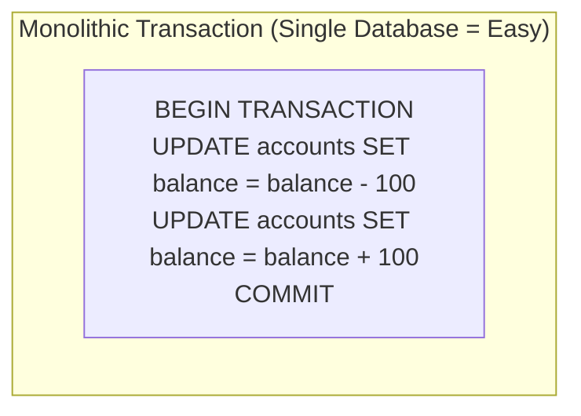
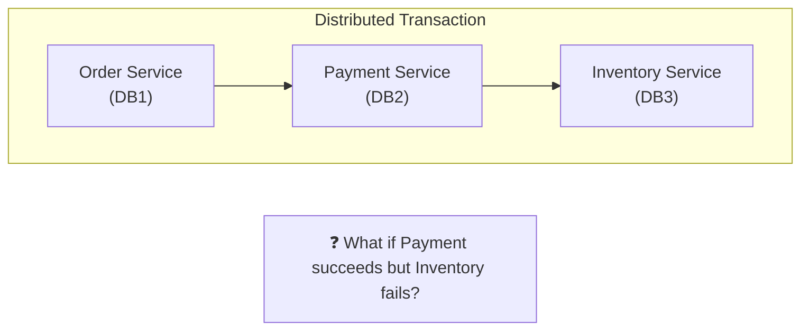
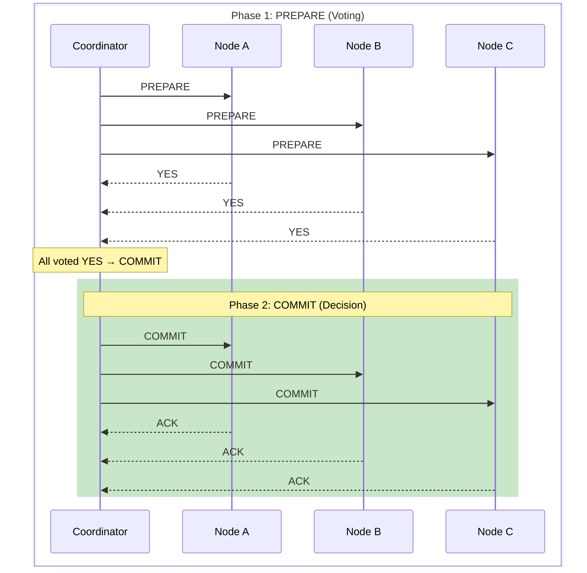
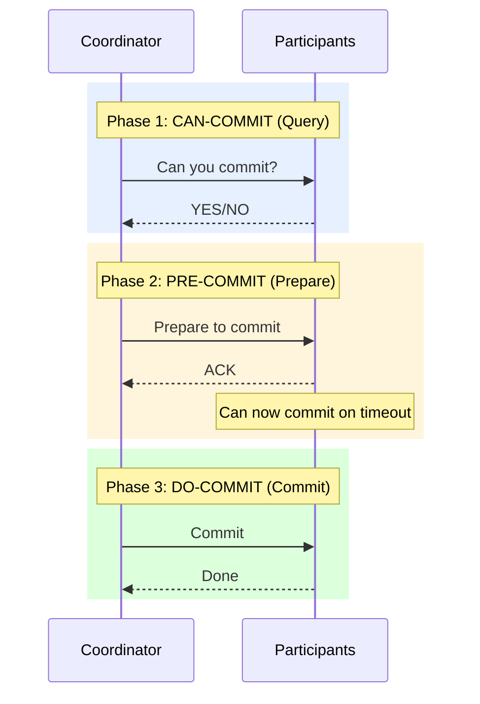
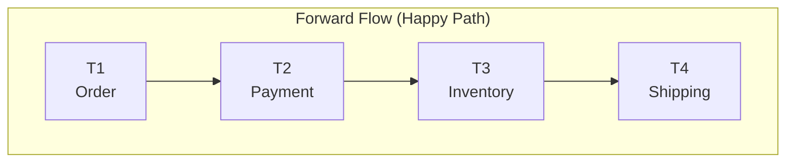
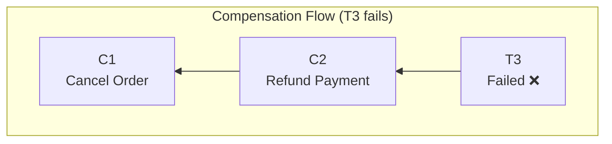
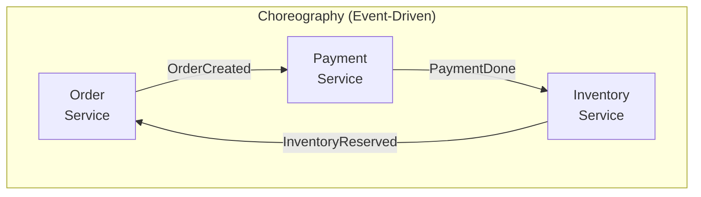
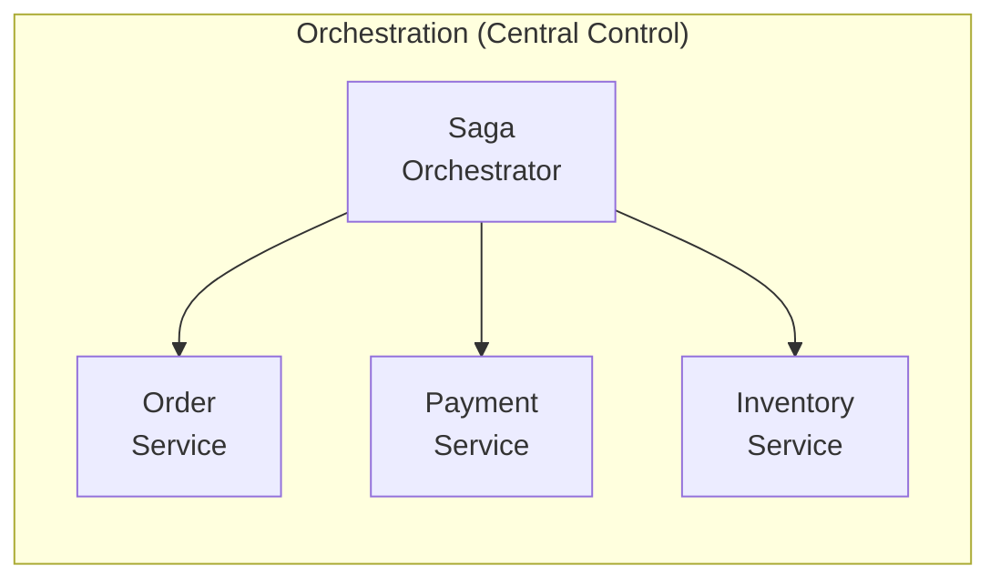
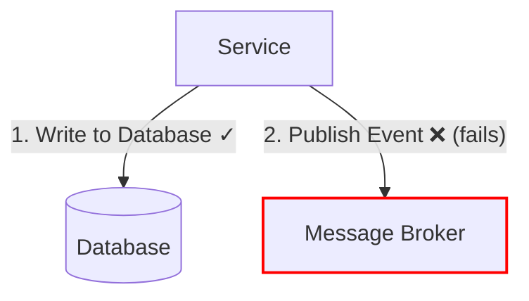
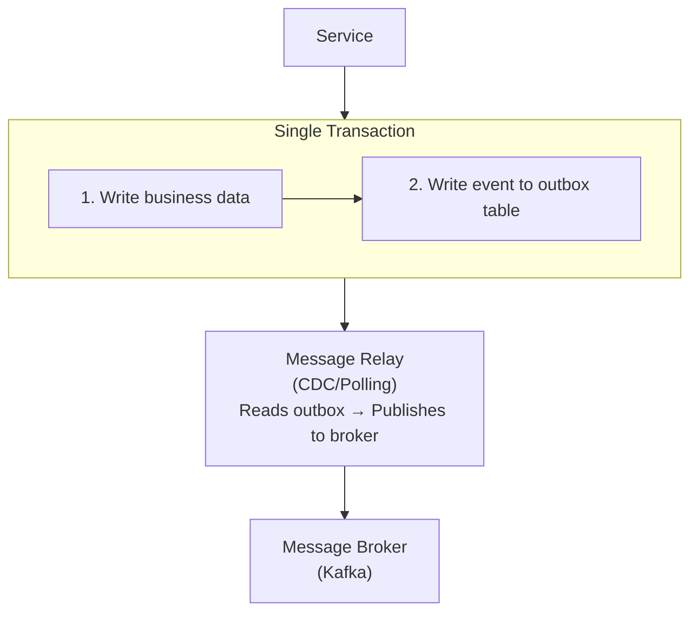

# Distributed Transactions

## Session Overview

| Attribute     | Details                                     |
| ------------- | ------------------------------------------- |
| Duration      | 60 minutes                                  |
| Level         | Intermediate to Advanced                    |
| Prerequisites | Database fundamentals, microservices basics |

## Agenda

| Time      | Topic                                             |
| --------- | ------------------------------------------------- |
| 0-5 min   | Introduction & ACID in distributed systems        |
| 5-20 min  | Two-Phase Commit (2PC) & Three-Phase Commit (3PC) |
| 20-35 min | Saga Pattern & Compensation                       |
| 35-50 min | Eventual Consistency & Outbox Pattern             |
| 50-60 min | Practical Exercise & Discussion                   |

## Learning Objectives

By the end of this session, you will be able to:
- Understand the challenges of transactions across distributed systems
- Compare 2PC, 3PC, and Saga patterns with their trade-offs
- Design compensation strategies for failed transactions
- Implement eventual consistency patterns in microservices
- Choose the right transaction pattern for different use cases

---

## 1. The Distributed Transaction Challenge

### Why Distributed Transactions Are Hard





### CAP Theorem Implications

| Property | Description | Impact on Transactions |
|----------|-------------|----------------------|
| Consistency | All nodes see same data | Strong consistency = blocking |
| Availability | System always responds | May return stale data |
| Partition Tolerance | Works despite network splits | Must choose C or A |

---

## 2. Two-Phase Commit (2PC)

### How 2PC Works



### 2PC Implementation Example

```java
public class TwoPhaseCommitCoordinator {
    private final List<TransactionParticipant> participants;
    private final TransactionLog transactionLog;
    
    public boolean executeTransaction(Transaction tx) {
        String txId = tx.getId();
        
        // Phase 1: Prepare
        transactionLog.logPrepare(txId);
        List<Boolean> votes = new ArrayList<>();
        
        for (TransactionParticipant participant : participants) {
            try {
                boolean vote = participant.prepare(tx);
                votes.add(vote);
                
                if (!vote) {
                    // Any NO vote → abort
                    return abort(txId);
                }
            } catch (Exception e) {
                // Timeout or failure → abort
                return abort(txId);
            }
        }
        
        // Phase 2: Commit (all voted YES)
        transactionLog.logCommit(txId);
        
        for (TransactionParticipant participant : participants) {
            try {
                participant.commit(txId);
            } catch (Exception e) {
                // Must retry until success (commit is durable)
                retryCommit(participant, txId);
            }
        }
        
        return true;
    }
    
    private boolean abort(String txId) {
        transactionLog.logAbort(txId);
        
        for (TransactionParticipant participant : participants) {
            try {
                participant.rollback(txId);
            } catch (Exception e) {
                // Retry rollback
                retryRollback(participant, txId);
            }
        }
        
        return false;
    }
}

public interface TransactionParticipant {
    boolean prepare(Transaction tx);  // Returns YES/NO vote
    void commit(String txId);
    void rollback(String txId);
}
```

### 2PC Problems

| Problem | Description | Impact |
|---------|-------------|--------|
| Blocking | Participants hold locks during voting | Reduced throughput |
| Coordinator Failure | Single point of failure | Participants stuck in uncertain state |
| Network Partition | Can't reach consensus | Transaction hangs |

---

## 3. Three-Phase Commit (3PC)

### 3PC Adds Pre-Commit Phase



### 2PC vs 3PC Comparison

| Aspect | 2PC | 3PC |
|--------|-----|-----|
| Phases | 2 | 3 |
| Blocking | Yes (indefinite) | Limited (timeout-based) |
| Coordinator Failure | Participants stuck | Participants can decide |
| Network Partitions | Problematic | Still problematic |
| Complexity | Lower | Higher |
| Latency | Lower | Higher |

---

## 4. Saga Pattern

### Saga: Sequence of Local Transactions





### Choreography vs Orchestration



> **Pros:** Loose coupling, no single point of failure  
> **Cons:** Hard to track, complex failure handling



> **Pros:** Easy to track, centralized logic  
> **Cons:** Single point of failure, tighter coupling


### Saga Orchestrator Implementation

```java
public class OrderSagaOrchestrator {
    private final OrderService orderService;
    private final PaymentService paymentService;
    private final InventoryService inventoryService;
    private final ShippingService shippingService;
    private final SagaStateStore stateStore;
    
    public SagaResult executeSaga(OrderRequest request) {
        String sagaId = UUID.randomUUID().toString();
        SagaState state = new SagaState(sagaId, SagaStep.ORDER_CREATED);
        
        try {
            // Step 1: Create Order
            Order order = orderService.createOrder(request);
            state.setOrderId(order.getId());
            state.setStep(SagaStep.ORDER_CREATED);
            stateStore.save(state);
            
            // Step 2: Process Payment
            PaymentResult payment = paymentService.processPayment(
                order.getId(), request.getPaymentInfo()
            );
            state.setPaymentId(payment.getId());
            state.setStep(SagaStep.PAYMENT_PROCESSED);
            stateStore.save(state);
            
            // Step 3: Reserve Inventory
            InventoryReservation reservation = inventoryService.reserve(
                order.getItems()
            );
            state.setReservationId(reservation.getId());
            state.setStep(SagaStep.INVENTORY_RESERVED);
            stateStore.save(state);
            
            // Step 4: Create Shipment
            Shipment shipment = shippingService.createShipment(order);
            state.setShipmentId(shipment.getId());
            state.setStep(SagaStep.COMPLETED);
            stateStore.save(state);
            
            return SagaResult.success(sagaId);
            
        } catch (Exception e) {
            return compensate(state, e);
        }
    }
    
    private SagaResult compensate(SagaState state, Exception cause) {
        // Compensate in reverse order
        switch (state.getStep()) {
            case INVENTORY_RESERVED:
                inventoryService.releaseReservation(state.getReservationId());
                // Fall through
            case PAYMENT_PROCESSED:
                paymentService.refund(state.getPaymentId());
                // Fall through
            case ORDER_CREATED:
                orderService.cancelOrder(state.getOrderId());
                break;
        }
        
        state.setStep(SagaStep.COMPENSATED);
        stateStore.save(state);
        
        return SagaResult.failed(state.getSagaId(), cause.getMessage());
    }
}

enum SagaStep {
    STARTED,
    ORDER_CREATED,
    PAYMENT_PROCESSED,
    INVENTORY_RESERVED,
    COMPLETED,
    COMPENSATED
}
```

### Choreography with Events

```java
// Order Service
@Service
public class OrderService {
    private final EventPublisher eventPublisher;
    
    @Transactional
    public Order createOrder(OrderRequest request) {
        Order order = orderRepository.save(new Order(request));
        
        // Publish event for next step
        eventPublisher.publish(new OrderCreatedEvent(
            order.getId(),
            order.getItems(),
            order.getTotalAmount()
        ));
        
        return order;
    }
    
    @EventListener
    public void onPaymentFailed(PaymentFailedEvent event) {
        // Compensation: cancel order
        Order order = orderRepository.findById(event.getOrderId());
        order.setStatus(OrderStatus.CANCELLED);
        orderRepository.save(order);
    }
}

// Payment Service
@Service
public class PaymentService {
    private final EventPublisher eventPublisher;
    
    @EventListener
    public void onOrderCreated(OrderCreatedEvent event) {
        try {
            Payment payment = processPayment(event);
            
            eventPublisher.publish(new PaymentCompletedEvent(
                event.getOrderId(),
                payment.getId()
            ));
        } catch (PaymentException e) {
            eventPublisher.publish(new PaymentFailedEvent(
                event.getOrderId(),
                e.getMessage()
            ));
        }
    }
}
```

---

## 5. Eventual Consistency & Outbox Pattern

### The Dual Write Problem



> **Result:** Database updated but event never published! Other services have inconsistent view.

### Transactional Outbox Pattern



### Outbox Implementation

```java
@Entity
@Table(name = "outbox_events")
public class OutboxEvent {
    @Id
    private String id;
    
    private String aggregateType;  // e.g., "Order"
    private String aggregateId;    // e.g., order ID
    private String eventType;      // e.g., "OrderCreated"
    
    @Column(columnDefinition = "TEXT")
    private String payload;        // JSON event data
    
    private Instant createdAt;
    private boolean published;
}

@Service
public class OrderService {
    private final OrderRepository orderRepository;
    private final OutboxRepository outboxRepository;
    
    @Transactional  // Single transaction!
    public Order createOrder(OrderRequest request) {
        // 1. Save business entity
        Order order = new Order(request);
        orderRepository.save(order);
        
        // 2. Save event to outbox (same transaction)
        OutboxEvent event = new OutboxEvent();
        event.setId(UUID.randomUUID().toString());
        event.setAggregateType("Order");
        event.setAggregateId(order.getId());
        event.setEventType("OrderCreated");
        event.setPayload(toJson(new OrderCreatedEvent(order)));
        event.setCreatedAt(Instant.now());
        event.setPublished(false);
        
        outboxRepository.save(event);
        
        return order;
    }
}

// Message Relay (runs separately)
@Scheduled(fixedDelay = 1000)
public void publishOutboxEvents() {
    List<OutboxEvent> events = outboxRepository
        .findByPublishedFalseOrderByCreatedAt();
    
    for (OutboxEvent event : events) {
        try {
            kafkaTemplate.send(
                event.getAggregateType(),
                event.getAggregateId(),
                event.getPayload()
            );
            
            event.setPublished(true);
            outboxRepository.save(event);
            
        } catch (Exception e) {
            // Will retry on next poll
            log.error("Failed to publish event: {}", event.getId(), e);
        }
    }
}
```

### Change Data Capture (CDC) with Debezium

```yaml
# Debezium connector configuration
{
  "name": "outbox-connector",
  "config": {
    "connector.class": "io.debezium.connector.postgresql.PostgresConnector",
    "database.hostname": "postgres",
    "database.port": "5432",
    "database.user": "debezium",
    "database.password": "secret",
    "database.dbname": "orders",
    "table.include.list": "public.outbox_events",
    "transforms": "outbox",
    "transforms.outbox.type": "io.debezium.transforms.outbox.EventRouter",
    "transforms.outbox.route.topic.replacement": "${routedByValue}",
    "transforms.outbox.table.field.event.key": "aggregate_id",
    "transforms.outbox.table.field.event.payload": "payload"
  }
}
```

---

## 6. Comparison of Approaches

| Aspect | 2PC | Saga | Eventual Consistency |
|--------|-----|------|---------------------|
| Consistency | Strong | Eventual | Eventual |
| Isolation | Full | None (dirty reads possible) | None |
| Latency | High (blocking) | Medium | Low |
| Complexity | Medium | High | Medium |
| Scalability | Low | High | High |
| Failure Handling | Automatic rollback | Compensation logic | Idempotent handlers |
| Use Case | Financial systems | E-commerce, booking | Social media, analytics |

---

## Key Takeaways

1. **2PC provides strong consistency** but blocks and doesn't scale well
2. **Sagas trade consistency for availability** using compensation
3. **Choreography is loosely coupled** but hard to track and debug
4. **Orchestration centralizes logic** but creates a single point of failure
5. **Outbox pattern solves dual-write** by using a single transaction
6. **CDC (Debezium) is more reliable** than polling for outbox relay
7. **Design for idempotency** - messages may be delivered multiple times
8. **Choose based on requirements** - not all systems need strong consistency

---

## Practical Exercise

Design a distributed transaction strategy for an e-commerce order flow:

**Requirements:**
- Order creation, payment processing, inventory reservation, shipping
- Payment failures should cancel the order
- Inventory failures should refund payment and cancel order
- System should handle partial failures gracefully

**Tasks:**
1. Draw the saga flow with compensation steps
2. Decide between choreography and orchestration (justify your choice)
3. Implement the outbox pattern for reliable event publishing
4. Handle idempotency for payment processing

**Discussion Points:**
- What happens if compensation fails?
- How do you handle long-running transactions (e.g., shipping takes days)?
- How do you provide transaction status to users?
