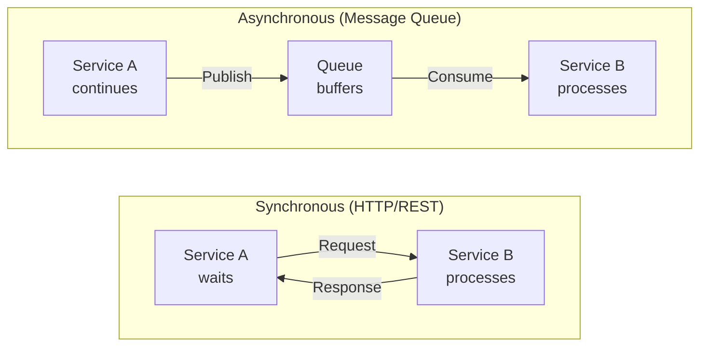
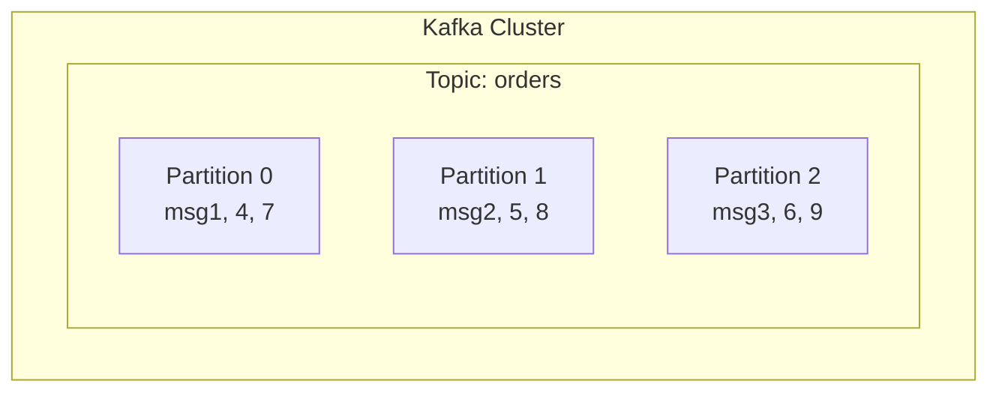
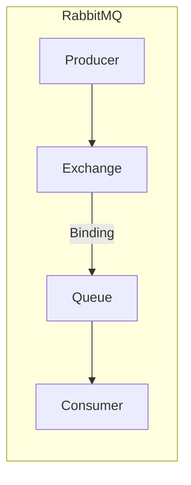
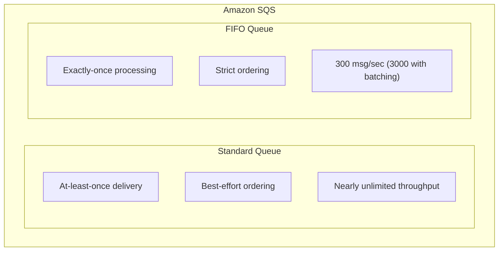
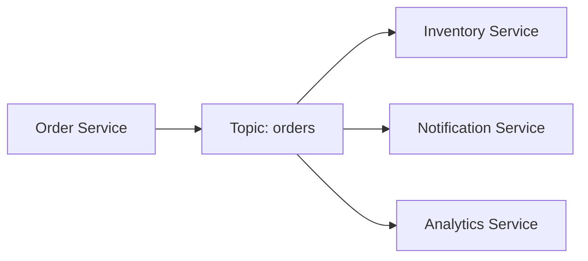
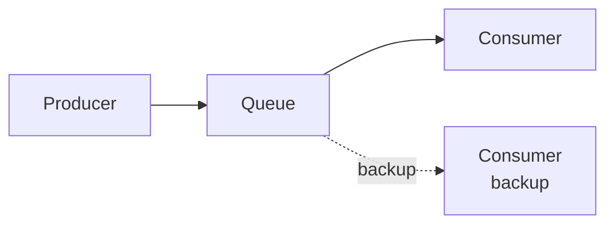
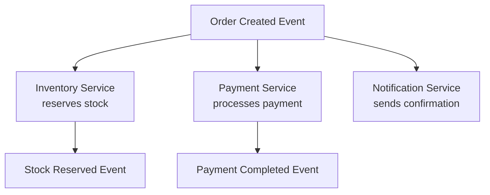
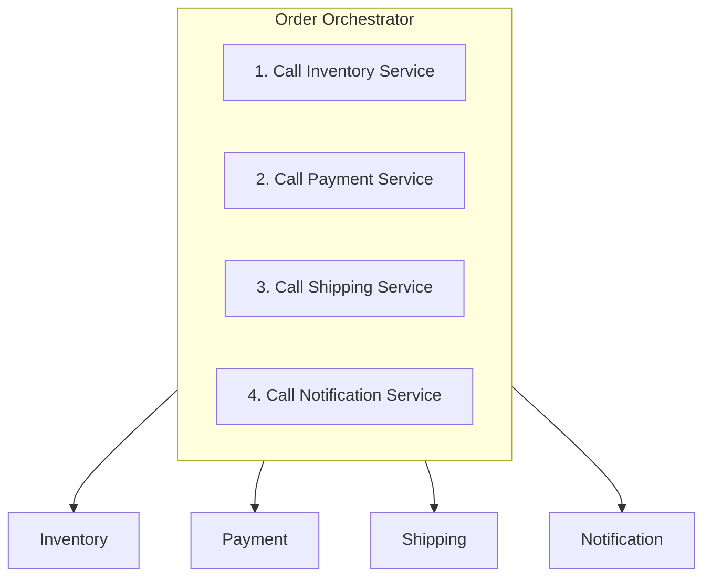
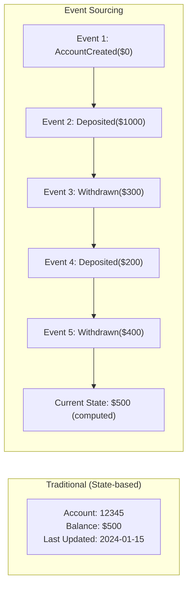
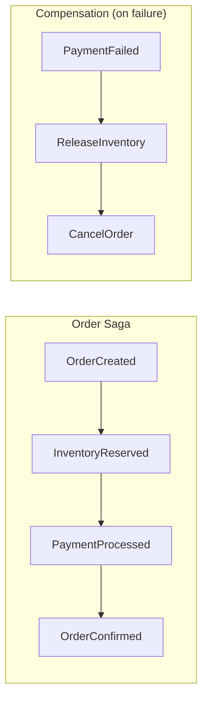

# Message Queue & Event-Driven Design - 1 Hour Session

**Duration:** 60 minutes
**Level:** Intermediate

---

## 📋 Session Agenda

- [ ] Introduction to Message Queues (10 min)
- [ ] Message Queue Technologies (15 min)
- [ ] Event-Driven Patterns (15 min)
- [ ] Advanced Concepts: Event Sourcing & CQRS (10 min)
- [ ] Implementation & Best Practices (10 min)

---

## 🎯 Learning Objectives

By the end of this session, you will understand:

- What message queues are and when to use them
- Key differences between Kafka, RabbitMQ, and SQS
- Pub/Sub patterns and their applications
- Event sourcing and CQRS concepts
- Choreography vs orchestration in distributed systems
- Common pitfalls and how to avoid them

---

## 1. Introduction to Message Queues (10 min)

### What is a Message Queue?

A **message queue** is a form of asynchronous service-to-service communication used in distributed systems. Messages are stored in the queue until processed and deleted.

> [!quote] Fundamental Principle
> "Decouple components by communicating through messages rather than direct calls."

### Why Use Message Queues?

**Key Benefits:**

- 🔄 **Decoupling:** Services don't need to know about each other
- ⚡ **Async Processing:** Non-blocking operations
- 📈 **Scalability:** Handle traffic spikes with buffering
- 🛡️ **Reliability:** Messages persist until processed
- ⚖️ **Load Leveling:** Smooth out traffic bursts

### Synchronous vs Asynchronous Communication

### Core Concepts

| Concept | Description |
|---------|-------------|
| **Producer** | Service that sends messages |
| **Consumer** | Service that receives messages |
| **Queue/Topic** | Storage for messages |
| **Message** | Data payload with metadata |
| **Broker** | Server managing queues |

---

## 2. Message Queue Technologies (15 min)

### Apache Kafka

**Distributed event streaming platform** designed for high-throughput, fault-tolerant messaging.

**Key Features:**

- Log-based storage (append-only)
- Consumer groups for parallel processing
- Message retention (configurable)
- Exactly-once semantics (with transactions)

~~~java
// Kafka Producer Example
Properties props = new Properties();
props.put("bootstrap.servers", "localhost:9092");
props.put("key.serializer", "org.apache.kafka.common.serialization.StringSerializer");
props.put("value.serializer", "org.apache.kafka.common.serialization.StringSerializer");

Producer<String, String> producer = new KafkaProducer<>(props);
producer.send(new ProducerRecord<>("orders", "order-123", orderJson));

// Kafka Consumer Example
props.put("group.id", "order-processor");
Consumer<String, String> consumer = new KafkaConsumer<>(props);
consumer.subscribe(Arrays.asList("orders"));

while (true) {
    ConsumerRecords<String, String> records = consumer.poll(Duration.ofMillis(100));
    for (ConsumerRecord<String, String> record : records) {
        processOrder(record.value());
    }
}
~~~

### RabbitMQ

**Traditional message broker** implementing AMQP protocol with flexible routing.

**Exchange Types:**
- **Direct** - routing key match
- **Fanout** - broadcast to all
- **Topic** - pattern matching
- **Headers** - header attributes

**Key Features:**

- Flexible routing with exchanges
- Message acknowledgments
- Dead letter queues
- Priority queues

~~~python
# RabbitMQ Producer Example
import pika

connection = pika.BlockingConnection(pika.ConnectionParameters('localhost'))
channel = connection.channel()

channel.queue_declare(queue='orders', durable=True)
channel.basic_publish(
    exchange='',
    routing_key='orders',
    body=order_json,
    properties=pika.BasicProperties(delivery_mode=2)  # Persistent
)

# RabbitMQ Consumer Example
def callback(ch, method, properties, body):
    process_order(body)
    ch.basic_ack(delivery_tag=method.delivery_tag)

channel.basic_consume(queue='orders', on_message_callback=callback)
channel.start_consuming()
~~~

### Amazon SQS

**Fully managed message queue service** by AWS.

~~~python
# SQS Example
import boto3

sqs = boto3.client('sqs')
queue_url = 'https://sqs.us-east-1.amazonaws.com/123456789/orders'

# Send message
sqs.send_message(
    QueueUrl=queue_url,
    MessageBody=order_json,
    MessageAttributes={
        'OrderType': {'DataType': 'String', 'StringValue': 'standard'}
    }
)

# Receive messages
response = sqs.receive_message(
    QueueUrl=queue_url,
    MaxNumberOfMessages=10,
    WaitTimeSeconds=20  # Long polling
)

for message in response.get('Messages', []):
    process_order(message['Body'])
    sqs.delete_message(
        QueueUrl=queue_url,
        ReceiptHandle=message['ReceiptHandle']
    )
~~~

### Technology Comparison

| Feature | Kafka | RabbitMQ | SQS |
|---------|-------|----------|-----|
| **Model** | Log-based | Queue-based | Queue-based |
| **Ordering** | Per partition | Per queue | FIFO only |
| **Throughput** | Very High | High | High |
| **Retention** | Configurable | Until consumed | 14 days max |
| **Replay** | Yes | No | No |
| **Managed** | No (MSK yes) | No | Yes |
| **Best For** | Event streaming | Task queues | AWS integration |

---

## 3. Event-Driven Patterns (15 min)

### Pub/Sub Pattern

**Publishers** send messages to **topics**, **subscribers** receive messages from topics they're interested in.

**Use Cases:**

- Event notifications
- Real-time updates
- Fan-out processing

### Point-to-Point Pattern

**One producer, one consumer** per message. Messages are consumed once.

*Only one consumer receives each message*

**Use Cases:**

- Task distribution
- Work queues
- Load balancing

### Choreography vs Orchestration

**Choreography:** Services react to events independently (decentralized).

**Orchestration:** Central coordinator manages the workflow.

| Aspect | Choreography | Orchestration |
|--------|--------------|---------------|
| **Coupling** | Loose | Tighter |
| **Visibility** | Distributed | Centralized |
| **Complexity** | In events | In orchestrator |
| **Failure Handling** | Each service | Orchestrator |
| **Best For** | Simple flows | Complex workflows |

---

## 4. Advanced Concepts: Event Sourcing & CQRS (10 min)

### Event Sourcing

**Store state as a sequence of events** rather than current state.

**Benefits:**

- Complete audit trail
- Time travel (reconstruct past states)
- Event replay for debugging
- Natural fit for event-driven systems

~~~python
# Event Sourcing Example
class BankAccount:
    def __init__(self, account_id):
        self.account_id = account_id
        self.balance = 0
        self.events = []
    
    def apply_event(self, event):
        if event['type'] == 'Deposited':
            self.balance += event['amount']
        elif event['type'] == 'Withdrawn':
            self.balance -= event['amount']
        self.events.append(event)
    
    def deposit(self, amount):
        event = {'type': 'Deposited', 'amount': amount, 'timestamp': now()}
        self.apply_event(event)
        event_store.save(self.account_id, event)
    
    def rebuild_from_events(self, events):
        for event in events:
            self.apply_event(event)
~~~

### CQRS (Command Query Responsibility Segregation)

**Separate read and write models** for different optimization.

~~~mermaid
flowchart TB
    subgraph CQRS[" CQRS Architecture "]
        direction TB
        
        subgraph CommandSide[" "]
            direction TB
            CT["⬇️ Commands (Write)"]
            C1[Create Order]
            C2[Update Order]
            C3[Cancel Order]
            WM[(Write Model Normalized)]
            
            CT ~~~ C1 & C2 & C3
            C1 & C2 & C3 --> WM
        end
        
        subgraph QuerySide[" "]
            direction TB
            QT["⬇️ Queries (Read)"]
            Q1[Get Orders]
            Q2[Search]
            Q3[Reports]
            RM[(Read Model Denormalized)]
            
            QT ~~~ Q1 & Q2 & Q3
            Q1 & Q2 & Q3 --> RM
        end
        
        WM -->|Sync| RM
    end
~~~

**Benefits:**
- Optimize reads and writes independently
- Scale read and write sides separately
- Different data models for different needs

~~~python
# CQRS Example
class OrderCommandHandler:
    def handle_create_order(self, command):
        order = Order.create(command.data)
        order_repository.save(order)
        event_bus.publish(OrderCreatedEvent(order))

class OrderQueryHandler:
    def get_order_summary(self, order_id):
        # Read from denormalized read model
        return read_db.query(
            "SELECT * FROM order_summaries WHERE id = ?", 
            order_id
        )

# Event handler updates read model
class OrderProjection:
    def handle_order_created(self, event):
        read_db.insert('order_summaries', {
            'id': event.order_id,
            'customer_name': event.customer_name,
            'total': event.total,
            'status': 'created'
        })
~~~

---

## 5. Implementation & Best Practices (10 min)

### Message Design

~~~json
{
  "messageId": "msg-uuid-12345",
  "type": "OrderCreated",
  "version": "1.0",
  "timestamp": "2024-01-15T10:30:00Z",
  "source": "order-service",
  "correlationId": "req-uuid-67890",
  "data": {
    "orderId": "order-123",
    "customerId": "cust-456",
    "items": [...],
    "total": 99.99
  },
  "metadata": {
    "traceId": "trace-abc",
    "userId": "user-789"
  }
}
~~~

### Idempotency

**Ensure processing a message multiple times has the same effect as once.**

~~~python
def process_order(message):
    message_id = message['messageId']
    
    # Check if already processed
    if processed_messages.exists(message_id):
        return  # Skip duplicate
    
    try:
        # Process the order
        create_order(message['data'])
        
        # Mark as processed
        processed_messages.add(message_id, ttl=7*24*60*60)  # 7 days
    except Exception as e:
        # Don't mark as processed - allow retry
        raise e
~~~

### Dead Letter Queues

**Handle messages that can't be processed.**

~~~mermaid
flowchart TB
    P[Producer] --> Q[Queue]
    Q --> C[Consumer]
    C -->|Failed 3x| Q
    Q --> DLQ[DLQ]
    DLQ --> A[Alert/Manual Review]
~~~

### Monitoring & Observability

**Key Metrics:**
- Queue depth (messages waiting)
- Processing latency
- Error rate
- Consumer lag (Kafka)
- Message age

~~~python
# Structured logging for tracing
import logging

def process_message(message):
    logger.info("Processing message", extra={
        'message_id': message['messageId'],
        'correlation_id': message['correlationId'],
        'trace_id': message['metadata']['traceId'],
        'message_type': message['type']
    })
~~~

---

## 🚨 Common Pitfalls & Solutions

### 1. Message Ordering

**Problem:** Messages processed out of order.

**Solutions:**
- Use partition keys (Kafka)
- FIFO queues (SQS)
- Sequence numbers in messages

### 2. Duplicate Processing

**Problem:** Same message processed multiple times.

**Solutions:**
- Idempotent consumers
- Deduplication with message IDs
- Exactly-once semantics (where available)

### 3. Poison Messages

**Problem:** Messages that always fail processing.

**Solutions:**
- Dead letter queues
- Retry limits
- Circuit breakers

### 4. Consumer Lag

**Problem:** Consumers can't keep up with producers.

**Solutions:**
- Scale consumers horizontally
- Increase batch size
- Optimize processing logic

---

## 📊 Architecture Patterns

### Event-Driven Microservices

~~~mermaid
flowchart TB
    subgraph services[Microservices Layer]
        direction LR
        OS[🛒 Order Service]
        IS[📦 Inventory Service]
        PS[💳 Payment Service]
    end
    
    subgraph broker[Messaging Layer]
        MB[("🔀 Message Broker (Kafka/RabbitMQ)")]
    end
    
    OS <-->|"order.created order.updated"| MB
    IS <-->|"inventory.reserved inventory.released"| MB
    PS <-->|"payment.processed payment.failed"| MB
    
    style MB fill:#6c5ce7,color:#fff
    style OS fill:#00b894,color:#fff
    style IS fill:#0984e3,color:#fff
    style PS fill:#e17055,color:#fff
~~~

---

## ✅ Key Takeaways

1. **Message queues enable loose coupling** and async communication
2. **Choose the right tool:** Kafka for streaming, RabbitMQ for routing, SQS for simplicity
3. **Pub/Sub vs Point-to-Point** depends on your use case
4. **Choreography vs Orchestration** - trade-offs in visibility and coupling
5. **Event Sourcing** provides audit trails and time travel
6. **CQRS** optimizes reads and writes separately
7. **Always design for idempotency** and handle failures gracefully

---

## 💡 Practical Exercise

**Scenario:** Design an e-commerce order processing system.

**Requirements:**
- Order placement
- Inventory check
- Payment processing
- Shipping notification
- Email confirmation

**Questions:**
1. Which message queue technology would you choose?
2. Choreography or orchestration?
3. How to handle payment failures?
4. How to ensure exactly-once processing?

---

**Session End - Thank You! 🎉**

#message-queue #event-driven #kafka #rabbitmq #sqs #architecture #session-notes
