# Comprehensive Guide to Rate Limiting and Throttling

## Table of Contents

1. [Core Concepts and Definitions](#core-concepts-and-definitions)
2. [Why We Use It](#why-we-use-it)
3. [What Happens Without It](#what-happens-without-it)
4. [Real-World Examples and Case Studies](#real-world-examples-and-case-studies)
5. [Rate Limiting Algorithms](#rate-limiting-algorithms)
6. [When to Use vs When Not to Use](#when-to-use-vs-when-not-to-use)
7. [Related Topics](#related-topics)
8. [Key Configuration Parameters](#key-configuration-parameters)
9. [Monitoring and Observability](#monitoring-and-observability)
10. [Common Pitfalls and Best Practices](#common-pitfalls-and-best-practices)

---

## Core Concepts and Definitions

### What is Rate Limiting?

**Rate Limiting** is a technique used to control the number of requests a client can make to a service within a specified time window. It acts as a gatekeeper that protects your systems from being overwhelmed by too many requests.

**Key Principle:** *Control the flow to protect the system.*

```mermaid
flowchart LR
    subgraph Clients
        C1[Client 1]
        C2[Client 2]
        C3[Client 3]
    end
    
    subgraph "Rate Limiter"
        RL{Rate Limit Check}
    end
    
    subgraph Backend
        S[Service]
    end
    
    C1 --> RL
    C2 --> RL
    C3 --> RL
    
    RL -->|"✓ Under limit"| S
    RL -->|"✗ Over limit"| Rejected[429 Too Many Requests]
    
    style Rejected fill:#ff6b6b
    style S fill:#90EE90
```




### Key Terminology

| Term        | Definition                                                   |
| ----------- | ------------------------------------------------------------ |
| **Rate**    | Number of allowed requests per time unit (e.g., 100 req/sec) |
| **Quota**   | Total allocation over a longer period (e.g., 10,000 req/day) |
| **Burst**   | Temporary allowance to exceed the steady rate                |
| **Window**  | Time period for counting requests                            |
| **Scope**   | Entity being limited (IP, user, API key, endpoint)           |
| **Backoff** | Client strategy to wait before retrying                      |

---

## Why We Use It

### Primary Motivations


### Detailed Benefits

#### 1. Protection Against Abuse and Attacks

- **DoS Mitigation:** Limits impact of distributed denial-of-service attacks
- **Brute Force Prevention:** Stops password guessing and credential stuffing
- **Scraping Defense:** Prevents automated data harvesting
- **Bug Protection:** Contains damage from client bugs causing request loops

#### 2. Fair Resource Allocation

- **Multi-tenancy:** Ensures one customer can't monopolize shared resources
- **Noisy Neighbor Prevention:** Isolates impact of heavy users
- **Democratic Access:** Guarantees all users get fair service

#### 3. System Stability and Reliability

- **Predictable Load:** Makes capacity planning possible
- **Overload Prevention:** Keeps systems within operational limits
- **Graceful Degradation:** Maintains service for most users during spikes
- **Downstream Protection:** Shields databases and internal services

#### 4. Cost Management

- **Cloud Cost Control:** Prevents runaway usage charges
- **Infrastructure Efficiency:** Right-sizes resource allocation
- **Third-party API Costs:** Controls expenses from metered APIs
- **Bandwidth Management:** Limits data transfer costs

#### 5. Business and Compliance

- **Tiered Service Levels:** Enables premium vs. free tier differentiation
- **SLA Enforcement:** Guarantees committed service levels
- **Regulatory Compliance:** Meets requirements for data access controls
- **Revenue Protection:** Monetizes API access appropriately

---

## What Happens Without It

### Failure Cascade Scenario


### Common Failure Scenarios

#### 1. The "Hug of Death"

    Scenario: Popular website links to your service

    Timeline:
    T+0min:   Normal traffic: 100 req/sec
    T+1min:   Reddit/HackerNews post goes viral
    T+2min:   Traffic spikes to 10,000 req/sec
    T+3min:   Server CPU at 100%, response times 30+ seconds
    T+5min:   Database connections exhausted
    T+7min:   Out of memory errors, servers crashing
    T+10min:  Complete service outage
    T+30min:  Manual intervention required to recover

#### 2. Runaway Client Bug

    Scenario: Mobile app bug causes infinite retry loop

    Impact:
    - Single user generates 1000x normal traffic
    - Multiplied across affected user base
    - Backend overwhelmed by legitimate (but buggy) clients
    - No malicious intent, but same devastating effect

#### 3. Cascading Service Failure


#### 4. Cost Explosion

    Cloud Cost Scenario (Without Rate Limiting):

    Normal monthly cost: $5,000
    - API Gateway: $500
    - Lambda invocations: $1,000
    - Database: $2,000
    - Data transfer: $1,500

    After traffic spike/attack:
    - API Gateway: $15,000 (30x traffic)
    - Lambda: $50,000 (50x invocations)
    - Database: $10,000 (auto-scaled)
    - Data transfer: $25,000

    Surprise bill: $100,000+ 😱

#### 5. Security Breach Enablement

| Attack Type | Without Rate Limiting |
|-------------|----------------------|
| **Credential Stuffing** | Millions of login attempts succeed in finding valid accounts |
| **API Enumeration** | Attackers discover all valid user IDs, emails |
| **Brute Force** | Passwords cracked through exhaustive attempts |
| **Data Scraping** | Entire database extracted through API |

---


## Rate Limiting Algorithms

### Algorithm Overview


### 1. Token Bucket

**Concept:** Tokens are added to a bucket at a fixed rate. Each request consumes a token. Requests are rejected when the bucket is empty.


**Characteristics:**

| Property | Description |
|----------|-------------|
| **Allows Bursts** | Yes, up to bucket capacity |
| **Average Rate** | Controlled by token refill rate |
| **Memory** | O(1) - just counter and timestamp |
| **Precision** | Good |

**Example:**

    Configuration:
    - Bucket capacity: 10 tokens
    - Refill rate: 2 tokens/second

    Scenario:
    T+0s: Bucket full (10 tokens)
    T+0s: 10 requests arrive → all processed, bucket empty
    T+0s: 11th request → rejected
    T+1s: Bucket has 2 tokens (refilled)
    T+1s: 2 requests → processed

**Use Cases:**
- API rate limiting
- Network traffic shaping
- Bursty workload handling

---

### 2. Leaky Bucket

**Concept:** Requests enter a queue (bucket) and are processed at a constant rate. The bucket "leaks" at a fixed rate.


**Characteristics:**

| Property | Description |
|----------|-------------|
| **Output Rate** | Constant (smooth) |
| **Bursts** | Absorbed by queue, not output |
| **Memory** | O(queue size) |
| **Latency** | Variable (queue wait time) |

**Comparison with Token Bucket:**

    Token Bucket:  Allows bursts in OUTPUT
    Leaky Bucket:  Allows bursts in INPUT, constant OUTPUT

**Use Cases:**
- Traffic shaping (networks)
- Smoothing bursty inputs
- When constant processing rate is required

---

### 3. Fixed Window Counter

**Concept:** Count requests in fixed time windows. Reset counter at window boundaries.

```mermaid
flowchart LR
    subgraph "Fixed Window"
        W1[Window 1\n00:00-00:59] --> W2[Window 2<br>01:00-01:59] --> W3[Window 3\n02:00-02:59]
    end
    
    W1 ---|"Count: 95/100"| OK1[✓]
    W2 ---|"Count: 100/100"| OK2[✓]
    W3 ---|"Count: 45/100"| OK3[✓]
```



**The Boundary Problem:**

    Limit: 100 requests per minute

    Timeline showing the problem:
    |-------- Minute 1 --------|-------- Minute 2 --------|
                        [100 requests][100 requests]
                        at 0:59      at 1:00
                        
    Result: 200 requests in 2 seconds! 😱

**Characteristics:**

| Property | Description |
|----------|-------------|
| **Simplicity** | Very simple to implement |
| **Memory** | O(1) |
| **Precision** | Poor at boundaries |
| **Use Case** | When simplicity trumps precision |

---

### 4. Sliding Window Log

**Concept:** Keep a log of all request timestamps. Count requests within the sliding window.

```mermaid
flowchart TB
    subgraph "Sliding Window Log"
        Now[Current Time: 12:01:30]
        Window["Window: Last 60 seconds\n(12:00:30 - 12:01:30)"]
        
        Log["Request Log:\n12:00:15 ❌ outside\n12:00:45 ✓\n12:01:00 ✓\n12:01:15 ✓\n12:01:25 ✓"]
        
        Count["Count: 4 requests\nLimit: 100\nResult: ALLOWED"]
    end
    
    Now --> Window --> Log --> Count
```



**Characteristics:**

| Property | Description |
|----------|-------------|
| **Precision** | Perfect - true sliding window |
| **Memory** | O(n) - stores all timestamps |
| **Computation** | O(n) per request |
| **Scalability** | Poor for high-volume |

**Use Cases:**
- Low-volume, high-precision requirements
- Audit logging needed anyway
- When exact counting is critical

---

### 5. Sliding Window Counter

**Concept:** Hybrid approach combining fixed windows with weighted averaging.

```mermaid
flowchart LR
    subgraph "Sliding Window Counter"
        Prev["Previous Window<br>Count: 80"]
        Curr["Current Window<br>Count: 30"]
        
        Calc["Weighted Calculation:<br>80 × 0.25 + 30 × 0.75 = 42.5<br>25% into current window"]
        
        Result["Estimated count: 42<br>Limit: 100<br>Result: ALLOWED"]
    end
    
    Prev --> Calc
    Curr --> Calc
    Calc --> Result
```



**Calculation:**

    weighted_count = (previous_count × overlap_percentage) + current_count

    Where:
    - overlap_percentage = (window_size - elapsed_time) / window_size

**Characteristics:**

| Property | Description |
|----------|-------------|
| **Precision** | Good approximation |
| **Memory** | O(1) - just two counters |
| **Computation** | O(1) |
| **Scalability** | Excellent |

**Use Cases:**
- Production API rate limiting
- High-volume scenarios
- Best balance of precision and performance

---

### Algorithm Comparison Summary

| Algorithm | Memory | Precision | Burst Handling | Best For |
|-----------|--------|-----------|----------------|----------|
| Token Bucket | O(1) | High | Allows bursts | APIs, general use |
| Leaky Bucket | O(n) | High | Smooths output | Traffic shaping |
| Fixed Window | O(1) | Low | Boundary issues | Simple cases |
| Sliding Log | O(n) | Perfect | Accurate | Low volume, audit |
| Sliding Counter | O(1) | Good | Balanced | High-volume APIs |

---

## When to Use vs When Not to Use

### ✅ When to Use Rate Limiting

| Scenario                          | Reasoning                              |
| --------------------------------- | -------------------------------------- |
| **Public APIs**                   | Protect from abuse, ensure fair access |
| **Authentication endpoints**      | Prevent brute force attacks            |
| **Resource-intensive operations** | Protect expensive backend processes    |
| **Multi-tenant systems**          | Ensure tenant isolation                |
| **Third-party integrations**      | Match upstream rate limits             |
| **Webhooks/Callbacks**            | Control outbound request rates         |
| **Mobile/IoT backends**           | Handle potentially buggy clients       |

**Decision Criteria:**


---

### ❌ When NOT to Use Rate Limiting

| Scenario                              | Reasoning                               |
| ------------------------------------- | --------------------------------------- |
| **Internal service-to-service calls** | Use circuit breakers instead (usually)  |
| **Health check endpoints**            | Should always respond for monitoring    |
| **Emergency/admin operations**        | Need guaranteed access                  |
| **Real-time critical paths**          | Latency of checking may be unacceptable |
| **Already-throttled upstream**        | Redundant limiting adds overhead        |
| **Static content behind CDN**         | CDN handles this better                 |

**Anti-Patterns:**

    ❌ Rate limiting everything uniformly
       → Different endpoints have different costs

    ❌ Rate limiting internal health checks
       → Kubernetes/load balancers need these

    ❌ Same limits for all user tiers
       → Paying customers expect more

    ❌ Rate limiting without feedback
       → Clients can't adapt behavior

---

### Decision Matrix by Endpoint Type

| Endpoint Type | Rate Limit? | Reasoning |
|---------------|-------------|-----------|
| /login | ✅ Strict | Brute force protection |
| /signup | ✅ Strict | Spam prevention |
| /api/data | ✅ Standard | Resource protection |
| /health | ❌ None | Monitoring needs access |
| /metrics | ⚠️ Internal only | Sensitive, but needed |
| /webhook | ✅ Standard | Control outbound rate |
| /admin/* | ⚠️ Different limits | Privileged access |
| /search | ✅ Strict | Expensive operation |

---

## Related Topics

### Pattern Ecosystem


### 1. Circuit Breaker

**Relationship:** Rate limiting controls inbound traffic; circuit breakers protect outbound calls.

| Aspect | Rate Limiting | Circuit Breaker |
|--------|--------------|-----------------|
| **Direction** | Inbound | Outbound |
| **Trigger** | Request count | Failure rate |
| **Purpose** | Protect self | Protect from others |
| **Response** | 429 rejection | Fallback/fast fail |

**Combined Usage:**

                        ┌─────────────────┐
    Incoming Traffic →  │  Rate Limiter   │
                        └────────┬────────┘
                                 ↓
                        ┌─────────────────┐
                        │   Your Service  │
                        └────────┬────────┘
                                 ↓
                        ┌─────────────────┐
    Outgoing Calls →    │ Circuit Breaker │ → Downstream
                        └─────────────────┘

---

### 2. Bulkhead Pattern

**Concept:** Isolate resources to prevent failure in one area from affecting others.


**Relationship with Rate Limiting:**
- Rate limiting controls request count
- Bulkhead controls resource allocation
- Both prevent resource exhaustion
- Often used together

---

### 3. Load Shedding

**Concept:** Intentionally dropping requests to maintain system stability.

**Spectrum of Traffic Management:**

    Light Touch                                    Heavy Hand
         │                                              │
         ▼                                              ▼
    Rate Limiting → Throttling → Load Shedding → Circuit Breaking
    (reject excess)  (slow down)   (drop low      (stop all calls)
                                   priority)

**Priority-Based Load Shedding:**

| Priority | Traffic Type | Action Under Load |
|----------|--------------|-------------------|
| P0 | Health checks | Always allow |
| P1 | Checkout/Payment | Last to shed |
| P2 | User requests | Shed under extreme load |
| P3 | Background jobs | First to shed |
| P4 | Analytics | Shed early |

---

### 4. Backpressure

**Concept:** Signal upstream to slow down when downstream is overwhelmed.


**Comparison:**

| Aspect | Rate Limiting | Backpressure |
|--------|--------------|--------------|
| **Direction** | Top-down control | Bottom-up signaling |
| **Mechanism** | Reject/delay | Request slowdown |
| **Intelligence** | Predefined limits | Dynamic adaptation |
| **Coupling** | Loose | Tighter |

---

### 5. Quotas

**Concept:** Long-term resource allocation limits.

    Rate Limit vs Quota:

    Rate Limit: 100 requests per second
    Quota:      1,000,000 requests per month

    Rate limits prevent spikes
    Quotas prevent overuse over time

**Typical Implementation:**

| Tier | Rate Limit | Daily Quota | Monthly Quota |
|------|------------|-------------|---------------|
| Free | 10/sec | 1,000 | 10,000 |
| Basic | 50/sec | 10,000 | 100,000 |
| Pro | 200/sec | 100,000 | 1,000,000 |
| Enterprise | Custom | Unlimited | Custom |

---

### 6. Admission Control

**Concept:** Decide whether to accept a request based on current system state.


**Relationship:** Rate limiting is a simple form of admission control based only on request count.

---

## Key Configuration Parameters

### Essential Parameters

| Parameter | Description | Example Values | Considerations |
|-----------|-------------|----------------|----------------|
| **Rate** | Requests per time unit | 100/sec, 1000/min | Based on capacity testing |
| **Burst** | Maximum burst size | 150 (1.5x rate) | Allow legitimate spikes |
| **Window** | Time window for counting | 1 sec, 1 min, 1 hour | Granularity vs. overhead |
| **Scope** | What to limit by | IP, User, API Key | Business requirements |
| **Response** | What to return | 429, Queue, Degrade | User experience |

### Scope Selection


### Response Strategy Options

| Strategy | HTTP Status | Use Case |
|----------|-------------|----------|
| **Hard Reject** | 429 | API abuse prevention |
| **Queue** | 202 Accepted | Background processing |
| **Degrade** | 200 (partial) | Graceful degradation |
| **Redirect** | 307 | Send to overflow server |
| **Delay** | 200 (slow) | Throttling |

### Retry-After Header

    HTTP/1.1 429 Too Many Requests
    Retry-After: 30
    X-RateLimit-Limit: 100
    X-RateLimit-Remaining: 0
    X-RateLimit-Reset: 1644789600

    {
      "error": "rate_limit_exceeded",
      "message": "Too many requests. Please retry after 30 seconds.",
      "retry_after": 30
    }

---

## Monitoring and Observability

### Essential Metrics


### Key Metrics to Track

| Metric | Purpose | Alert Threshold |
|--------|---------|-----------------|
| Rejection Rate | Overall limit effectiveness | > 10% sustained |
| Requests per Client | Identify heavy users | > 80% of limit |
| Limit Utilization | Capacity planning | > 70% of capacity |
| 429 Response Count | User experience impact | Sudden spikes |
| Retry Storm Detection | Client behavior issues | Exponential increase |
| Latency Added | Performance overhead | > 5ms p99 |

### Dashboard Recommendations

**Real-Time View:**
- Current requests per second (global)
- Rejection rate gauge
- Top clients by request count
- Top rejected clients

**Historical View:**
- Request volume trends
- Rejection rate over time
- Limit changes and their impact
- Correlation with incidents

### Alerting Strategy

    Alert Levels:

    🟡 WARNING:
       - Rejection rate > 5%
       - Single client at > 80% of limit
       - Unusual traffic pattern detected

    🔴 CRITICAL:
       - Rejection rate > 20%
       - Potential DDoS detected
       - Rate limiter latency spike
       - Storage backend unavailable

    📊 INFORMATIONAL:
       - New client approaching limits
       - Traffic pattern change
       - Limit configuration changed

### Logging Best Practices

    What to Log:
    ✓ Client identifier (anonymized if needed)
    ✓ Endpoint accessed
    ✓ Current count vs. limit
    ✓ Action taken (allowed/rejected)
    ✓ Timestamp

    What NOT to Log:
    ✗ Every allowed request (too verbose)
    ✗ Full request bodies
    ✗ Sensitive identifiers without hashing

---

## Common Pitfalls and Best Practices

### ❌ Common Pitfalls

#### 1. One-Size-Fits-All Limits

**Problem:** Same rate limit for all endpoints

    ❌ BAD:
    All endpoints: 100 requests/minute

    Reality:
    - /health → Should be unlimited for monitoring
    - /search → Expensive, should be stricter
    - /profile → Cheap, could be higher
    - /export → Very expensive, should be much lower

**Solution:** Tiered limits based on resource cost

---

#### 2. Not Communicating Limits to Clients

**Problem:** Clients have no visibility into limits

    ❌ BAD:
    HTTP/1.1 429 Too Many Requests

    (No information about when to retry or current usage)

**Solution:** Always include rate limit headers

    ✅ GOOD:
    HTTP/1.1 429 Too Many Requests
    X-RateLimit-Limit: 100
    X-RateLimit-Remaining: 0
    X-RateLimit-Reset: 1644789600
    Retry-After: 30

---

#### 3. Rate Limiting After Authentication

**Problem:** Expensive auth happens before rate limit check

```mermaid
flowchart LR
    subgraph "❌ Wrong Order"
        R1[Request] --> Auth1[Authenticate] --> RL1[Rate Limit]
    end
    
    subgraph "✅ Correct Order"
        R2[Request] --> RL2[Rate Limit] --> Auth2[Authenticate]
    end
```



**Solution:** Apply rate limits as early as possible

---

#### 4. Forgetting Distributed State

**Problem:** Each server maintains its own counters

    Scenario: 4 servers, limit 100/minute

    Server A: 90 requests counted
    Server B: 85 requests counted
    Server C: 95 requests counted
    Server D: 88 requests counted

    Total actual: 358 requests (3.5x over limit!)

**Solution:** Centralized or synchronized rate limit storage

---

#### 5. Not Handling Rate Limiter Failures

**Problem:** Rate limiter becomes single point of failure


**Solution:** Define failure mode policy, implement fallbacks

---

#### 6. Ignoring Legitimate Burst Patterns

**Problem:** Strict limits break legitimate use cases

    Scenario: Mobile app syncs on launch

    Normal behavior:
    - App opens
    - Fetches 20 resources immediately
    - Then idle for minutes

    Strict limit of 5/sec breaks the app!

**Solution:** Allow bursts with token bucket algorithm

---

### ✅ Best Practices

#### 1. Layer Your Rate Limits

    Layer 1: Edge/CDN Level
             - DDoS protection
             - Very high limits
             - By IP

    Layer 2: API Gateway
             - Per-client limits
             - By API key
             - Endpoint-specific

    Layer 3: Application
             - Business logic limits
             - User-specific
             - Feature-based

---

#### 2. Implement Graceful Degradation

| Load Level | Response |
|------------|----------|
| Normal | Full functionality |
| High | Disable expensive features |
| Very High | Return cached data |
| Critical | Static fallback page |

---

#### 3. Provide Clear Documentation

Document for API consumers:
- Rate limits per endpoint
- How limits are calculated
- What headers to expect
- How to request limit increases
- Best practices for staying within limits

---

#### 4. Test Your Limits

| Test Type | Purpose |
|-----------|---------|
| Load testing | Verify limits work under load |
| Spike testing | Confirm burst handling |
| Soak testing | Check for memory leaks |
| Chaos testing | Validate failure modes |

---

#### 5. Plan for Legitimate High-Volume Users

    Options for power users:

    1. Tiered pricing with higher limits
    2. Dedicated rate limit pools
    3. Bulk/batch endpoints
    4. Webhook push instead of polling
    5. Enterprise agreements

---

#### 6. Use Exponential Backoff on Client Side

    Retry Strategy for Clients:

    Attempt 1: Immediate
    Attempt 2: Wait 1 second
    Attempt 3: Wait 2 seconds
    Attempt 4: Wait 4 seconds
    Attempt 5: Wait 8 seconds
    ...
    Max wait: 32 seconds
    Add jitter: ±20% randomization

---

## Real-World Examples and Case Studies

### Twitter: API Rate Limiting as Core Strategy

**Context:** Twitter handles 500+ million tweets per day with extensive API usage.

**Rate Limiting Implementation:**

| Endpoint Category | Rate Limit | Window |
|-------------------|------------|--------|
| User timeline | 900 requests | 15 minutes |
| Search tweets | 180 requests | 15 minutes |
| Post tweet | 300 requests | 3 hours |
| Direct messages | 1,000 requests | 24 hours |

**Key Decisions:**
- Different limits per endpoint based on resource cost
- App-level vs. user-level limits
- Elevated access tiers for partners
- Clear rate limit headers in responses

**Headers Returned:**

    X-Rate-Limit-Limit: 900
    X-Rate-Limit-Remaining: 845
    X-Rate-Limit-Reset: 1644789600

**Lessons Learned:**
> "Rate limiting isn't just about protection—it's about creating a sustainable ecosystem where developers can build reliably." — Twitter API Team

---

### GitHub: Sophisticated Multi-Tier Rate Limiting

**Rate Limit Structure:**


**Conditional Requests:**
GitHub encourages efficient API usage through conditional requests:
- Returns `304 Not Modified` for unchanged resources
- Conditional requests don't count against rate limit
- Incentivizes caching and efficient client behavior

**Secondary Rate Limits:**
Beyond request counts, GitHub also limits:
- Concurrent requests (100 per endpoint)
- Content creation (burst protection)
- Compute-intensive operations

---

### Stripe: Rate Limiting for Financial Infrastructure

**Context:** Stripe processes hundreds of billions of dollars annually.

**Approach:**
- **Live mode:** 100 read requests/sec, 100 write requests/sec
- **Test mode:** More lenient for development
- **Burst allowance:** Short spikes permitted

**Intelligent Limiting:**
- Limits apply per API key
- Different limits for different endpoints
- Idempotency keys prevent duplicate charges

**Best Practice from Stripe:**
> "We recommend implementing retry logic with exponential backoff. Rate limits protect both you and us—preventing runaway costs and ensuring platform stability."

---

### AWS: Service-Level Throttling

**API Gateway Throttling:**

| Level | Default Limit | Configurable |
|-------|--------------|--------------|
| Account | 10,000 req/sec | Yes |
| Stage | 10,000 req/sec | Yes |
| Method | Inherited | Yes |
| Usage Plan | Custom | Yes |

**DynamoDB Throttling:**
- Read Capacity Units (RCU) and Write Capacity Units (WCU)
- Automatic throttling when exceeded
- Adaptive capacity for uneven workloads

**The 2017 S3 Outage Connection:**
While primarily an operational error, the incident highlighted:
- Services without proper throttling cascaded failures
- Rate limiting at service boundaries could have contained impact
- Dependency on single region without limits was problematic

---

### Shopify: Flash Sale Protection

**Challenge:** Handle extreme traffic spikes during flash sales and product drops.

**Solution: Leaky Bucket at Scale**

    Shopify's Approach:

    Normal traffic: 2 requests/second per store
    Flash sale: Same limit enforced

    What happens:
    - First requests fill the bucket instantly
    - Excess requests queued briefly
    - Beyond queue: 429 with Retry-After header
    - Critical paths (checkout) get priority

**Results:**
- Maintained checkout availability during 100x traffic spikes
- Protected backend systems from overload
- Fair access for customers during limited releases

---

### Cloudflare: Edge Rate Limiting at Scale

**Context:** Cloudflare handles 10%+ of global internet traffic.

**Multi-Layer Protection:**

```mermaid
flowchart TB
    Internet[Internet Traffic] --> L1[Layer 1: IP Reputation]
    L1 --> L2[Layer 2: Connection Limits]
    L2 --> L3[Layer 3: Request Rate Limiting]
    L3 --> L4[Layer 4: Advanced Rules]
    L4 --> Origin[Origin Server]
    
    L1 -.->|"Known bad IPs"| Block1[Block]
    L2 -.->|"Too many connections"| Block2[Block]
    L3 -.->|"Rate exceeded"| Block3[Challenge/Block]
    L4 -.->|"Custom rules triggered"| Block4[Block]
    
    style Block1 fill:#ff6b6b
    style Block2 fill:#ff6b6b
    style Block3 fill:#ffa500
    style Block4 fill:#ff6b6b
```

**Key Innovation:**
- Rate limiting at edge (close to users)
- Reduces load on origin servers
- Millisecond-level decision making
- Distributed state for global consistency

---

### Reddit: The Hug of Death Problem

**The Challenge:**
When Reddit links to small websites, massive traffic floods can crash them.

**From Both Sides:**

| Perspective | Problem | Solution |
|-------------|---------|----------|
| **Linked Site** | Sudden 1000x traffic | CDN + rate limiting + caching |
| **Reddit API** | Developers hammering API | Strict rate limits (60 req/min) |

**Reddit's API Rate Limits:**
- OAuth clients: 60 requests per minute
- Must include User-Agent header
- Violations result in temporary bans
- Repeated violations lead to permanent bans

---

## Summary

```mermaid
flowchart TB
    subgraph "Rate Limiting Essentials"
        Purpose["Purpose: Control request flow"]
        Algorithms["Algorithms: Token/Leaky Bucket, Windows"]
        Config["Config: Rate, Burst, Window, Scope"]
        Monitor["Monitor: Rejections, Latency, Patterns"]
    end
    
    subgraph "Remember"
        R1["Different limits for different endpoints"]
        R2["Communicate limits via headers"]
        R3["Handle distributed state properly"]
        R4["Plan for bursts and failures"]
    end
    
    Purpose --> Algorithms --> Config --> Monitor
    Monitor --> R1 --> R2 --> R3 --> R4
```

---

## Quick Reference Card

| Aspect | Key Points |
|--------|------------|
| **What** | Controlling request rate to protect systems |
| **When** | Public APIs, auth endpoints, expensive operations |
| **Algorithms** | Token Bucket (common), Sliding Window Counter (efficient) |
| **Key Configs** | Rate, burst, window, scope |
| **Headers** | X-RateLimit-*, Retry-After |
| **Related** | Circuit Breaker, Bulkhead, Load Shedding |
| **Monitor** | Rejection rate, top clients, latency |
| **Pitfalls** | Uniform limits, no headers, wrong order, distributed state |
