# Rate Limiter - 1 Hour Session

**Duration:** 60 minutes
**Level:** Intermediate

---

## 📋 Session Agenda

- [ ] Introduction to Rate Limiting (10 min)
- [ ] Rate Limiting Algorithms (15 min)
- [ ] Distributed Rate Limiting (15 min)
- [ ] Implementation Patterns (10 min)
- [ ] Best Practices & Real-World Examples (10 min)

---

## 🎯 Learning Objectives

By the end of this session, you will understand:
- What rate limiting is and why it's essential
- Different rate limiting algorithms and their trade-offs
- How to implement distributed rate limiting
- Common patterns and best practices
- How to choose the right algorithm for your use case

---

## 1. Introduction to Rate Limiting (10 min)

### What is Rate Limiting?

**Rate limiting** is a technique to control the rate of requests a client can make to a service within a specified time window.

> [!quote] Fundamental Principle
> "Rate limiting is the first line of defense against abuse and the last line of defense for availability."

### Why Rate Limit?

**Protection & Control:**
- 🛡️ **DDoS Protection:** Prevent denial-of-service attacks
- 💰 **Cost Control:** Limit expensive API calls
- ⚖️ **Fair Usage:** Ensure equitable resource distribution
- 🔧 **System Stability:** Prevent cascading failures
- 📊 **Predictable Performance:** Maintain SLAs

### Rate Limiting Dimensions


### Key Metrics

| Metric | Description | Example |
|--------|-------------|---------|
| **Rate** | Requests allowed per time unit | 100 req/sec |
| **Burst** | Maximum requests in short burst | 150 req |
| **Window** | Time period for rate calculation | 1 minute |
| **Quota** | Total requests in longer period | 10,000/day |

---

## 2. Rate Limiting Algorithms (15 min)

### 1. Token Bucket Algorithm

**Concept:** Tokens are added to a bucket at a fixed rate. Each request consumes a token.


**Implementation:**

~~~python
import time
from threading import Lock

class TokenBucket:
    def __init__(self, capacity: int, refill_rate: float):
        self.capacity = capacity
        self.tokens = capacity
        self.refill_rate = refill_rate  # tokens per second
        self.last_refill = time.time()
        self.lock = Lock()
    
    def _refill(self):
        now = time.time()
        elapsed = now - self.last_refill
        tokens_to_add = elapsed * self.refill_rate
        self.tokens = min(self.capacity, self.tokens + tokens_to_add)
        self.last_refill = now
    
    def consume(self, tokens: int = 1) -> bool:
        with self.lock:
            self._refill()
            if self.tokens >= tokens:
                self.tokens -= tokens
                return True
            return False

# Usage
bucket = TokenBucket(capacity=10, refill_rate=2)

for i in range(15):
    if bucket.consume():
        print(f"Request {i+1}: Allowed")
    else:
        print(f"Request {i+1}: Rate limited")
~~~

**Pros:**
- ✅ Allows bursts up to bucket capacity
- ✅ Smooth rate limiting over time
- ✅ Memory efficient (O(1) per client)

**Cons:**
- ❌ Burst can overwhelm downstream services
- ❌ Requires careful capacity tuning

---

### 2. Leaky Bucket Algorithm

**Concept:** Requests enter a queue (bucket) and are processed at a fixed rate. Overflow is rejected.

```mermaid
flowchart TB
    subgraph Input
        R1[Request 1]
        R2[Request 2]
        R3[Request 3]
        R4[Request ...]
    end
    
    subgraph Bucket["Queue (Bucket)"]
        Q["🔵 🔵 🔵 🔵 🔵<br/>🔵 🔵 🔵"]
    end
    
    subgraph Output
        P[Processed at<br/>constant rate]
    end
    
    R1 & R2 & R3 & R4 --> |Incoming Requests| Bucket
    Bucket --> |Fixed outflow rate| P
    
    style Bucket fill:#e1f5fe
    style P fill:#c8e6c9
```



**Implementation:**

~~~python
import time
from collections import deque
from threading import Lock

class LeakyBucket:
    def __init__(self, capacity: int, leak_rate: float):
        self.capacity = capacity
        self.leak_rate = leak_rate  # requests per second
        self.queue = deque()
        self.last_leak = time.time()
        self.lock = Lock()
    
    def _leak(self):
        now = time.time()
        elapsed = now - self.last_leak
        leaks = int(elapsed * self.leak_rate)
        
        for _ in range(min(leaks, len(self.queue))):
            self.queue.popleft()
        
        if leaks > 0:
            self.last_leak = now
    
    def allow(self) -> bool:
        with self.lock:
            self._leak()
            if len(self.queue) < self.capacity:
                self.queue.append(time.time())
                return True
            return False

# Usage
bucket = LeakyBucket(capacity=5, leak_rate=1)
~~~

**Pros:**
- ✅ Constant output rate (no bursts)
- ✅ Predictable downstream load
- ✅ Good for APIs with strict rate requirements

**Cons:**
- ❌ No burst allowance
- ❌ Recent requests may wait behind old ones

---

### 3. Fixed Window Counter

**Concept:** Count requests in fixed time windows. Reset counter at window boundary.


> **Note:** Counter resets at window boundary (12:01:00)

**Implementation:**

~~~python
import time
from threading import Lock

class FixedWindowCounter:
    def __init__(self, limit: int, window_seconds: int):
        self.limit = limit
        self.window_seconds = window_seconds
        self.counters = {}  # client_id -> (window_start, count)
        self.lock = Lock()
    
    def _get_window_start(self) -> int:
        return int(time.time() // self.window_seconds) * self.window_seconds
    
    def allow(self, client_id: str) -> bool:
        with self.lock:
            window_start = self._get_window_start()
            
            if client_id not in self.counters:
                self.counters[client_id] = (window_start, 0)
            
            stored_window, count = self.counters[client_id]
            
            # New window - reset counter
            if stored_window != window_start:
                self.counters[client_id] = (window_start, 1)
                return True
            
            # Same window - check limit
            if count < self.limit:
                self.counters[client_id] = (window_start, count + 1)
                return True
            
            return False

# Usage
limiter = FixedWindowCounter(limit=100, window_seconds=60)
~~~

**Pros:**
- ✅ Simple to implement
- ✅ Memory efficient
- ✅ Easy to understand

**Cons:**
- ❌ Boundary burst problem (2x limit at window edges)

```mermaid
timeline
    title Boundary Burst Problem
    section Window 1 (12:00:00 - 12:00:59)
        12:00:30 - 12:00:59 : 100 requests ✓ allowed
    section Window 2 (12:01:00 - 12:01:59)
        12:01:00 - 12:01:30 : 100 requests ✓ allowed
    section Result
        Actual 1-minute span : 200 requests in 60 seconds! (2x limit)
```

---

### 4. Sliding Window Log

**Concept:** Store timestamp of each request. Count requests within sliding window.

```mermaid
flowchart LR
    subgraph Window["Sliding Window (60 sec from 12:00:30 to 12:01:30)"]
        direction LR
        T1["12:00:45<br/>✓"]
        T2["12:01:00<br/>✓"]
        T3["12:01:15<br/>✓"]
        T4["12:01:20<br/>✓"]
        T5["12:01:25<br/>✓"]
    end
    
    NEW["New Request<br/>12:01:30"] --> |"Count = 5<br/>Limit = 5"| REJECT["❌ REJECTED<br/>(limit reached)"]
    
    style Window fill:#e3f2fd
    style REJECT fill:#ffcdd2
```



**Implementation:**

~~~python
import time
from collections import deque
from threading import Lock

class SlidingWindowLog:
    def __init__(self, limit: int, window_seconds: int):
        self.limit = limit
        self.window_seconds = window_seconds
        self.logs = {}  # client_id -> deque of timestamps
        self.lock = Lock()
    
    def allow(self, client_id: str) -> bool:
        with self.lock:
            now = time.time()
            window_start = now - self.window_seconds
            
            if client_id not in self.logs:
                self.logs[client_id] = deque()
            
            # Remove expired timestamps
            while self.logs[client_id] and self.logs[client_id][0] < window_start:
                self.logs[client_id].popleft()
            
            # Check limit
            if len(self.logs[client_id]) < self.limit:
                self.logs[client_id].append(now)
                return True
            
            return False

# Usage
limiter = SlidingWindowLog(limit=100, window_seconds=60)
~~~

**Pros:**
- ✅ Accurate rate limiting
- ✅ No boundary burst problem
- ✅ Smooth rate enforcement

**Cons:**
- ❌ High memory usage (stores all timestamps)
- ❌ O(n) cleanup operation

---

### 5. Sliding Window Counter

**Concept:** Hybrid of fixed window and sliding window. Weighted average of current and previous window.

```mermaid
flowchart TB
    subgraph Calculation["Sliding Window Counter Calculation"]
        direction TB
        PREV["Previous Window<br/>(12:00-12:01)<br/>84 requests"]
        CURR["Current Window<br/>(12:01-12:02)<br/>36 requests"]
        TIME["Current Time: 12:01:15<br/>(25% into current window)"]
        
        FORMULA["Weighted Count =<br/>84 × 0.75 + 36 × 0.25<br/>= 63 + 9 = 72"]
        
        PREV --> FORMULA
        CURR --> FORMULA
        TIME --> FORMULA
    end
    
    FORMULA --> RESULT["72 < 100 (limit)<br/>✅ ALLOWED"]
    
    style PREV fill:#fff3e0
    style CURR fill:#e8f5e9
    style RESULT fill:#c8e6c9
```



**Implementation:**

~~~python
import time
from threading import Lock

class SlidingWindowCounter:
    def __init__(self, limit: int, window_seconds: int):
        self.limit = limit
        self.window_seconds = window_seconds
        self.windows = {}  # client_id -> {prev_count, curr_count, curr_window}
        self.lock = Lock()
    
    def _get_window_start(self) -> int:
        return int(time.time() // self.window_seconds) * self.window_seconds
    
    def allow(self, client_id: str) -> bool:
        with self.lock:
            now = time.time()
            window_start = self._get_window_start()
            window_progress = (now - window_start) / self.window_seconds
            
            if client_id not in self.windows:
                self.windows[client_id] = {
                    'prev_count': 0,
                    'curr_count': 0,
                    'curr_window': window_start
                }
            
            w = self.windows[client_id]
            
            # Check if we moved to a new window
            if w['curr_window'] != window_start:
                if w['curr_window'] == window_start - self.window_seconds:
                    w['prev_count'] = w['curr_count']
                else:
                    w['prev_count'] = 0
                w['curr_count'] = 0
                w['curr_window'] = window_start
            
            # Calculate weighted count
            weighted_count = (w['prev_count'] * (1 - window_progress) + 
                            w['curr_count'])
            
            if weighted_count < self.limit:
                w['curr_count'] += 1
                return True
            
            return False

# Usage
limiter = SlidingWindowCounter(limit=100, window_seconds=60)
~~~

**Pros:**
- ✅ Smooths boundary burst problem
- ✅ Memory efficient (O(1) per client)
- ✅ Good balance of accuracy and efficiency

**Cons:**
- ❌ Approximation (not 100% accurate)
- ❌ Slightly more complex than fixed window

---

### Algorithm Comparison

| Algorithm | Memory | Accuracy | Burst Handling | Complexity |
|-----------|--------|----------|----------------|------------|
| Token Bucket | O(1) | High | Allows bursts | Low |
| Leaky Bucket | O(n) | High | No bursts | Medium |
| Fixed Window | O(1) | Low | Boundary burst | Low |
| Sliding Log | O(n) | Highest | Smooth | Medium |
| Sliding Counter | O(1) | High | Smooth | Medium |


---

## 3. Distributed Rate Limiting (15 min)

### The Challenge

In distributed systems, rate limiting becomes complex because requests can hit any server.


### Solution 1: Centralized Rate Limiter

**Use a shared data store (Redis) for rate limit counters.**


**Redis Implementation:**

~~~python
import redis
import time

class DistributedRateLimiter:
    def __init__(self, redis_client, limit: int, window_seconds: int):
        self.redis = redis_client
        self.limit = limit
        self.window = window_seconds
    
    def is_allowed(self, client_id: str) -> bool:
        key = f"rate_limit:{client_id}"
        current_time = int(time.time())
        window_start = current_time - self.window
        
        # Use Redis pipeline for atomic operations
        pipe = self.redis.pipeline()
        
        # Remove old entries
        pipe.zremrangebyscore(key, 0, window_start)
        
        # Count current entries
        pipe.zcard(key)
        
        # Add current request
        pipe.zadd(key, {str(current_time): current_time})
        
        # Set expiry
        pipe.expire(key, self.window)
        
        results = pipe.execute()
        request_count = results[1]
        
        return request_count < self.limit

# Usage
r = redis.Redis(host='localhost', port=6379)
limiter = DistributedRateLimiter(r, limit=100, window_seconds=60)

if limiter.is_allowed("user_123"):
    print("Request allowed")
else:
    print("Rate limited")
~~~

**Lua Script for Atomicity:**

~~~lua
-- rate_limit.lua
local key = KEYS[1]
local limit = tonumber(ARGV[1])
local window = tonumber(ARGV[2])
local current_time = tonumber(ARGV[3])

-- Remove old entries
redis.call('ZREMRANGEBYSCORE', key, 0, current_time - window)

-- Get current count
local count = redis.call('ZCARD', key)

if count < limit then
    -- Add new entry
    redis.call('ZADD', key, current_time, current_time)
    redis.call('EXPIRE', key, window)
    return 1  -- Allowed
else
    return 0  -- Rate limited
end
~~~

~~~python
# Using Lua script in Python
RATE_LIMIT_SCRIPT = """
local key = KEYS[1]
local limit = tonumber(ARGV[1])
local window = tonumber(ARGV[2])
local current_time = tonumber(ARGV[3])

redis.call('ZREMRANGEBYSCORE', key, 0, current_time - window)
local count = redis.call('ZCARD', key)

if count < limit then
    redis.call('ZADD', key, current_time, current_time)
    redis.call('EXPIRE', key, window)
    return 1
else
    return 0
end
"""

class AtomicRateLimiter:
    def __init__(self, redis_client, limit: int, window_seconds: int):
        self.redis = redis_client
        self.limit = limit
        self.window = window_seconds
        self.script = self.redis.register_script(RATE_LIMIT_SCRIPT)
    
    def is_allowed(self, client_id: str) -> bool:
        key = f"rate_limit:{client_id}"
        result = self.script(
            keys=[key],
            args=[self.limit, self.window, int(time.time())]
        )
        return result == 1
~~~

### Solution 2: Token Bucket with Redis

~~~python
import redis
import time

class DistributedTokenBucket:
    def __init__(self, redis_client, capacity: int, refill_rate: float):
        self.redis = redis_client
        self.capacity = capacity
        self.refill_rate = refill_rate  # tokens per second
    
    def consume(self, client_id: str, tokens: int = 1) -> bool:
        key = f"token_bucket:{client_id}"
        now = time.time()
        
        # Lua script for atomic token bucket
        script = """
        local key = KEYS[1]
        local capacity = tonumber(ARGV[1])
        local refill_rate = tonumber(ARGV[2])
        local tokens_requested = tonumber(ARGV[3])
        local now = tonumber(ARGV[4])
        
        local bucket = redis.call('HMGET', key, 'tokens', 'last_refill')
        local current_tokens = tonumber(bucket[1]) or capacity
        local last_refill = tonumber(bucket[2]) or now
        
        -- Calculate tokens to add
        local elapsed = now - last_refill
        local tokens_to_add = elapsed * refill_rate
        current_tokens = math.min(capacity, current_tokens + tokens_to_add)
        
        if current_tokens >= tokens_requested then
            current_tokens = current_tokens - tokens_requested
            redis.call('HMSET', key, 'tokens', current_tokens, 'last_refill', now)
            redis.call('EXPIRE', key, 3600)
            return 1
        else
            redis.call('HMSET', key, 'tokens', current_tokens, 'last_refill', now)
            redis.call('EXPIRE', key, 3600)
            return 0
        end
        """
        
        result = self.redis.eval(
            script, 1, key,
            self.capacity, self.refill_rate, tokens, now
        )
        return result == 1
~~~

### Solution 3: Local + Global Rate Limiting

**Hybrid approach for reduced latency:**


~~~python
import time
import threading
from collections import defaultdict

class HybridRateLimiter:
    def __init__(self, redis_client, global_limit: int, local_limit: int, 
                 window_seconds: int, sync_interval: float = 1.0):
        self.redis = redis_client
        self.global_limit = global_limit
        self.local_limit = local_limit
        self.window = window_seconds
        self.sync_interval = sync_interval
        
        self.local_counters = defaultdict(int)
        self.lock = threading.Lock()
        
        # Start sync thread
        self.sync_thread = threading.Thread(target=self._sync_loop, daemon=True)
        self.sync_thread.start()
    
    def is_allowed(self, client_id: str) -> bool:
        with self.lock:
            # Check local limit first (fast path)
            if self.local_counters[client_id] >= self.local_limit:
                return False
            
            self.local_counters[client_id] += 1
            return True
    
    def _sync_loop(self):
        while True:
            time.sleep(self.sync_interval)
            self._sync_to_redis()
    
    def _sync_to_redis(self):
        with self.lock:
            for client_id, count in list(self.local_counters.items()):
                if count > 0:
                    key = f"rate_limit:{client_id}"
                    self.redis.incrby(key, count)
                    self.redis.expire(key, self.window)
                    
                    # Check global limit
                    global_count = int(self.redis.get(key) or 0)
                    if global_count > self.global_limit:
                        # Reduce local limit temporarily
                        self.local_limit = max(1, self.local_limit // 2)
                    
            self.local_counters.clear()
~~~

### Rate Limiting at Different Layers

```mermaid
flowchart TB
    subgraph Layers["Rate Limiting Layers"]
        direction TB
        L1["1️⃣ CDN/Edge<br/>(Cloudflare, AWS WAF)<br/>IP-based, geographic, DDoS protection"]
        L2["2️⃣ API Gateway<br/>(Kong, AWS API Gateway)<br/>API key, user tier, endpoint-specific"]
        L3["3️⃣ Load Balancer<br/>(NGINX, HAProxy)<br/>Connection limits, request rate"]
        L4["4️⃣ Application Layer<br/>Business logic, user-specific rules"]
        L5["5️⃣ Database Layer<br/>Connection pooling, query limits"]
        
        L1 --> L2 --> L3 --> L4 --> L5
    end
    
    style L1 fill:#e3f2fd
    style L2 fill:#e8f5e9
    style L3 fill:#fff3e0
    style L4 fill:#fce4ec
    style L5 fill:#f3e5f5
```



---

## 4. Implementation Patterns (10 min)

### Pattern 1: API Gateway Rate Limiting

**AWS API Gateway:**

~~~yaml
# serverless.yml
functions:
  api:
    handler: handler.main
    events:
      - http:
          path: /api/{proxy+}
          method: any
          throttling:
            burstLimit: 200
            rateLimit: 100
~~~

**Kong Rate Limiting:**

~~~yaml
# kong.yml
plugins:
  - name: rate-limiting
    config:
      minute: 100
      hour: 1000
      policy: redis
      redis_host: redis.example.com
      redis_port: 6379
~~~

### Pattern 2: Middleware Implementation

**Express.js:**

~~~javascript
const rateLimit = require('express-rate-limit');
const RedisStore = require('rate-limit-redis');
const Redis = require('ioredis');

const redis = new Redis({
  host: 'localhost',
  port: 6379
});

// Basic rate limiter
const limiter = rateLimit({
  windowMs: 60 * 1000, // 1 minute
  max: 100, // 100 requests per minute
  standardHeaders: true,
  legacyHeaders: false,
  store: new RedisStore({
    sendCommand: (...args) => redis.call(...args),
  }),
  message: {
    error: 'Too many requests',
    retryAfter: 60
  }
});

// Tiered rate limiting
const tierLimits = {
  free: rateLimit({ windowMs: 60000, max: 10 }),
  pro: rateLimit({ windowMs: 60000, max: 100 }),
  enterprise: rateLimit({ windowMs: 60000, max: 1000 })
};

function tieredRateLimiter(req, res, next) {
  const tier = req.user?.tier || 'free';
  return tierLimits[tier](req, res, next);
}

app.use('/api/', tieredRateLimiter);
~~~

**Python FastAPI:**

~~~python
from fastapi import FastAPI, Request, HTTPException
from slowapi import Limiter, _rate_limit_exceeded_handler
from slowapi.util import get_remote_address
from slowapi.errors import RateLimitExceeded

limiter = Limiter(key_func=get_remote_address)
app = FastAPI()
app.state.limiter = limiter
app.add_exception_handler(RateLimitExceeded, _rate_limit_exceeded_handler)

@app.get("/api/resource")
@limiter.limit("100/minute")
async def get_resource(request: Request):
    return {"data": "resource"}

# Custom key function (by API key)
def get_api_key(request: Request) -> str:
    return request.headers.get("X-API-Key", get_remote_address(request))

@app.get("/api/premium")
@limiter.limit("1000/minute", key_func=get_api_key)
async def premium_endpoint(request: Request):
    return {"data": "premium resource"}
~~~

### Pattern 3: Response Headers

**Standard Rate Limit Headers:**

~~~http
HTTP/1.1 200 OK
X-RateLimit-Limit: 100
X-RateLimit-Remaining: 45
X-RateLimit-Reset: 1640000000
Retry-After: 30

# When rate limited
HTTP/1.1 429 Too Many Requests
X-RateLimit-Limit: 100
X-RateLimit-Remaining: 0
X-RateLimit-Reset: 1640000000
Retry-After: 30
Content-Type: application/json

{
  "error": "rate_limit_exceeded",
  "message": "Too many requests. Please retry after 30 seconds.",
  "retry_after": 30
}
~~~

**Implementation:**

~~~python
from fastapi import FastAPI, Request, Response
from fastapi.responses import JSONResponse

class RateLimitMiddleware:
    def __init__(self, app, limiter):
        self.app = app
        self.limiter = limiter
    
    async def __call__(self, scope, receive, send):
        if scope["type"] != "http":
            await self.app(scope, receive, send)
            return
        
        request = Request(scope, receive)
        client_id = self._get_client_id(request)
        
        allowed, info = self.limiter.check(client_id)
        
        if not allowed:
            response = JSONResponse(
                status_code=429,
                content={
                    "error": "rate_limit_exceeded",
                    "retry_after": info["retry_after"]
                },
                headers={
                    "X-RateLimit-Limit": str(info["limit"]),
                    "X-RateLimit-Remaining": "0",
                    "X-RateLimit-Reset": str(info["reset"]),
                    "Retry-After": str(info["retry_after"])
                }
            )
            await response(scope, receive, send)
            return
        
        # Add rate limit headers to successful responses
        async def send_with_headers(message):
            if message["type"] == "http.response.start":
                headers = dict(message.get("headers", []))
                headers[b"x-ratelimit-limit"] = str(info["limit"]).encode()
                headers[b"x-ratelimit-remaining"] = str(info["remaining"]).encode()
                headers[b"x-ratelimit-reset"] = str(info["reset"]).encode()
                message["headers"] = list(headers.items())
            await send(message)
        
        await self.app(scope, receive, send_with_headers)
~~~

### Pattern 4: Graceful Degradation

~~~python
class GracefulRateLimiter:
    def __init__(self, redis_client, hard_limit: int, soft_limit: int):
        self.redis = redis_client
        self.hard_limit = hard_limit
        self.soft_limit = soft_limit
    
    def check(self, client_id: str) -> tuple[str, dict]:
        """
        Returns:
        - 'allow': Request allowed
        - 'throttle': Request allowed but degraded
        - 'reject': Request rejected
        """
        count = self._get_count(client_id)
        
        if count < self.soft_limit:
            return 'allow', {'priority': 'high'}
        elif count < self.hard_limit:
            return 'throttle', {'priority': 'low', 'degraded': True}
        else:
            return 'reject', {'retry_after': 60}

# Usage
result, info = limiter.check("user_123")

if result == 'allow':
    response = full_response()
elif result == 'throttle':
    response = degraded_response()  # Cached/simplified response
else:
    raise RateLimitExceeded(info['retry_after'])
~~~

---

## 5. Best Practices & Real-World Examples (10 min)

### Best Practices

#### 1. Choose the Right Granularity

~~~python
# Multiple rate limits for different concerns
RATE_LIMITS = {
    # Per-user limits
    'user_per_second': {'limit': 10, 'window': 1},
    'user_per_minute': {'limit': 100, 'window': 60},
    'user_per_day': {'limit': 10000, 'window': 86400},
    
    # Per-IP limits (for unauthenticated)
    'ip_per_minute': {'limit': 30, 'window': 60},
    
    # Per-endpoint limits
    'search_per_minute': {'limit': 20, 'window': 60},
    'upload_per_hour': {'limit': 10, 'window': 3600},
    
    # Global limits
    'global_per_second': {'limit': 10000, 'window': 1},
}
~~~

#### 2. Implement Backoff Strategies

~~~python
import time
import random

def exponential_backoff(attempt: int, base_delay: float = 1.0, 
                        max_delay: float = 60.0) -> float:
    """Calculate delay with exponential backoff and jitter"""
    delay = min(base_delay * (2 ** attempt), max_delay)
    jitter = random.uniform(0, delay * 0.1)
    return delay + jitter

def make_request_with_retry(url: str, max_retries: int = 5):
    for attempt in range(max_retries):
        response = requests.get(url)
        
        if response.status_code == 429:
            retry_after = int(response.headers.get('Retry-After', 0))
            delay = retry_after or exponential_backoff(attempt)
            print(f"Rate limited. Retrying in {delay:.2f}s")
            time.sleep(delay)
            continue
        
        return response
    
    raise Exception("Max retries exceeded")
~~~

#### 3. Monitor and Alert

~~~python
import prometheus_client as prom

# Metrics
rate_limit_hits = prom.Counter(
    'rate_limit_hits_total',
    'Total rate limit hits',
    ['client_tier', 'endpoint']
)

rate_limit_remaining = prom.Gauge(
    'rate_limit_remaining',
    'Remaining requests in current window',
    ['client_id']
)

def check_rate_limit(client_id: str, endpoint: str) -> bool:
    allowed, remaining = limiter.check(client_id)
    
    rate_limit_remaining.labels(client_id=client_id).set(remaining)
    
    if not allowed:
        tier = get_client_tier(client_id)
        rate_limit_hits.labels(client_tier=tier, endpoint=endpoint).inc()
    
    return allowed
~~~

#### 4. Provide Clear Error Messages

~~~python
def rate_limit_response(limit_info: dict) -> dict:
    return {
        "error": {
            "code": "RATE_LIMIT_EXCEEDED",
            "message": "You have exceeded the rate limit for this endpoint.",
            "details": {
                "limit": limit_info["limit"],
                "window": f"{limit_info['window']} seconds",
                "retry_after": limit_info["retry_after"],
                "reset_at": limit_info["reset_timestamp"]
            },
            "documentation": "https://api.example.com/docs/rate-limits",
            "upgrade_url": "https://example.com/pricing"
        }
    }
~~~

### Real-World Examples

#### GitHub API

~~~
Rate Limits:
- Unauthenticated: 60 requests/hour
- Authenticated: 5,000 requests/hour
- GitHub Apps: 15,000 requests/hour

Headers:
X-RateLimit-Limit: 5000
X-RateLimit-Remaining: 4999
X-RateLimit-Reset: 1372700873
X-RateLimit-Resource: core
~~~

#### Twitter API

~~~
Rate Limits (v2):
- App-level: 300 requests/15 min (tweets lookup)
- User-level: 900 requests/15 min (user timeline)

Response:
{
  "title": "Too Many Requests",
  "detail": "Too Many Requests",
  "type": "about:blank",
  "status": 429
}
~~~

#### Stripe API

~~~
Rate Limits:
- Live mode: 100 requests/second
- Test mode: 25 requests/second

Special handling:
- Idempotency keys for safe retries
- Automatic retry with exponential backoff
~~~

#### AWS API Gateway

~~~yaml
# Default limits
Account-level: 10,000 requests/second
Per-method: Configurable

# Throttling response
{
  "message": "Rate exceeded"
}
Status: 429
~~~

### Anti-Patterns to Avoid

~~~
❌ DON'T:
- Rate limit without providing headers
- Use only IP-based limiting (NAT issues)
- Set limits too aggressively
- Forget to handle Redis failures
- Ignore burst requirements

✅ DO:
- Provide clear rate limit headers
- Use multiple identifiers (user + IP)
- Start generous, tighten based on data
- Have fallback when Redis is down
- Allow reasonable bursts
~~~

---

## ✅ Key Takeaways

1. **Rate limiting protects your system** from abuse, ensures fair usage, and maintains stability
2. **Choose the right algorithm** based on your needs - Token Bucket for bursts, Sliding Window for accuracy
3. **Distributed rate limiting requires coordination** - use Redis or similar shared storage
4. **Layer your rate limits** - CDN, API Gateway, Application, Database
5. **Provide good developer experience** - clear headers, error messages, and documentation
6. **Monitor and iterate** - track metrics and adjust limits based on real usage

---

## 💡 Practical Exercise

**Scenario:** Design a rate limiting system for a public API with the following requirements:

**Requirements:**
- Free tier: 100 requests/hour
- Pro tier: 1,000 requests/hour
- Enterprise tier: 10,000 requests/hour
- Burst allowance: 2x limit for 10 seconds
- Global limit: 50,000 requests/second across all users

**Questions:**
1. Which algorithm would you use?
2. How would you handle distributed rate limiting?
3. What headers would you return?
4. How would you handle Redis failures?

**Suggested Solution:**

~~~yaml
Architecture:
  Algorithm: Token Bucket (for burst support)
  Storage: Redis Cluster (distributed)
  Fallback: Local in-memory with sync

Rate Limits:
  free:
    capacity: 100
    refill_rate: 100/3600  # ~0.028 tokens/sec
    burst_capacity: 200
    
  pro:
    capacity: 1000
    refill_rate: 1000/3600  # ~0.28 tokens/sec
    burst_capacity: 2000
    
  enterprise:
    capacity: 10000
    refill_rate: 10000/3600  # ~2.78 tokens/sec
    burst_capacity: 20000

Global:
  algorithm: Fixed Window Counter
  limit: 50000/second
  
Headers:
  - X-RateLimit-Limit
  - X-RateLimit-Remaining
  - X-RateLimit-Reset
  - Retry-After (on 429)

Fallback Strategy:
  - On Redis failure: Use local counter
  - Sync to Redis when available
  - Accept slightly higher limits during outage
~~~

---

## Q&A Session

**Time remaining for questions and discussion**

Common Questions:

1. **Token Bucket vs Leaky Bucket?**
   - Token Bucket: Allows bursts, good for APIs
   - Leaky Bucket: Constant rate, good for background jobs

2. **How to handle legitimate traffic spikes?**
   - Implement burst allowance
   - Use adaptive rate limiting
   - Consider queue-based throttling

3. **Rate limiting in microservices?**
   - Centralized rate limiter service
   - Or distributed with Redis
   - Consider service mesh (Istio, Envoy)

4. **What about WebSocket connections?**
   - Rate limit connection attempts
   - Rate limit messages per connection
   - Use sliding window for message rate

---

**Session End - Thank You! 🎉**

#rate-limiting #api-design #distributed-systems #architecture #session-notes
